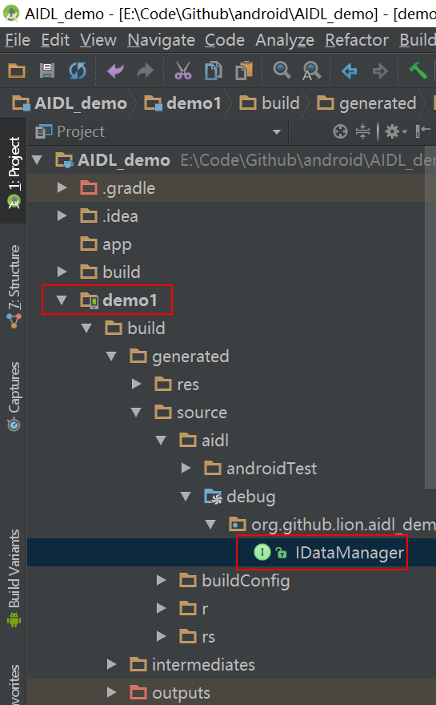

AIDL使用以及IPC原理分析（进程间通信）
==============================

#**概要**

为了大家能够更好的理解android的进程间通信原理，以下将会从以下几个方面讲解跨进程通讯信：
1. 必要了解的概念
2. 为什么要使用aidl进程间通信
3. 可能遇到的问题以及解决办法
4. aidl的使用，通过android提供的aidl实现一个进程间通信
5. 不使用aidl，手动编写Binder实现进程间通信
6. 分析aidl的原理，梳理andriod进程间通信相关知识

#1.必要了解的概念
#####a.IPC
IPC是Inner-Process Communication，就是进程间通信。
#####b.AIDL 
AUDL是Android Interface Define Language 安卓接口语言缩写。
#####c.Binder
Binder是android中负责进程间通信的驱动类，Binder内部设计十分复杂这里我们暂不做深入研究，这里我们只需要了解它是负责进程间通信的类即可。
#####d.Proxy代理模式
如果你不是很了解代理模式，可以去这里看看。
[Proxy Pattern https://github.com/onlynight/Proxy]


#2.WHY？
1. 某些情况下远端的服务更适合运算或者更适合执行耗时操作，这时候我们会使用aidl请求远程服务；
2. android对单个应用的内存限制，当有需求需要突破这个限制的时候我们需要另启进程扩大内存。
实际使用情况还有很多，笔者遇到的情况还不是很多这里就不意义列举了，反正aidl是一种很有效的IPC通信方式。

#3.可能遇到的问题
我们都知道在android中一个应用就对应一个linux进程，或者说默认情况下所有的组件都是在同一个进程下的；我们也可以将不同的组件放在不同的进程中，详情请查看我的另外一篇文章[Multi Process Component https://github.com/onlynight/MultiProcessComponent]，这样应用就不止一个进程了，按照一个进程对应一个虚拟机，也就是说我们应用不止一个虚拟机了。可能出现的问题我们来举个栗子：

假设你的代码里有一个单例，DemoSingletion；虚拟机1启动时创建了这个单例，你在虚拟机中任何一个线程中使用都只有它一个对象，线程同步问题可以添加线程锁解决。那么问题来了，虚拟机2启动的时候还会再创建这个单例吗？如果不创建的话和虚拟机1使用的是同一个单例吗？

实际情况是每个虚拟机启动的时候都会创建各自的单例，他们是不同的对象，在不同的地址空间上。那么问题又来了，两个虚拟机操作的是不同的对象那么这个DemoSingletion怎么同步呢？无论是添加线程锁还是对象锁我们都无法做到同步，究其原因就是操作的是不同的对象。这就是多进程带来的问题之一，接下来我们列举会出现的问题并说明如何解决这些问题。

1. 单例模式完全失效
2. 静态变量无法同步

#4.AIDL的使用
注：由于基于eclipse的adt过于老旧这里不再讲解操作，请使用android studio完成以下操作。

## **·** 使用AIDL文件

###a.新建aidl文件
在你想要创建aidl的包下新建aidl文件（这里我们命名为IDataManager），aidl文件的语法与java类似，默认生成的aidl会有一个demo方法

```java
void basicTypes(int anInt, long aLong, boolean aBoolean, float aFloat,double aDouble, String aString);
```
系统生成的```basicTypes```这个demo方法告诉我们能够传递那些类型的数据。
###b.添加自定义方法

```java
import org.github.lion.aidl_demo.Data;
// Declare any non-default types here with import statements

interface IDataManager {
	/**
	 * Demonstrates some basic types that you can use as parameters
	 * and return values in AIDL.
	 */
	void basicTypes(int anInt, long aLong, boolean aBoolean, float aFloat,double aDouble, String aString);

	int getDataTypeCount();

	List<Data> getData();

	String getUrlContent(String url);
}
```
```List<Data> getData()```这个方法中使用了自定义的数据类型，虽然我们在文件开头写了import但是还是无法通过编译，我们需要在sdk的platform下修改framework.aidl，完整路径如下:```~/platforms/android-xx/framework.aidl```，加入我们自己添加的类名即可：

```aidl
// user define aidl parcelable data
parcelable org.github.lion.aidl_demo.Data;
```

**```Data```需实现```Parcelable```接口。**
以下是android studio的默认实现。

```java
/**
 * Created by lion on 2016/10/11.
 * 要通过Bundle传递的数据需要实现Parcelable接口，
 * 一旦你实现了这个接口android studio会提示你帮
 * 你快速实现带有Parcel的构造函数。
 */
public class Data implements Parcelable {

	...

	protected Data(Parcel in) {
		...
	}

	public static final Creator<Data> CREATOR = new Creator<Data>() {
		@Override
		public Data createFromParcel(Parcel in) {
			return new Data(in);
		}

		@Override
		public Data[] newArray(int size) {
			return new Data[size];
		}
	};
}
```

###c. 编译aidl文件
到这里aidl的编写就完成了，我们build下工程，编译器会自动生成IDataManager.java文件。
该文件在工程的```~/app/build/generated/source/aidl/debug/<package>/IDataManager.java```，这里我们先不讲解生成的这个类，先看下如何使用aidl。
	
###d. 添加Service类（远端服务）
添加一个```Service```命名为```DataManagerService```我们在```DataManagerService```中实现一个静态的```IDataManager.Stub```的类

```java
private static final IDataManager.Stub mBinder = new IDataManager.Stub() {

	@Override
	public void basicTypes(int anInt, long aLong, boolean aBoolean, float aFloat, double aDouble, String aString) throws RemoteException {
	}

	@Override
	public int getDataTypeCount() throws RemoteException {
		// todo return some data
		return 0;
	}

	@Override
	public List<Data> getData() throws RemoteException {
		// todo return some data
		return null;
	}

	@Override
	public String getUrlContent(String url) throws RemoteException {
		// todo return some data
		return null;
	}
};
```
在```onBind```方法中返回这个Binder，这样当我们调用Activity的```bindService```方法的时候就能返回这个binder对象了。

```java
@Override
public IBinder onBind(Intent intent) {
    return mBinder;
}
```

###e.绑定服务并测试夸进程通信
在你需要调用的Activity中添加如下代码：

```java
/**
 * data manager service 的远程引用
 */
private IDataManager dataManagerService = null;

/**
 * 创建Service Connection用于监听service链接与断开链接
 */
private ServiceConnection dataServiceConnection = new ServiceConnection() {
    @Override
    public void onServiceConnected(ComponentName name, IBinder service) {
        dataManagerService = IDataManager.Stub.asInterface(service);
    }

    @Override
    public void onServiceDisconnected(ComponentName name) {
        dataManagerService = null;
    }
};
```
当你的Activity启动时绑定远程服务

```java
@Override
protected void onCreate(Bundle savedInstanceState) {
	...

    bindService(new Intent(this, DataManagerService.class), dataServiceConnection,
            Context.BIND_AUTO_CREATE);
}
```
接下来我们编写测试代码，在button的回调函数中我们编写如下测试代码：

```java
public void callService(View view) {
    try {
        System.out.println(dataManagerService.getDataTypeCount());
        
        StringBuilder sb = new StringBuilder();
        for (Data data : dataManagerService.getData()) {
            System.out.println(data.toString());
            sb.append(data.toString()).append("\n");
        }
        textData.setText(sb.toString());

        new Thread(new Runnable() {
            @Override
            public void run() {
                try {
                    System.out.println(dataManagerService.getUrlContent("http://www.baidu.com"));
                } catch (RemoteException e) {
                    e.printStackTrace();
                }
            }
        }).start();
    } catch (RemoteException e) {
        e.printStackTrace();
    }
}
```
###f.运行查看结果

## **·**自己实现Binder
上面我们展示了如何使用AIDL文件实现进程间通信，为了能够更好的理解进程间通信机制接下来将会展示如何手动编写一个Binder实现IPC。

###aidl生成类分析
将Android Studio切换到项目视图，找到如下文件：

我们将这个接口文件简化以下，看看系统多给我们做了些什么。

```java
public interface IDataManager extends android.os.IInterface {

    /**
     * Local-side IPC implementation stub class.
     */
    public static abstract class Stub extends android.os.Binder implements org.github.lion.aidl_demo.IDataManager {

    	private static class Proxy implements org.github.lion.aidl_demo.IDataManager {}
    }
}
```

####```IDataManager```
这个是我们定义的aidl接口，这个接口里面就要定义我们需要的要成服务能力的接口;

####```IDataManager.Stub```
这个是一个继承自Binder并且实现了IDataManager的抽象类；

####```IDataManager.Stub.Proxy```
这个是一个私有内部类，实现了IDataManager;

我们知道Binder是Android中的IPC通信驱动，从类结构我们就可以看出最终的实际功能类是```IDataManager.Stub.Proxy```。具体的类方法我们暂时不做分析，接下来我们不使用aidl文件自己实现一个Binder驱动类，写的过程中我们细细来分析各个函数的功能。

###自己实现Binder驱动IPC通信

####定义公共接口
从上面aidl生成的类我们看出需要实现IPC通信需要实现IInterface接口，并且继承Binder类从中间驱动。所以首先我们先定义公共接口继承IInterface接口。

```java
//IDataManager.java
public interface IDataManager2 extends IInterface {

	// 返回值为基本数据类型，定义接口时不需要做特殊处理
    int getDataCount() throws RemoteException;

    // 自定义的返回数据类型需要实现Parcelable接口，进程间通信不能直接共享内存，需要将对象持久化。
    // 所以自定义的类需要实现Parcelable接口
    List<Data2> getData() throws RemoteException;
}


/**
 * Data2.java
 * Created by lion on 2016/10/11.
 * 要通过Bundle传递的数据需要实现Parcelable接口，
 * 一旦你实现了这个接口android studio会提示你帮
 * 你快速实现带有Parcel的构造函数。
 */
public class Data2 implements Parcelable {

    private int id;
    private String content;

    public Data2() {
    }

    protected Data2(Parcel in) {
        id = in.readInt();
        content = in.readString();
    }

    public static final Creator<Data2> CREATOR = new Creator<Data2>() {
        @Override
        public Data2 createFromParcel(Parcel in) {
            return new Data2(in);
        }

        @Override
        public Data2[] newArray(int size) {
            return new Data2[size];
        }
    };

    public int getId() {
        return id;
    }

    public void setId(int id) {
        this.id = id;
    }

    public String getContent() {
        return content;
    }

    public void setContent(String content) {
        this.content = content;
    }

    @Override
    public int describeContents() {
        return 0;
    }

    @Override
    public void writeToParcel(Parcel dest, int flags) {
        dest.writeInt(id);
        dest.writeString(content);
    }

    @Override
    public String toString() {
        return "id = " + id + " content = " + content;
    }
}
```

为了让代码逻辑更加清晰，这回我们的Binder类不再写成内部类。

```java
```

AIDL原理分析
-----------

[Multi Process Component https://github.com/onlynight/MultiProcessComponent]: https://github.com/onlynight/MultiProcessComponent
[Proxy Pattern https://github.com/onlynight/Proxy]: https://github.com/onlynight/Proxy