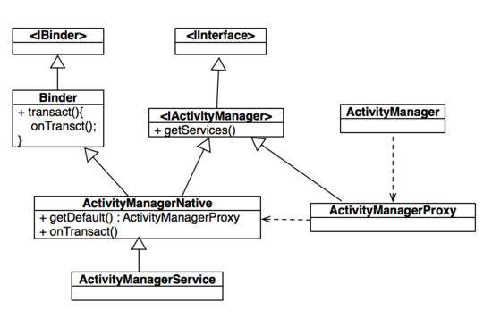

Activity启动过程剖析
===================

#写在前面
在看这篇文章之前你需要了解android的IPC通信机制里面的ADIL的原理，还有一些常用的设计模式比如代理模式你也需要有所了解，了解这些会让你更容易理解android源码。阅读本文的读者我都默认你是了解这些东西的，如果你正好还没没有看过这些东西，那么我想你推荐我的另外几篇文章，希望能让你快速了解android的IPC的AIDL的设计原理：

- [AIDL使用及原理分析CSDN]
- [AIDL使用及原理分析Github]
- [代理模式初探CSDN]
- [Proxy_Github]

下面我们开始正片。


#阅读源码的方法
Android源码数量相当多我们不能从头逐一查看所有文件中的源码，你需要理出一条线索来，你感兴趣的线索比如本文讲的Activity的启动过程分析就是从```startActivity```函数开始然后逐步深入去查看其中的奥妙。还有一点需要说的是看源码的时候不要太深入细节，我们想了解的代码的逻辑而不是其中如何实现的（当然这个是我看源码的主要目的，如果你的出发点是如何实现的那我们关注的重点就不一样了），梳理代码逻辑让我们能更好的了解android的工作原理，从而在遇到问题的时候不再抓虾而能精准的定位到问题的所在，希望这篇文章能够帮到你。这里同样有一篇文章推荐给你：[Android源码阅读配置]

#需要了解的几个类
开始之前你需要对几个类有所了解知道他们的职责这样有助于理解源码：
###1.Activity
An activity is a single, focused thing that the user can do.  Almost all
activities interact with the user, so the Activity class takes care of
creating a window for you in which you can place your UI with
{@link #setContentView}.  While activities are often presented to the user
as full-screen windows, they can also be used in other ways: as floating
windows (via a theme with {@link android.R.attr#windowIsFloating} set)
or embedded inside of another activity (using {@link ActivityGroup}).

Activity是我们日常中最常用的组件，它通常显示给用户的是一个全屏的窗口，或者一个浮动的窗口（例如音乐播放器的浮动歌词），或者嵌入其他的Activity使用ActivityGroup。它Android四大组件中唯一能和用户交互的组件，这里就不再多做解释了。

###2.Instrumentation
Base class for implementing application instrumentation code.  When running
with instrumentation turned on, this class will be instantiated for you
before any of the application code, allowing you to monitor all of the
interaction the system has with the application.  An Instrumentation
implementation is described to the system through an AndroidManifest.xml's
instrumentation tag.

当Instrumentation打开的时候，在你的应用代码执行之前会首先实例化一个instrumentation，你可以监听所有系统应用交互。
用于执行具体操作的类，辅助Activity的监控和测试。

###3.ActivityManagerNative、ActivityManagerProxy、IActivityManager、ActivityManagerService
IPC需要的类，了解过aidl的童鞋应该都不陌生。需要有一个继承```IInterface```的接口定义ipc的能力接口，需要有个继承```Binder```类的驱动类，还需要有一个远程服务的代理类```Proxy```代理远程服务的操作，实现```Binder```的类可能是个抽象类，还需要有类实例化这个```Binder```或者继承它实现所有抽象方法。

1. ```IActivityManager```就是继承了```IInterface```的能力接口。
2. ```ActivityManagerNative```继承了```Binder```实现了```IInterface```接口。
3. ```ActivityManagerProxy```有一个```mRemote```其类型是```Binder```，远程服务代理。
4. ```ActivityManagerService```继承了```ActivityManagerNative```并且实现了它的所有抽象方法。

类结构图如下：



#源码逻辑梳理
首先我们来看```startActivity```这个函数：

```java
// Activity.java


public void startActivity(Intent intent) {
    this.startActivity(intent, null);
}

public void startActivity(Intent intent, @Nullable Bundle options) {
    if (options != null) {
        startActivityForResult(intent, -1, options);
    } else {
        // Note we want to go through this call for compatibility with
        // applications that may have overridden the method.
        startActivityForResult(intent, -1);
    }
}

public void startActivityForResult(@RequiresPermission Intent intent, int requestCode,
            @Nullable Bundle options) {
    if (mParent == null) {
        Instrumentation.ActivityResult ar =
            mInstrumentation.execStartActivity(
                this, mMainThread.getApplicationThread(), mToken, this,
                intent, requestCode, options);
        if (ar != null) {
            mMainThread.sendActivityResult(
                mToken, mEmbeddedID, requestCode, ar.getResultCode(),
                ar.getResultData());
        }
        if (requestCode >= 0) {
            // If this start is requesting a result, we can avoid making
            // the activity visible until the result is received.  Setting
            // this code during onCreate(Bundle savedInstanceState) or onResume() will keep the
            // activity hidden during this time, to avoid flickering.
            // This can only be done when a result is requested because
            // that guarantees we will get information back when the
            // activity is finished, no matter what happens to it.
            mStartedActivity = true;
        }

        cancelInputsAndStartExitTransition(options);
        // TODO Consider clearing/flushing other event sources and events for child windows.
    } else {
        if (options != null) {
            mParent.startActivityFromChild(this, intent, requestCode, options);
        } else {
            // Note we want to go through this method for compatibility with
            // existing applications that may have overridden it.
            mParent.startActivityFromChild(this, intent, requestCode);
        }
    }
}
```

可以看到```startActivity```函数调用的还是```startActivityForResult```只是传入的默认```requestCode```为-1，这里就提醒我们```requestCode```需要大于等于0，否则和直接调用```startActivity```是一样的效果不会回调```onActivityResult```。


```startActivityForResult```出现分支判断是否有```mParent```，```mParent```即为```ActivityGroup```，实际上两个分支执行的代码是相同的只是是谁启动```activity```的区别，```startActivityFromChild```这个函数可以验证这个说法：

```java
public void startActivityFromChild(@NonNull Activity child, @RequiresPermission Intent intent,
            int requestCode, @Nullable Bundle options) {
    Instrumentation.ActivityResult ar =
        mInstrumentation.execStartActivity(
            this, mMainThread.getApplicationThread(), mToken, child,
            intent, requestCode, options);
    if (ar != null) {
        mMainThread.sendActivityResult(
            mToken, child.mEmbeddedID, requestCode,
            ar.getResultCode(), ar.getResultData());
    }
    cancelInputsAndStartExitTransition(options);
}
```

可以看到这个函数的内部实现和```startActivityForResult```中```mParent==null```的分支代码基本相同只是传入的```embeddedID```不同，下面我们顺着主线继续往往下看，```startActivityForResult```中调用了```Instrumention.execStartActivity```方法：

```java
//Instrumention.java

public ActivityResult execStartActivity(
    Context who, IBinder contextThread, IBinder token, String target,
    Intent intent, int requestCode, Bundle options) {
    IApplicationThread whoThread = (IApplicationThread) contextThread;
    if (mActivityMonitors != null) {
        synchronized (mSync) {
            final int N = mActivityMonitors.size();
            for (int i=0; i<N; i++) {
                final ActivityMonitor am = mActivityMonitors.get(i);
                if (am.match(who, null, intent)) {
                    am.mHits++;
                    if (am.isBlocking()) {
                        return requestCode >= 0 ? am.getResult() : null;
                    }
                    break;
                }
            }
        }
    }
    try {
        intent.migrateExtraStreamToClipData();
        intent.prepareToLeaveProcess(who);
        int result = ActivityManagerNative.getDefault()
            .startActivity(whoThread, who.getBasePackageName(), intent,
                    intent.resolveTypeIfNeeded(who.getContentResolver()),
                    token, target, requestCode, 0, null, options);
        checkStartActivityResult(result, intent);
    } catch (RemoteException e) {
        throw new RuntimeException("Failure from system", e);
    }
    return null;
}
```

这里就有一些比较复杂的代码，本着研究的心理总要把代码是如何实现的看个清楚，其实不然，你大可根据变量和方法的命名大概知道是什么作用就可以继续看代码了，例如这个```mActivityMonitors```我们看到它的类型是```List<ActivityMonitor>```，通过名字和类型我们就大概知道它是用来记录Activity的，大概分析下这里应该不是真正启动Activity的地方这里应该是请求activity返回的检测。继续往下看，这里调用了```ActivityManagerNative.startActivity```方法，我们继续深入：

```java
//ActivityManagerNative.java

static public IActivityManager getDefault() {
    return gDefault.get();
}

private static final Singleton<IActivityManager> gDefault = new Singleton<IActivityManager>() {
    protected IActivityManager create() {
        IBinder b = ServiceManager.getService("activity");
        if (false) {
            Log.v("ActivityManager", "default service binder = " + b);
        }
        IActivityManager am = asInterface(b);
        if (false) {
            Log.v("ActivityManager", "default service = " + am);
        }
        return am;
    }
};

static public IActivityManager asInterface(IBinder obj) {
    if (obj == null) {
        return null;
    }
    IActivityManager in =
        (IActivityManager)obj.queryLocalInterface(descriptor);
    if (in != null) {
        return in;
    }

    return new ActivityManagerProxy(obj);
}


class ActivityManagerProxy implements IActivityManager
{
	private IBiner mRemote;

    public ActivityManagerProxy(IBinder remote)
    {
        mRemote = remote;
    }

    public IBinder asBinder()
    {
        return mRemote;
    }

    public int startActivity(IApplicationThread caller, String callingPackage, Intent intent,
            String resolvedType, IBinder resultTo, String resultWho, int requestCode,
            int startFlags, ProfilerInfo profilerInfo, Bundle options) throws RemoteException {
        Parcel data = Parcel.obtain();
        Parcel reply = Parcel.obtain();
        data.writeInterfaceToken(IActivityManager.descriptor);
        data.writeStrongBinder(caller != null ? caller.asBinder() : null);
        data.writeString(callingPackage);
        intent.writeToParcel(data, 0);
        data.writeString(resolvedType);
        data.writeStrongBinder(resultTo);
        data.writeString(resultWho);
        data.writeInt(requestCode);
        data.writeInt(startFlags);
        if (profilerInfo != null) {
            data.writeInt(1);
            profilerInfo.writeToParcel(data, Parcelable.PARCELABLE_WRITE_RETURN_VALUE);
        } else {
            data.writeInt(0);
        }
        if (options != null) {
            data.writeInt(1);
            options.writeToParcel(data, 0);
        } else {
            data.writeInt(0);
        }
        mRemote.transact(START_ACTIVITY_TRANSACTION, data, reply, 0);
        reply.readException();
        int result = reply.readInt();
        reply.recycle();
        data.recycle();
        return result;
    }

    ...
}
```

这里看到```ActivityManagerNative.getDefault```中的```gDefault```是一个单例其中的```Binder```就是我们要的远程Binder了，```ServiceManager.getService```获取到的```Binder```，这里我们先放放先不看```ServiceManager```的内部实现，只要我们知道这个远程Binder是从这里获取到的就可以了。拿到这个```Binder```后通过```ActivityManagerNative.asInterface```方法将其强转为```IActivityManager```接口：

```java
static public IActivityManager asInterface(IBinder obj) {
    if (obj == null) {
        return null;
    }
    IActivityManager in =
        (IActivityManager)obj.queryLocalInterface(descriptor);
    if (in != null) {
        return in;
    }

    return new ActivityManagerProxy(obj);
}
```

如果这个```Binder```在本地能找到那么就直接返回，如果找不到就通过```Binder```创建一个远程服务的代理类。```ActivityManagerProxy```将传入的```IBinder```作为远程服务的```Binder```，可以看到```ActivityManagerProxy.startActivity```方法的本质实际上是调用了```mRemote.transact```方法，请求远程服务完成操作。懂AIDL的朋友都知道```transact```和```onTransact```是成对出现的，```onTransact```才是真正的实现。那么问题来了这个```onTransact```实在哪里实现的呢，当然是```ActivityManagerProxy.mRemote```已经实现了，现在我们再倒回来找找这个```mRemote```是从哪里来的。

```java
//ServiceManager.java

/**
 * Returns a reference to a service with the given name.
 * 
 * @param name the name of the service to get
 * @return a reference to the service, or <code>null</code> if the service doesn't exist
 */
public static IBinder getService(String name) {
    try {
        IBinder service = sCache.get(name);
        if (service != null) {
            return service;
        } else {
            return getIServiceManager().getService(name);
        }
    } catch (RemoteException e) {
        Log.e(TAG, "error in getService", e);
    }
    return null;
}

private static IServiceManager getIServiceManager() {
    if (sServiceManager != null) {
        return sServiceManager;
    }

    // Find the service manager
    sServiceManager = ServiceManagerNative.asInterface(BinderInternal.getContextObject());
    return sServiceManager;
}
```

看到这些熟悉的命名方式```ServiceManager```，```IServiceManager```，```ServiceManagerNative```，那么这个```ServiceManager```也是AIDL实现，我们再来看下这个AIDL的远程代理从哪里来的，这里没有```gDefault```但是有个静态方法```getIServiceManager```来获取```IInterface```接口，继续往里深入：

```java
//BinderInternal.java

/**
 * Return the global "context object" of the system.  This is usually
 * an implementation of IServiceManager, which you can use to find
 * other services.
 */
public static final native IBinder getContextObject();
```

```java
//ServiceManagerNative.java

/**
 * Native implementation of the service manager.  Most clients will only
 * care about getDefault() and possibly asInterface().
 * @hide
 */
public abstract class ServiceManagerNative extends Binder implements IServiceManager{}
```

这里获取```IBinder```是通过```native```方式来实现的，这里我们就不再深入了。我们知道```ServiceManager```是用来获取其他service的接口那么它的实现必然跟普通的service有所不同，再回到我们之前的方法```ServiceManager.getService("activity")```，中通过```activity```参数获取到了一个```Binder```这个```Binder```必然是已经继承自```Binder```并且实现了```IActivityManager```接口的类，这样的类我们现在只能定位到```ActivityManagerNative```这个类，但是这个类是个抽象类它并没有实现```IActivityManager```中的方法，我们再全局搜索一下```ActivityManagerNative```这个类看有没有实例化这个类的地方或者继承这个类的分抽象类，很幸运我们找到了```ActivityManagerService```这个类继承了```ActivityManagerNative```并且实现了接口的方法。

```ServiceManager```中有个```sCache```其类型是```HashMap<String, IBinder>```，既然有```getService```那么会有相应的```addService```将service加入到其中：

```java
//ServiceManager.java

private HashMap<String, IBinder> sCache = new HashMap<String, IBinder>();

/**
 * Returns a reference to a service with the given name.
 * 
 * @param name the name of the service to get
 * @return a reference to the service, or <code>null</code> if the service doesn't exist
 */
public static IBinder getService(String name) {
    try {
        IBinder service = sCache.get(name);
        if (service != null) {
            return service;
        } else {
            return getIServiceManager().getService(name);
        }
    } catch (RemoteException e) {
        Log.e(TAG, "error in getService", e);
    }
    return null;
}


/**
 * Returns a reference to a service with the given name.
 * 
 * @param name the name of the service to get
 * @return a reference to the service, or <code>null</code> if the service doesn't exist
 */
public static IBinder getService(String name) {
    try {
        IBinder service = sCache.get(name);
        if (service != null) {
            return service;
        } else {
            return getIServiceManager().getService(name);
        }
    } catch (RemoteException e) {
        Log.e(TAG, "error in getService", e);
    }
    return null;
}
```

好了我们再来看看```activity```这个service是怎么被添加到里面去的，在```ActivityManagerService```中找到了相应的代码：

```java
// ActivityManagerService.java


public void setSystemProcess() {
    try {
        ServiceManager.addService(Context.ACTIVITY_SERVICE, this, true);
        ServiceManager.addService(ProcessStats.SERVICE_NAME, mProcessStats);
        ServiceManager.addService("meminfo", new MemBinder(this));
        ServiceManager.addService("gfxinfo", new GraphicsBinder(this));
        ServiceManager.addService("dbinfo", new DbBinder(this));
        if (MONITOR_CPU_USAGE) {
            ServiceManager.addService("cpuinfo", new CpuBinder(this));
        }
        ServiceManager.addService("permission", new PermissionController(this));

        ApplicationInfo info = mContext.getPackageManager().getApplicationInfo(
                "android", STOCK_PM_FLAGS);
        mSystemThread.installSystemApplicationInfo(info, getClass().getClassLoader());

        synchronized (this) {
            ProcessRecord app = newProcessRecordLocked(info, info.processName, false, 0);
            app.persistent = true;
            app.pid = MY_PID;
            app.maxAdj = ProcessList.SYSTEM_ADJ;
            app.makeActive(mSystemThread.getApplicationThread(), mProcessStats);
            mProcessNames.put(app.processName, app.uid, app);
            synchronized (mPidsSelfLocked) {
                mPidsSelfLocked.put(app.pid, app);
            }
            updateLruProcessLocked(app, false, null);
            updateOomAdjLocked();
        }
    } catch (PackageManager.NameNotFoundException e) {
        throw new RuntimeException(
                "Unable to find android system package", e);
    }
}
```

这个```setSystemProcess```方法在系统启动的时候会被调用，那么```ActivityManagerService```就被添加到```ServiceManager```中去了，这里可以看出```ActivityManagerService```是一个系统级的```Service```在系统启动的时候就被加载了。

找到来了```ActivityManagerNative.gDefault```中的源头我们再回过头来理顺Activity的启动过程，我们知道```transact```后的真正执行者是```onTransact```方法，那么我们这里的```onTransact```方法就是```ActivityManagerService.onTransact```实际就是```ActivityManagerNative.onTransact```：

```java
// ActivityManagerNative.java

/** {@hide} */
public abstract class ActivityManagerNative extends Binder implements IActivityManager {
    @Override
    public boolean onTransact(int code, Parcel data, Parcel reply, int flags)
            throws RemoteException {
        switch (code) {
            case START_ACTIVITY_TRANSACTION: {
                data.enforceInterface(IActivityManager.descriptor);
                IBinder b = data.readStrongBinder();
                IApplicationThread app = ApplicationThreadNative.asInterface(b);
                String callingPackage = data.readString();
                Intent intent = Intent.CREATOR.createFromParcel(data);
                String resolvedType = data.readString();
                IBinder resultTo = data.readStrongBinder();
                String resultWho = data.readString();
                int requestCode = data.readInt();
                int startFlags = data.readInt();
                ProfilerInfo profilerInfo = data.readInt() != 0
                        ? ProfilerInfo.CREATOR.createFromParcel(data) : null;
                Bundle options = data.readInt() != 0
                        ? Bundle.CREATOR.createFromParcel(data) : null;
                int result = startActivity(app, callingPackage, intent, resolvedType,
                        resultTo, resultWho, requestCode, startFlags, profilerInfo, options);
                reply.writeNoException();
                reply.writeInt(result);
                return true;
            }
        }
    }
}


class ActivityManagerProxy implements IActivityManager
{
    public ActivityManagerProxy(IBinder remote)
    {
        mRemote = remote;
    }

    public IBinder asBinder()
    {
        return mRemote;
    }

    public int startActivity(IApplicationThread caller, String callingPackage, Intent intent,
            String resolvedType, IBinder resultTo, String resultWho, int requestCode,
            int startFlags, ProfilerInfo profilerInfo, Bundle options) throws RemoteException {
        Parcel data = Parcel.obtain();
        Parcel reply = Parcel.obtain();
        data.writeInterfaceToken(IActivityManager.descriptor);
        data.writeStrongBinder(caller != null ? caller.asBinder() : null);
        data.writeString(callingPackage);
        intent.writeToParcel(data, 0);
        data.writeString(resolvedType);
        data.writeStrongBinder(resultTo);
        data.writeString(resultWho);
        data.writeInt(requestCode);
        data.writeInt(startFlags);
        if (profilerInfo != null) {
            data.writeInt(1);
            profilerInfo.writeToParcel(data, Parcelable.PARCELABLE_WRITE_RETURN_VALUE);
        } else {
            data.writeInt(0);
        }
        if (options != null) {
            data.writeInt(1);
            options.writeToParcel(data, 0);
        } else {
            data.writeInt(0);
        }
        mRemote.transact(START_ACTIVITY_TRANSACTION, data, reply, 0);
        reply.readException();
        int result = reply.readInt();
        reply.recycle();
        data.recycle();
        return result;
    }
}
```

在```ActivityManagerNative```中的```mRemote.transact```发送了一个```START_ACTIVITY_TRANSACTION```消息，接着```onTransact```方法真正将方法最终落地调用了```startActivity```方法，由于```ActivityManagerNative```是抽象类，那么就要查看它子类中的这个方法：

```java
//ActivityManagerService.java

public final int startActivity(IApplicationThread caller, String callingPackage,
        Intent intent, String resolvedType, IBinder resultTo, String resultWho, int requestCode,
        int startFlags, ProfilerInfo profilerInfo, Bundle bOptions) {
    return startActivityAsUser(caller, callingPackage, intent, resolvedType, resultTo,
            resultWho, requestCode, startFlags, profilerInfo, bOptions,
            UserHandle.getCallingUserId());
}

public final int startActivityAsUser(IApplicationThread caller, String callingPackage,
        Intent intent, String resolvedType, IBinder resultTo, String resultWho, int requestCode,
        int startFlags, ProfilerInfo profilerInfo, Bundle bOptions, int userId) {
    enforceNotIsolatedCaller("startActivity");
    userId = mUserController.handleIncomingUser(Binder.getCallingPid(), Binder.getCallingUid(),
            userId, false, ALLOW_FULL_ONLY, "startActivity", null);
    // TODO: Switch to user app stacks here.
    return mActivityStarter.startActivityMayWait(caller, -1, callingPackage, intent,
            resolvedType, null, null, resultTo, resultWho, requestCode, startFlags,
            profilerInfo, null, null, bOptions, false, userId, null, null);
}
```

继续深入查看```mActivityStarter.startActivityMayWait```:

```java
// ActivityStarter.java

/**
 * Controller for interpreting how and then launching activities.
 *
 * This class collects all the logic for determining how an intent and flags should be turned into
 * an activity and associated task and stack.
 */
class ActivityStarter {

	...

	final int startActivityMayWait(IApplicationThread caller, int callingUid,
            String callingPackage, Intent intent, String resolvedType,
            IVoiceInteractionSession voiceSession, IVoiceInteractor voiceInteractor,
            IBinder resultTo, String resultWho, int requestCode, int startFlags,
            ProfilerInfo profilerInfo, IActivityManager.WaitResult outResult, Configuration config,
            Bundle bOptions, boolean ignoreTargetSecurity, int userId,
            IActivityContainer iContainer, TaskRecord inTask) {
        
    	...
    	//化繁为简，省略的这些代码就是为了给startActivityLocked构造参数

        final ActivityRecord[] outRecord = new ActivityRecord[1];
        int res = startActivityLocked(caller, intent, ephemeralIntent, resolvedType,
                aInfo, rInfo, voiceSession, voiceInteractor,
                resultTo, resultWho, requestCode, callingPid,
                callingUid, callingPackage, realCallingPid, realCallingUid, startFlags,
                options, ignoreTargetSecurity, componentSpecified, outRecord, container,
                inTask);

        ...
    }


    final int startActivityLocked(IApplicationThread caller, Intent intent, Intent ephemeralIntent,
            String resolvedType, ActivityInfo aInfo, ResolveInfo rInfo,
            IVoiceInteractionSession voiceSession, IVoiceInteractor voiceInteractor,
            IBinder resultTo, String resultWho, int requestCode, int callingPid, int callingUid,
            String callingPackage, int realCallingPid, int realCallingUid, int startFlags,
            ActivityOptions options, boolean ignoreTargetSecurity, boolean componentSpecified,
            ActivityRecord[] outActivity, ActivityStackSupervisor.ActivityContainer container,
            TaskRecord inTask) {
        ...
        try {
            mService.mWindowManager.deferSurfaceLayout();
            err = startActivityUnchecked(r, sourceRecord, voiceSession, voiceInteractor, startFlags,
                    true, options, inTask);
        } finally {
            mService.mWindowManager.continueSurfaceLayout();
        }
        ...
    }

    private int startActivityUnchecked(final ActivityRecord r, ActivityRecord sourceRecord,
            IVoiceInteractionSession voiceSession, IVoiceInteractor voiceInteractor,
            int startFlags, boolean doResume, ActivityOptions options, TaskRecord inTask) {
    	...
    	mWindowManager.executeAppTransition();
    	...
    }
	...
}
```

我们就深入到这里就好了不再深入研究代码，```mWindowManager```的类型是```WindowManagerService```也是一个aidl的实现，具体实现有兴趣的读者可以深入研究```WindowManagerService```的内部实现。

本文实际上就是详细讲了```ActivityManagerService```是如何与前端链接上的，Android中许多其他的服务例如```MediaCenter```等都是IPC的实现，可以根据本文的的线索和思路查看相应的源码。在梳理完相应的代码逻辑以后就可以关注内部的代码实现了，最后希望本文能够真正帮到你理解Activity的启动过程。


[AIDL使用及原理分析CSDN]: http://blog.csdn.net/tgbus18990140382/article/details/52799899
[AIDL使用及原理分析Github]: https://github.com/onlynight/AIDL_demo
[代理模式初探CSDN]: http://blog.csdn.net/tgbus18990140382/article/details/52817322
[Proxy_Github]: https://github.com/onlynight/Proxy
[Android源码阅读配置]: http://blog.csdn.net/tgbus18990140382/article/details/52704433