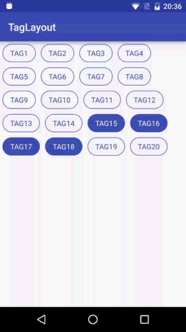

从自定义TagLayout看自定义布局的一般步骤[手动加精]
=============================================

我们常用的布局有LinearLayout，FrameLayout，RelativeLayout，大多数情况下都能满足我们的需求，但是也有很多情况下这些布局不能满足我们的需求，无论我们怎么嵌套布局都没法实现我们想要的效果，这时候我们就需要用到自定义布局啦。如果你正准备学习自定义布局，或者你想彻底了解自定义布局的一般步骤，那么这篇文章一定很适合你。

#预览



#概述

一般的，我们自定义布局的原则就是继承现有的布局，这样可以少写很多不必要的代码，但是现有的布局如果不能满足需求我们就要继承ViewGroup实现其中的所有流程了。下面我们先说明几个概念：

##1. ViewGroup和View的关系与区别

ViewGroup继承自View但是它的和View的侧重点不同，View侧重的是onDraw绘制的内容，而ViewGroup侧重的是对其内部的子view的layout，也就是布局过程（onLayout）。当然ViewGroup同样也可以重写onDraw函数在其中绘制内容，但是一般的我们不会这么做，绘制特殊的图形一般采用自定义View而不是自定义ViewGroup。

##2. ViewGroup、View、LayoutParams的关系

- ViewGroup继承自View，所以ViewGroup实质上也是View
- ViewGroup中可以包含多个View或者ViewGroup，从逻辑上来说他们ViewGroup和View共同构成了视图树，ViewGroup是父节点，View是子节点。View中不能包含View。
- 有了布局就多出了一个概念，就是View在ViewGroup中的位置，andorid中为这个位置信息添加了个对象叫做LayoutParams。LayoutParams描述了ViewGroup中的子控件View的大小等属性。
- LayoutParams针对不同的布局类型又有不同的子类，例如LinearLayout.LayoutParams中除了描述View的大小外还有一个weight属性，layout_weight相信大家都用过啦这里就不再赘述。自定义的ViewGroup如果需要ViewGroup.LayoutParams以外的属性，你需要重新构造一个你需要的布局参数，这个ViewGroup中所有的View都被设置上这个类型的布局参数。

##3. 自定义ViewGroup的一般步骤

1. onMeasure中测量自己以及子控件View的尺寸。
2. onLayout中设置子控件View的位置。
3. onDraw 如果又需要你可以在onDraw中绘制内容，但是自己布局我们一般都不会用到这个步骤。

##4. MeasureSpec

MeasureSpec是android中一个特殊的值，我们看到onMeasure的参数即是MeasureSpec：

```java
@Override
protected void onMeasure(int widthMeasureSpec, int heightMeasureSpec) {}
```

我哦们将其打印出来后发现不是想象中的像素值，而是一个奇怪的数字，实际上这一个数值代表了两个属性，这个整形的高两位是描述的测量模式，低30位描述的才是控件尺寸的像素值。我们从这个函数中就可以看出端倪了：

```java
private static final int MODE_SHIFT = 30;
private static final int MODE_MASK  = 0x3 << MODE_SHIFT;

@MeasureSpecMode
public static int getMode(int measureSpec) {
    //noinspection ResourceType
    return (measureSpec & MODE_MASK);
}
```

MeasureSpec#getMode函数将measureSpec的后30位置为0，得到其高2位的值。

# 自定义TagLayout详细实现

## 1. 功能描述

我们想要实现的效果就是View横向排列，当宽度不够时向下换行；同时支持Tag item的margin属性；支持单选多选和不能选择三种选择模式。这就是我们想要的TagLayout的基本功能。

## 2. 选择继承的布局类

综合以上功能我们发现基本的布局已经不能满足我们的需求，所以需要继承ViewGroup实现以上功能。

## 3. 设置布局参数

功能中提到要实现布局的margin参数，要使用这个参数首先布局得支持这个参数，所有我们继承ViewGroup后要重写generateLayoutParams方法，并将其返回值设置位MarginLayoutParams：

```java
/**
 * set the item layout parmas to {@link android.view.ViewGroup.MarginLayoutParams}.
 *
 * @param attrs
 * @return
 */
@Override
public LayoutParams generateLayoutParams(AttributeSet attrs) {
    return new MarginLayoutParams(getContext(), attrs);
}
```

这样当调用ViewGroup的addView方法的时候就会通过这个方法获取布局参数，并给每一个子View设置MarginLayoutParams。在看MarginLayoutParams的构造参数，第一个为Context就不多说了，再看第二个参数AttributeSet，是不是觉得似曾相识？没错这个和View的构造函数中的AttributeSet是一样的，这个参数是LayoutInflator通过解析xml布局文件生成的控件属性参数，其中包含了layout_width,layout_height,layout_margin之类的系统为我们定义的属性，还有我们自己定义的属性。这样就为我们使用layout_margin参数做好了准备。

## 4. 向ViewGroup中添加控件View

从预览图的效果我们知道TagLayout中可以添加多个Tag View，但是每个Tag View都是相同的只是部分属性不同，这时候我们就要用到一种很方便的设计模式---适配器模式。相信大家也很常用ListView或者RecyclerView他们控件和数据绑定的方式就是适配器。这里我们也使用适配器，这样tag view可以灵活添加，tag的数量通过适配器就能轻松搞定。

我们来看一下setAdapter函数中我们做了些什么：

```java
private BaseAdapter mAdapter;

public void setAdapter(BaseAdapter adapter) {
    this.mAdapter = adapter;
    removeAllViews();
    if (mAdapter == null) {
        return;
    }

    if (!registeredDataObserver) {
        registeredDataObserver = true;
        mAdapter.registerDataSetObserver(dataSetObserver);
    }

    for (int i = 0; i < this.mAdapter.getCount(); i++) {
        View child = this.mAdapter.getView(i, null, this);
        addView(child);
    }
    setSelectMode(mMaxSelectCount);
}
```

注意这里我们使用Adapter#getView方法时传入第二个参数为null，我们知道ListView一种优化方式是使用ViewHolder，然后通过convertView的复用规则我们可以不用每次都inflat布局，这里我们并没有像ListView一样复用convertView，因为多数情况下convertView都不会被复用，所有的tag都是同时显示再屏幕上的，所以这里出入null即可。

实际上我们在setAdapter函数中最重要的有两点，第一将Adapter中的View添加到ViewGroup中去，第二为Adapter中的控件设置点击事件。一般的Adapter中的item点击事件都交由控件自身处理而不是由ViewGroup处理，这里我们使组控件为了监听他们的点击所有点击事件需要由ViewGroup接收并响应。需要注意的是我们不能在onMeasure，onLayout和onDraw中设置回掉事件，因为这些方法会被多次调用，这样设置回掉事件很耗时同时也有可能引发内存泄露，所以设置回调事件一般在初始化的时候进行。下面我们来看一下tag item的点击响应事件的处理：

## 5. 处理Tag选择模式
```java
/**
 * set the select mode.
 *
 * @param selectModeOrMaxSelectCount {@link TagLayout.SELECT_MODE_ALL} can select all.</p>
 *                                   {@link TagLayout.SELECT_MODE_NONE} can select none.</p>
 *                                   {@link TagLayout.SELECT_MODE_SINGLE} can select one.</p>
 *                                   or you can set the max select count you want.</p>
 */
public void setSelectMode(int selectModeOrMaxSelectCount) {
    this.mMaxSelectCount = selectModeOrMaxSelectCount;

    if (mMaxSelectCount == 0) {
        for (int i = 0; i < this.mAdapter.getCount(); i++) {
            getChildAt(i).setOnClickListener(null);
        }
        clearSelect();
    } else {
        for (int i = 0; i < this.mAdapter.getCount(); i++) {
            final int index = i;
            final View child = getChildAt(i);
            child.setOnClickListener(new OnClickListener() {
                @Override
                public void onClick(View v) {

                	//处理只单选的模式
                    if (mMaxSelectCount == 1) {
                        clearSelect();
                        child.setSelected(!child.isSelected());
                    } 
                    // 处理多选模式
                    else if (mMaxSelectCount > 1) {
                        List<Integer> selected = getSelected();
                        // 超过最大选择数处理方式
                        if (selected.size() >= mMaxSelectCount) {
                            if (child.isSelected()) {
                                child.setSelected(false);
                                if (onTagItemSelectedListener != null) {
                                    onTagItemSelectedListener.onSelected(
                                            false, index, selected);
                                }
                            } else {
                                if (onTagItemSelectedListener != null) {
                                    onTagItemSelectedListener.onCanNotSelectMore(
                                            false, index, selected);
                                }
                            }
                        } 
                        // 正常多选处理方式
                        else {
                            child.setSelected(!child.isSelected());
                            if (onTagItemSelectedListener != null) {
                                onTagItemSelectedListener.onSelected(
                                        child.isSelected(), index, selected);
                            }
                        }
                    } 
                    // 处理全选模式
                    else if (mMaxSelectCount == -1) {
                        child.setSelected(!child.isSelected());
                        if (onTagItemSelectedListener != null) {
                            List<Integer> selected = getSelected();
                            onTagItemSelectedListener.onSelected(
                                    child.isSelected(), index, selected);
                        }
                    }
                }
            });
        }
    }
}
```

看这上面写的很复杂，实际上就是处理了几种选择模式：

1. 不能选择的模式SELECT_TYPE_NONE
	
	禁止点击模式处理最简单，不设置点击回调即可。

2. 单选模式SELECT_TYPE_SINGLE

	单选模式处理时，先清除所有被选择的tag然后把当前tag设为被选中即可。

3. 全选模式SELECT_TYPE_ALL

	全选模式，就是可以选中所有tag，不做任何限制。

4. 多选模式 大于1的任意数字

	多选模式处理时候比较复杂，如果没达到可选择的上限就继续选择，如果到达可选择的上限则回调提示用户不能再选。

基本处理完以上一种模式，就是以上这个复杂的代码了。

## 6. 为Adapter设置DataObserver

我们知道使用Adapter的时候需要更新数据时直接调用Adapter#notifyDataSetChange方法即可更新数据。实际上这是个观察者模式，Adapter是被观察对象，我们需要创建观察者监听Adapter的数据更新通知：


```java
private boolean registeredDataObserver = false;

private DataSetObserver dataSetObserver = new DataSetObserver() {
    @Override
    public void onChanged() {
        setAdapter(mAdapter);
    }
};

public void setAdapter(BaseAdapter adapter) {
    this.mAdapter = adapter;
    removeAllViews();
    if (mAdapter == null) {
        return;
    }

    if (!registeredDataObserver) {
        registeredDataObserver = true;
        mAdapter.registerDataSetObserver(dataSetObserver);
    }

    for (int i = 0; i < this.mAdapter.getCount(); i++) {
        View child = this.mAdapter.getView(i, null, this);
        addView(child);
    }
    setSelectMode(mMaxSelectCount);
}
```

我们这里简单处理一下，当数据更新的时候重新设置下适配器完成数据更新。

## 7. 测量控件onMeasure

下面就要说自定义ViewGroup的重要步骤之一了----测量过程onMeasure。自定义View中onMeasure过程主要是测量自己的大小，而ViewGroup中除了测量自己的大小外，还要测量子控件的大小，实际上这两个过程应该反过来，首先测量子控件测尺寸，然后通过子控件的尺寸计算自身测尺寸，因为ViewGroup的layout_width/layout_height如果设置为wrap_content的话就i需要根据子控件的尺寸计算自身的大小，如果不这样那么ViewGroup默认的会将wrap_content设置为match_parent一样的效果。下面我们先来看一下onMeasure方法中的代码：

```java
@Override
protected void onMeasure(int widthMeasureSpec, int heightMeasureSpec) {
    super.onMeasure(widthMeasureSpec, heightMeasureSpec);

    // 解析MeasureSpec
    int widthSpecMode = MeasureSpec.getMode(widthMeasureSpec);
    int widthSpecSize = MeasureSpec.getSize(widthMeasureSpec);
    int heightSpecMode = MeasureSpec.getMode(heightMeasureSpec);
    int heightSpecSize = MeasureSpec.getSize(heightMeasureSpec);

    //测量子控件
    measureChildren(widthMeasureSpec, heightMeasureSpec);
    int childWidth = 0;
    int childHeight = 0;
    int lines = 1;
    int lineWidth = 0;
    mMaxWidth = 0;
    mMaxHeight = 0;
    int eachLineHeight = 0;

    /**
     * 根据我们的布局规则计算子控件需要占父控件的大小，
     * 这里我们先不管ViewGroup的MeasureSpec模式，我们
     * 先根据布局规则计算高度，宽度根据ViewGroup的的
     * widthMeasureSpec 确定宽度，这个就是ViewGroup的最大宽度。
     */
    for (int i = 0; i < getChildCount(); i++) {
        MarginLayoutParams params = (MarginLayoutParams)
                getChildAt(i).getLayoutParams();

        // calculate child total size include margin.
        childWidth = getChildAt(i).getMeasuredWidth() +
                params.leftMargin + params.rightMargin;
        childHeight = getChildAt(i).getMeasuredHeight() +
                params.topMargin + params.bottomMargin;

        // 这里我们不对每一行高度单独计算，假定每一行的高度都是一样的。
        eachLineHeight = childHeight;

        lineWidth += childWidth;
        if (lineWidth >= widthSpecSize) {
            lines++;
            lineWidth = childWidth;
            mMaxWidth = widthSpecSize;
        }
    }

    mMaxHeight = eachLineHeight * lines;

    // 更具子控件的需要的尺寸计算自身的大小
    setSelfSize(widthSpecMode, widthSpecSize, heightSpecMode, heightSpecSize);
}
```

这个函数整体来说很简洁，做了以下几件事：

1. 测量所有子控件的大小 ```measureChildren```

	该方法会遍历所有子控件计算每一个控件的尺寸。

2. 根据子控件的尺寸计算子控件所需要的最大空间

	根据我们的布局规则，tag标签横向排列占满一行想下换行，统计计算时应考虑子控件的layout_margin参数，就是以上for循环中的计算步骤，就算出一个最大宽度和最大高度。计算最大宽度的原因是tag标签有可能不能占满一行，这时候ViewGroup就要重新设置下width。

3. 根据子控件所需要的尺寸计算自身的尺寸 ```setSelfSize```

	setSelfSize函数中会根据ViewGroup的测量模式具体设置ViewGroup的尺寸，下面我们来详细看下这个函数。

```java
/**
 * set self size.
 *
 * @param widthSpecMode  width measure spec mode
 * @param widthSpecSize  width measure spec size
 * @param heightSpecMode height measure spec mode
 * @param heightSpecSize height measure spec size
 */
private void setSelfSize(int widthSpecMode, int widthSpecSize,
                         int heightSpecMode, int heightSpecSize) {
    int finalWidth = 0;
    int finalHeight = 0;

    switch (widthSpecMode) {
        case MeasureSpec.EXACTLY:
        case MeasureSpec.UNSPECIFIED:
            finalWidth = widthSpecSize;
            break;
        case MeasureSpec.AT_MOST:
            finalWidth = mMaxWidth;
            break;
    }

    switch (heightSpecMode) {
        case MeasureSpec.EXACTLY:
        case MeasureSpec.UNSPECIFIED:
            finalHeight = heightSpecSize;
            break;
        case MeasureSpec.AT_MOST:
            finalHeight = mMaxHeight;
            break;
    }

    setMeasuredDimension(finalWidth, finalHeight);
}
```

MeasureSpec的模式之前我们已经有介绍过了，这里我们针对```UNSPECIFIED```不限制模式，```EXACTLY```知道具体宽度模式，设置为VewGroup的父控件传过来的尺寸，这种模式下表明父控件已经知道了具体的尺寸我们直接设置即可。另外一种```AT_MOST```就要用到我们之前计算的子控件所需的最大尺寸，```AT_MOST```表示的是子控件需要的最大空间，我们将上一步的计算值直接赋值即可。最后的关键函数是```setMeasuredDimension```设置ViewGroup自身的测量值，这时候不能使用setWidth/setHeight来设置宽高，我们还在测量过程中这个方法是无效的，需要布局完成后使用该方法才能有效设置尺寸。

## 8. 布局控件onLayout

上一步中我们测量测所需的尺寸，接下来就是布局了。布局说简单了就是设置ViewGroup的子控件子ViewGroup中的位置，下面先来看下onLayout函数：

```java
@Override
protected void onLayout(boolean changed, int l, int t, int r, int b) {
    int width = getWidth();
    int lines = 0;
    int lineWidth = 0;
    int lineHeight = 0;

    // 为每一个子控件设置位置
    for (int i = 0; i < getChildCount(); i++) {
        View child = getChildAt(i);
        MarginLayoutParams layoutParams =
                (MarginLayoutParams) child.getLayoutParams();

        // 计算每一个子控件的位置
        lineWidth += child.getMeasuredWidth() + layoutParams.leftMargin
                + layoutParams.rightMargin;
        if (lineWidth >= width) {
            lines++;
            lineWidth = child.getMeasuredWidth() + layoutParams.leftMargin
                    + layoutParams.rightMargin;
            lineHeight = lines * (child.getMeasuredHeight() +
                    layoutParams.topMargin + layoutParams.bottomMargin);
        }

        // 布局子控件
        child.layout(lineWidth - child.getMeasuredWidth() - layoutParams.rightMargin,
                lineHeight + layoutParams.topMargin,
                lineWidth - layoutParams.rightMargin,
                lineHeight + layoutParams.topMargin + child.getMeasuredHeight());
    }
}
```

需要注意的是我们设置子控件的位置是子控件相对于ViewGroup的位置，也就是说父控件的左上角的坐标是(0,0)，右下角的坐标是(viewGroupWidth,viewGroupHeight)。

以上代码也很简单，```View#layout```函数的四个参数分别是```left```，```top```，```right```，```bottom```我们根据子控件自身的尺寸就算right和bottom，通过布局规则计算left和top。需要注意的是layout_margin参数不能包含在其中，否则会将控件放大，我们需要跳过layout_margin响应的空间来计算上下左右的坐标。

## 9. 完整代码

最后我们来看一张全家福，总览以下TagLayout的代码有个更直观的认识：

```java
import android.content.Context;
import android.content.res.TypedArray;
import android.database.DataSetObserver;
import android.support.annotation.RequiresApi;
import android.util.AttributeSet;
import android.view.View;
import android.view.ViewGroup;
import android.widget.BaseAdapter;

import java.util.LinkedList;
import java.util.List;

/**
 * Created by lion on 2016/11/22.
 * Tag item layout.
 */

public class TagLayout extends ViewGroup {

    /**
     * the select mode all, you can select all tag.
     */
    public static final int SELECT_MODE_ALL = -1;

    /**
     * the select mode none, you can't select any item.
     */
    public static final int SELECT_MODE_NONE = 0;

    /**
     * the select mode single, you can only select one item.
     */
    public static final int SELECT_MODE_SINGLE = 1;

    /**
     * save the {@link TagLayout} max width.
     */
    private int mMaxWidth;

    /**
     * save the {@link TagLayout} max width.
     */
    private int mMaxHeight;

    /**
     * save the max select count.</p>
     * it is also select mode.
     * {@link SELECT_MODE_ALL},{@link SELECT_MODE_NONE},{@link SELECT_MODE_SINGLE}
     */
    private int mMaxSelectCount = 1;

    private BaseAdapter mAdapter;
    private OnTagItemSelectedListener onTagItemSelectedListener;
    private boolean registeredDataObserver = false;

    private DataSetObserver dataSetObserver = new DataSetObserver() {
        @Override
        public void onChanged() {
            setAdapter(mAdapter);
        }
    };

    public void setOnTagItemSelectedListener(OnTagItemSelectedListener onTagItemSelectedListener) {
        this.onTagItemSelectedListener = onTagItemSelectedListener;
    }

    public TagLayout(Context context) {
        super(context);
        init(null);
    }

    public TagLayout(Context context, AttributeSet attrs) {
        super(context, attrs);
        TypedArray array = context.obtainStyledAttributes(attrs, R.styleable.TagLayout);
        init(array);
    }

    public TagLayout(Context context, AttributeSet attrs, int defStyleAttr) {
        super(context, attrs, defStyleAttr);
        TypedArray array = context.obtainStyledAttributes(attrs,
                R.styleable.TagLayout, defStyleAttr, 0);
        init(array);
    }

    @RequiresApi(21)
    public TagLayout(Context context, AttributeSet attrs, int defStyleAttr, int defStyleRes) {
        super(context, attrs, defStyleAttr, defStyleRes);
        TypedArray array = context.obtainStyledAttributes(attrs,
                R.styleable.TagLayout, defStyleAttr, defStyleRes);
        init(array);
    }

    private void init(TypedArray array) {
        if (array != null) {
            mMaxSelectCount = array.getInteger(
                    R.styleable.TagLayout_maxSelectCount, 1);
        }
    }

    public int getMaxSelectCount() {
        return mMaxSelectCount;
    }

    public void setAdapter(BaseAdapter adapter) {
        this.mAdapter = adapter;
        removeAllViews();
        if (mAdapter == null) {
            return;
        }

        if (!registeredDataObserver) {
            registeredDataObserver = true;
            mAdapter.registerDataSetObserver(dataSetObserver);
        }

        for (int i = 0; i < this.mAdapter.getCount(); i++) {
            View child = this.mAdapter.getView(i, null, this);
            addView(child);
        }
        setSelectMode(mMaxSelectCount);
    }

    @Override
    protected void onLayout(boolean changed, int l, int t, int r, int b) {
        int width = getWidth();
        int lines = 0;
        int lineWidth = 0;
        int lineHeight = 0;

        for (int i = 0; i < getChildCount(); i++) {
            View child = getChildAt(i);
            MarginLayoutParams layoutParams =
                    (MarginLayoutParams) child.getLayoutParams();

            lineWidth += child.getMeasuredWidth() + layoutParams.leftMargin
                    + layoutParams.rightMargin;
            if (lineWidth >= width) {
                lines++;
                lineWidth = child.getMeasuredWidth() + layoutParams.leftMargin
                        + layoutParams.rightMargin;
                lineHeight = lines * (child.getMeasuredHeight() +
                        layoutParams.topMargin + layoutParams.bottomMargin);
            }

            child.layout(lineWidth - child.getMeasuredWidth() - layoutParams.rightMargin,
                    lineHeight + layoutParams.topMargin,
                    lineWidth - layoutParams.rightMargin,
                    lineHeight + layoutParams.topMargin + child.getMeasuredHeight());
        }
    }

    @Override
    protected void onMeasure(int widthMeasureSpec, int heightMeasureSpec) {
        super.onMeasure(widthMeasureSpec, heightMeasureSpec);
        int widthSpecMode = MeasureSpec.getMode(widthMeasureSpec);
        int widthSpecSize = MeasureSpec.getSize(widthMeasureSpec);
        int heightSpecMode = MeasureSpec.getMode(heightMeasureSpec);
        int heightSpecSize = MeasureSpec.getSize(heightMeasureSpec);

        measureChildren(widthMeasureSpec, heightMeasureSpec);
        int childWidth = 0;
        int childHeight = 0;
        int lines = 1;
        int lineWidth = 0;
        mMaxWidth = 0;
        mMaxHeight = 0;
        int eachLineHeight = 0;

        for (int i = 0; i < getChildCount(); i++) {
            MarginLayoutParams params = (MarginLayoutParams)
                    getChildAt(i).getLayoutParams();

            // calculate child total size include margin.
            childWidth = getChildAt(i).getMeasuredWidth() +
                    params.leftMargin + params.rightMargin;
            childHeight = getChildAt(i).getMeasuredHeight() +
                    params.topMargin + params.bottomMargin;
            eachLineHeight = childHeight;

            lineWidth += childWidth;
            if (lineWidth >= widthSpecSize) {
                lines++;
                lineWidth = childWidth;
                mMaxWidth = widthSpecSize;
            }
        }

        mMaxHeight = eachLineHeight * lines;

        setSelfSize(widthSpecMode, widthSpecSize, heightSpecMode, heightSpecSize);
    }

    /**
     * set self size.
     *
     * @param widthSpecMode  width measure spec mode
     * @param widthSpecSize  width measure spec size
     * @param heightSpecMode height measure spec mode
     * @param heightSpecSize height measure spec size
     */
    private void setSelfSize(int widthSpecMode, int widthSpecSize,
                             int heightSpecMode, int heightSpecSize) {
        int finalWidth = 0;
        int finalHeight = 0;

        switch (widthSpecMode) {
            case MeasureSpec.EXACTLY:
            case MeasureSpec.UNSPECIFIED:
                finalWidth = widthSpecSize;
                break;
            case MeasureSpec.AT_MOST:
                finalWidth = mMaxWidth;
                break;
        }

        switch (heightSpecMode) {
            case MeasureSpec.EXACTLY:
            case MeasureSpec.UNSPECIFIED:
                finalHeight = heightSpecSize;
                break;
            case MeasureSpec.AT_MOST:
                finalHeight = mMaxHeight;
                break;
        }

        setMeasuredDimension(finalWidth, finalHeight);
    }

    /**
     * set the item layout parmas to {@link android.view.ViewGroup.MarginLayoutParams}.
     *
     * @param attrs
     * @return
     */
    @Override
    public LayoutParams generateLayoutParams(AttributeSet attrs) {
        return new MarginLayoutParams(getContext(), attrs);
    }

    /**
     * clear all the selected item.
     */
    public void clearSelect() {
        for (int i = 0; i < getChildCount(); i++) {
            View child = getChildAt(i);
            child.setSelected(false);
        }
    }

    /**
     * get selected item id.
     *
     * @return a list of selected item's id.
     */
    public List<Integer> getSelected() {
        List<Integer> selected = new LinkedList<>();
        for (int i = 0; i < getChildCount(); i++) {
            View child = getChildAt(i);
            if (child.isSelected()) {
                selected.add(i);
            }
        }
        return selected;
    }

    /**
     * set item state to selected.
     *
     * @param items the items you want to be set select.
     */
    public void setSelect(List<Integer> items) {
        if (items == null) {
            return;
        }

        clearSelect();

        for (int i = 0; i < items.size(); i++) {
            if (i + 1 <= mMaxSelectCount) {
                if (items.get(i) + 1 < getChildCount()) {
                    View child = getChildAt(items.get(i));
                    child.setSelected(true);
                }
            }
        }
    }

    /**
     * set the select mode.
     *
     * @param selectModeOrMaxSelectCount {@link TagLayout.SELECT_MODE_ALL} can select all.</p>
     *                                   {@link TagLayout.SELECT_MODE_NONE} can select none.</p>
     *                                   {@link TagLayout.SELECT_MODE_SINGLE} can select one.</p>
     *                                   or you can set the max select count you want.</p>
     */
    public void setSelectMode(int selectModeOrMaxSelectCount) {
        this.mMaxSelectCount = selectModeOrMaxSelectCount;

        if (mMaxSelectCount == 0) {
            for (int i = 0; i < this.mAdapter.getCount(); i++) {
                getChildAt(i).setOnClickListener(null);
            }
            clearSelect();
        } else {
            for (int i = 0; i < this.mAdapter.getCount(); i++) {
                final int index = i;
                final View child = getChildAt(i);
                child.setOnClickListener(new OnClickListener() {
                    @Override
                    public void onClick(View v) {
                        if (mMaxSelectCount == 1) {
                            clearSelect();
                            child.setSelected(!child.isSelected());
                        } else if (mMaxSelectCount > 1) {
                            List<Integer> selected = getSelected();
                            if (selected.size() >= mMaxSelectCount) {
                                if (child.isSelected()) {
                                    child.setSelected(false);
                                    if (onTagItemSelectedListener != null) {
                                        onTagItemSelectedListener.onSelected(
                                                false, index, selected);
                                    }
                                } else {
                                    if (onTagItemSelectedListener != null) {
                                        onTagItemSelectedListener.onCanNotSelectMore(
                                                false, index, selected);
                                    }
                                }
                            } else {
                                child.setSelected(!child.isSelected());
                                if (onTagItemSelectedListener != null) {
                                    onTagItemSelectedListener.onSelected(
                                            child.isSelected(), index, selected);
                                }
                            }
                        } else if (mMaxSelectCount == -1) {
                            child.setSelected(!child.isSelected());
                            if (onTagItemSelectedListener != null) {
                                List<Integer> selected = getSelected();
                                onTagItemSelectedListener.onSelected(
                                        child.isSelected(), index, selected);
                            }
                        }
                    }
                });
            }
        }
    }

    /**
     * set the tag layout max select count.</p>
     * this method is the same as {@link TagLayout#setSelectMode(int)}
     *
     * @param maxSelectCount it is bigger than 0,</p>
     *                       the -1 is means you can select all tag item.</p>
     *                       {@link TagLayout.SELECT_MODE_ALL} can select all.</p>
     *                       {@link TagLayout.SELECT_MODE_NONE} can select none.</p>
     *                       {@link TagLayout.SELECT_MODE_SINGLE} can select one.</p>
     */
    public void setMaxSelectCount(int maxSelectCount) {
        setSelectMode(maxSelectCount);
    }

    public interface OnTagItemSelectedListener {
        void onSelected(boolean selected, int currentSelected, List<Integer> allSelected);

        void onCanNotSelectMore(boolean selected, int currentSelected, List<Integer> allSelected);
    }

}

```

以上就是布局的全部过程啦，这里我们自定义TagLayout就全部完成了下面来归纳下自定义ViewGroup的一般步骤。

#自定义ViewGroup的一般步骤

## 1. 首先确定ViewGroup的子控件的来源

ViewGroup的来源有很多种，怎么使用取决于是当时的使用场景，一般包含以下几种：

1. 通过xml布局文件中添加
2. 通过Adapter适配器模式添加
3. 通过代码动态添加

了解来源的原因是我们要知道怎样合理的初始化控件。例如TagLayout需要添加多个标签，而这些标签有可能是网络来源也有可能是本地来源，个数不固定，所以适配器模式添加非常合适，只要是有规律的数据都可以使用Adapter模式。

## 2. 测量控件尺寸onMeasure

ViewGroup测量自身尺寸之前需要先测量子控件的尺寸这样才能很好的适配wrap_content参数，测量完子控件再对自身进行测量就完成了测量过程。

## 3. 布局子控件onLayout

测量完成后就需要根据布局规则对所有的子控件进行布局过程，为了使得ViewGroup更加的通用一般的我们会考虑layout_margin参数。

## 4. 绘制ViewGroup onDraw

一般的ViewGroup中我们强调的是布局过程，一般不会在ViewGroup中绘制一些特殊的图形，重绘制一般会在自定义View中比较常用。

以上就是自己一ViewGroup的一般步骤，希望这篇文章能够帮助到想要获得跟多知识的你，如果你喜欢这篇文章你可以在文章末尾给我评论支持我继续更新文章。
