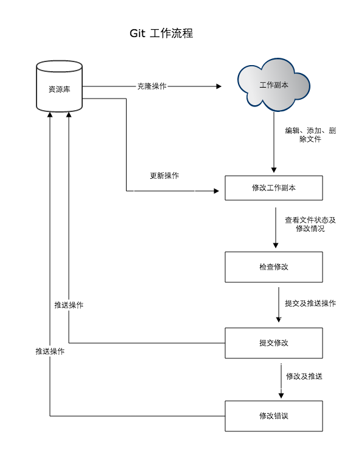
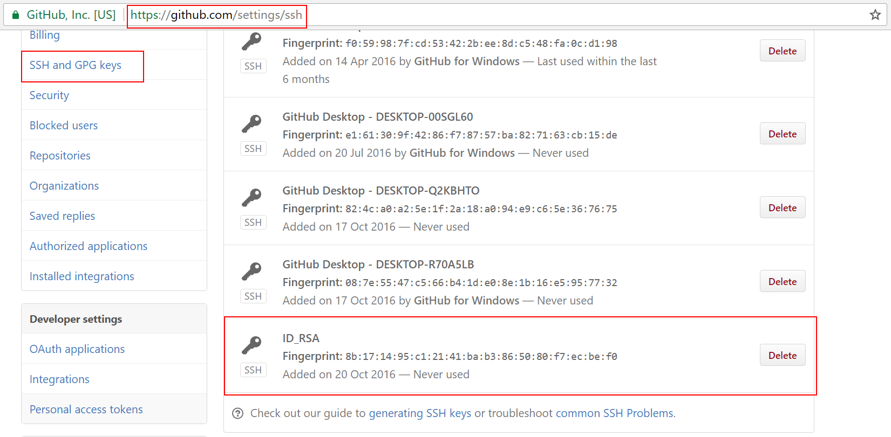
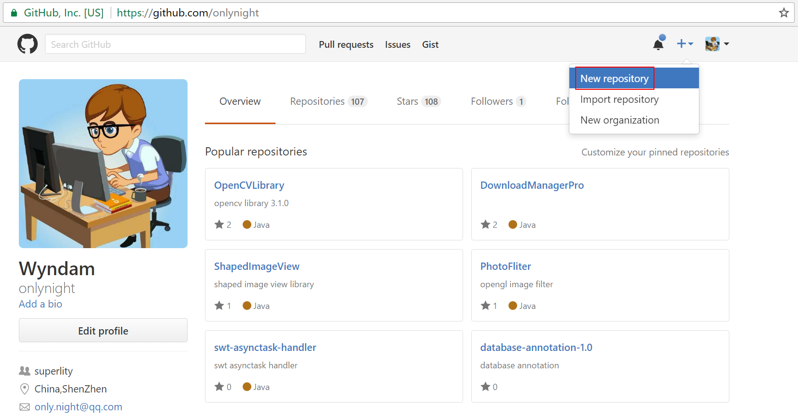
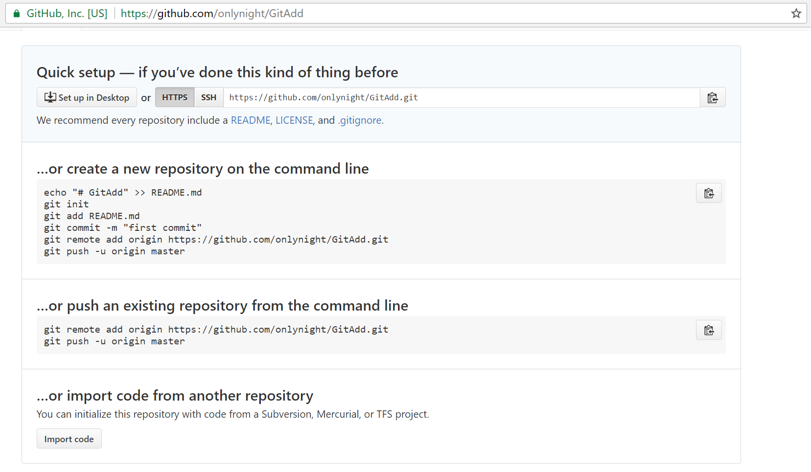

#Git使用教程

##Git是什么
Git是一个开源的分布式版本控制系统，用于敏捷高效地处理任何或小或大的项目。
Git是 Linus Torvalds 为了帮助管理 Linux 内核开发而开发的一个开放源码的版本控制软件。
Git与常用的版本控制工具 CVS, Subversion 等不同，它采用了分布式版本库的方式，不必服务器端软件支持。

##Git与SVN的区别
GIT不仅仅是个版本控制系统，它也是个内容管理系统(CMS),工作管理系统等。
如果你是一个具有使用SVN背景的人，你需要做一定的思想转换，来适应GIT提供的一些概念和特征。
Git 与 SVN 区别点：

1. GIT是分布式的，SVN不是：这是GIT和其它非分布式的版本控制系统，例如SVN，CVS等，最核心的区别。
2. GIT把内容按元数据方式存储，而SVN是按文件：所有的资源控制系统都是把文件的元信息隐藏在一个类似.svn,.cvs等的文件夹里。
3. GIT分支和SVN的分支不同：分支在SVN中一点不特别，就是版本库中的另外的一个目录。
4. GIT没有一个全局的版本号，而SVN有：目前为止这是跟SVN相比GIT缺少的最大的一个特征。
5. GIT的内容完整性要优于SVN：GIT的内容存储使用的是SHA-1哈希算法。这能确保代码内容的完整性，确保在遇到磁盘故障和网络问题时降低对版本库的破坏。

##Git配置 git config
Git 提供了一个叫做 git config 的工具，专门用来配置或读取相应的工作环境变量。
这些环境变量，决定了 Git 在各个环节的具体工作方式和行为。这些变量可以存放在以下三个不同的地方：
>/etc/gitconfig 文件：系统中对所有用户都普遍适用的配置。若使用 git config 时用 --system 选项，读写的就是这个文件。
>~/.gitconfig 文件：用户目录下的配置文件只适用于该用户。若使用 git config 时用 --global 选项，读写的就是这个文件。
>当前项目的 Git 目录中的配置文件（也就是工作目录中的 .git/config 文件）：这里的配置仅仅针对当前项目有效。每一个级别的配置都会覆盖上层的相同配置，所以 .git/config 里的配置会覆盖 /etc/gitconfig 中的同名变量。

>在 Windows 系统上，Git 会找寻用户主目录下的 .gitconfig 文件。主目录即 $HOME 变量指定的目录，一般都是 C:\Documents and Settings\$USER。

>此外，Git 还会尝试找寻 /etc/gitconfig 文件，只不过看当初 Git 装在什么目录，就以此作为根目录来定位。

###1.用户信息 git config user
配置个人的用户名称和电子邮件地址：

```bash
$ git config --global user.name "wyndam"
$ git config --global user.email "only.night@qq.com"
```

如果用了*--global*选项，那么更改的配置文件就是位于你用户主目录下的那个，以后你所有的项目都会默认使用这里配置的用户信息。
如果要在某个特定的项目中使用其他名字或者电邮，只要去掉*--global*选项重新配置即可，新的设定保存在当前项目的 .git/config 文件里。

###2.文本编辑器
设置Git默认使用的文本编辑器, 一般可能会是 Vi 或者 Vim。如果你有其他偏好，比如 Emacs 的话，可以重新设置：

```bash
$ git config --global core.editor emacs
```

###3.差异分析工具
还有一个比较常用的是，在解决合并冲突时使用哪种差异分析工具。比如要改用 vimdiff 的话：

```bash
$ git config --global merge.tool vimdiff
```

Git 可以理解 kdiff3，tkdiff，meld，xxdiff，emerge，vimdiff，gvimdiff，ecmerge，和 opendiff 等合并工具的输出信息。
当然，你也可以指定使用自己开发的工具，具体怎么做可以参阅后面的章节。

###4.查看配置信息 git config --list
要检查已有的配置信息，可以使用 git config --list 命令：

```bash
$ git config --list

core.symlinks=false
core.autocrlf=true
color.diff=auto
color.status=auto
color.branch=auto
color.interactive=true
pack.packsizelimit=2g
help.format=html
http.sslcainfo=E:/Platform/Git/mingw32/ssl/certs/ca-bundle.crt
diff.astextplain.textconv=astextplain
rebase.autosquash=true
filter.lfs.clean=git-lfs clean %f
filter.lfs.smudge=git-lfs smudge %f
filter.lfs.required=true
user.name=Wyndam
user.email=only.night@qq.com
core.editor=subl
```

有时候会看到重复的变量名，那就说明它们来自不同的配置文件（比如 /etc/gitconfig 和 ~/.gitconfig），不过最终 Git 实际采用的是最后一个。
这些配置我们也可以在 ~/.gitconfig 或 /etc/gitconfig 看到，如下所示：

```c
[filter "lfs"]
	clean = git-lfs clean %f
	smudge = git-lfs smudge %f
	required = true
[user]
	name = Wyndam
	email = only.night@qq.com
[core]
	editor = subl

```

也可以直接查阅某个环境变量的设定，只要把特定的名字跟在后面即可，像这样：

```bash
$ git config user.email

only.night@qq.com
```

#Git工作流程
本章节我们将为大家介绍 Git 的工作流程。
一般工作流程如下：
1. 克隆 Git 资源作为工作目录。
2. 在克隆的资源上添加或修改文件。
3. 如果其他人修改了，你可以更新资源。
4. 在提交前查看修改。
5. 提交修改。
6. 在修改完成后，如果发现错误，可以撤回提交并再次修改并提交。
下图展示了 Git 的工作流程：


#Git 工作区、暂存区和版本库

##基本概念
我们先来理解下Git 工作区、暂存区和版本库概念

+ *工作区：*就是你项目的目录（可见目录）。
+ *缓存区：*英文叫stage, 或index。一般存放在"git目录"下的index文件（.git/index）中，所以我们把暂存区有时也叫作索引（index）。
+ *版本库：*工作区有一个隐藏目录.git，这个不算工作区，而是Git的版本库。

下面这个图展示了工作区、版本库中的暂存区和版本库之间的关系：


#Git 创建仓库
本章节我们将为大家介绍如何创建一个 Git 仓库。
你可以使用一个已经存在的目录作为Git仓库。

##新建本地仓库 git init
Git 使用 git init 命令来初始化一个 Git 仓库，Git 的很多命令都需要在 Git 的仓库中运行，所以 git init 是使用 Git 的第一个命令。
在执行完成 git init 命令后，Git 仓库会生成一个 .git 目录，该目录包含了资源的所有元数据，其他的项目目录保持不变（不像 SVN 会在每个子目录生成 .svn 目录，Git 只在仓库的根目录生成 .git 目录）。

##使用方法
使用当前目录作为Git仓库，我们只需使它初始化。

```bash
$ git init
```

该命令执行完后会在当前目录生成一个 .git 目录。
使用我们指定目录作为Git仓库。

```bash
$ git init newrepo
```

初始化后，会在 newrepo 目录下会出现一个名为 .git 的目录，所有 Git 需要的数据和资源都存放在这个目录中。
如果当前目录下有几个文件想要纳入版本控制，需要先用 git add 命令告诉 Git 开始对这些文件进行跟踪，然后提交：

```bash
$ git add *.java
$ git add README.md
$ git commit -m "inital commit"
```

以上命令将目录下以 .java 结尾及 README.md 文件提交到仓库中。

##复制远程仓库 git clone
我们使用 git clone 从现有 Git 仓库中拷贝项目（类似 svn checkout）。
克隆仓库的命令格式为：

```bash
$ git clone <repo>
```

如果我们需要克隆到指定的目录，可以使用以下命令格式：

```bash
$ git clone <repo> <directory>
```

参数说明：

+ ```repo```:Git 仓库。
+ ```directory```:本地目录。

比如，要克隆 Ruby 语言的 Git 代码仓库 Grit，可以用下面的命令：

```bash
$ git clone git://github.com/schacon/grit.git
```

执行该命令后，会在当前目录下创建一个名为grit的目录，其中包含一个 .git 的目录，用于保存下载下来的所有版本记录。
如果要自己定义要新建的项目目录名称，可以在上面的命令末尾指定新的名字：

```bash
$ git clone git://github.com/schacon/grit.git mygrit
```

#Git基本操作
Git 的工作就是创建和保存你项目的快照及与之后的快照进行对比。本章将对有关创建与提交你的项目快照的命令作介绍。

##获取与创建项目命令

###git init
用 git init 在目录中创建新的 Git 仓库。 你可以在任何时候、任何目录中这么做，完全是本地化的。
在目录中执行 git init，就可以创建一个 Git 仓库了。比如我们创建 runoob 项目：

```bash
$ mkdir wyndam
$ cd wyndam/
$ git init
Initialized empty Git repository in C:/Users/lion/Desktop/wyndam/.git/
# 在 桌面/wyndam/ 目录初始化空 Git 仓库完毕。
```

现在你可以看到在你的项目中生成了 .git 这个子目录。 这就是你的 Git 仓库了，所有有关你的此项目的快照数据都存放在这里。

```bash
$ ls -a
.  ..  .git
```

###git clone
使用 git clone 拷贝一个 Git 仓库到本地，让自己能够查看该项目，或者进行修改。
如果你需要与他人合作一个项目，或者想要复制一个项目，看看代码，你就可以克隆那个项目。 执行命令：

```bash
$ git clone [url]
```

[url] 为你想要复制的项目git地址，就可以了。
例如我们克隆 Github 上的项目：

```bash
$ git clone https://www.github.com/onlynight/Proxy.git
Cloning into 'Proxy'...
remote: Counting objects: 50, done.
remote: Compressing objects: 100% (28/28), done.
remote: Total 50 (delta 13), reused 47 (delta 10), pack-reused 0
Unpacking objects: 100% (50/50), done.
Checking connectivity... done.
```

克隆完成后，在当前目录下会生成一个 simplegit 目录：

```bash
$ cd Proxy/
$ ls -a
.  ..  .git  .idea  Proxy.iml  README.md  images  src
```

默认情况下，Git 会按照你提供的 URL 所指示的项目的名称创建你的本地项目目录。 通常就是该 URL 最后一个 / 之后的项目名称。如果你想要一个不一样的名字， 你可以在该命令后加上你想要的名称。


##基本快照
Git 的工作就是创建和保存你的项目的快照及与之后的快照进行对比。本章将对有关创建与提交你的项目的快照的命令作介绍。

###添加文件到缓存 git add
git add 命令可将该文件添加到缓存，如我们添加以下两个文件：

```bash
$ touch README.md
$ touch HelloWorld.java
$ ls
HelloWorld.java  README.md
$ git status -s
?? HelloWorld.java
?? README.md
```

git status 命令用于查看项目的当前状态。
接下来我们执行 git add 命令来添加文件：

```bash
$ git add README.md HelloWorld.java
```

现在我们再执行 git status，就可以看到这两个文件已经加上去了。

```bash
$ git status -s
A  HelloWorld.java
A  README.md
```

新项目中，添加所有文件很普遍，我们可以使用 git add . 命令来添加当前项目的所有文件。
现在我们修改 README 文件：

```bash
$ vim README
#README.md
This is readme markdown file.
$ git status -s
A  HelloWorld.java
AM README.md
```

"AM" 状态的意思是，这个文件在我们将它添加到缓存之后又有改动。改动后我们在执行 git add 命令将其添加到缓存中：

```bash
$ git add .
$ git status -s
A  HelloWorld.java
A  README.md
```

当你要将你的修改包含在即将提交的快照里的时候，需要执行 git add。

###查看状态 git status
git status 以查看在你上次提交之后是否有修改。
我演示该命令的时候加了 -s 参数，以获得简短的结果输出。如果没加该参数会详细输出内容：

```bash
$ git status
On branch master

Initial commit

Changes to be committed:
  (use "git rm --cached <file>..." to unstage)

        new file:   HelloWorld.java
        new file:   README.md
```

###对比改动 git diff
执行 git diff 来查看执行 git status 的结果的详细信息。
git diff 命令显示已写入缓存与已修改但尚未写入缓存的改动的区别。git diff 有两个主要的应用场景。

+ 尚未缓存的改动：git diff
+ 查看已缓存的改动： git diff --cached
+ 查看已缓存的与未缓存的所有改动：git diff HEAD
+ 显示摘要而非整个 diff：git diff --stat

在 HelloWorld.java 文件中输入以下内容：

```java
public class HelloWorld {

	public static void main(String[] args) {
		System.out.println("Hello World!");
	}

}
```

```java
$ git status -s
AM HelloWorld.java
A  README.md
$ git diff
diff --git a/HelloWorld.java b/HelloWorld.java
index e69de29..68271e5 100644
--- a/HelloWorld.java
+++ b/HelloWorld.java
@@ -0,0 +1,7 @@
+public class HelloWorld {
+
+       public static void main(String[] args) {
+               System.out.println("Hello World!");
+       }
+
+}
```

git status 显示你上次提交更新后的更改或者写入缓存的改动， 而 git diff 一行一行地显示这些改动具体是啥。
接下来我们来查看下 git diff --cached 的执行效果：

```
$ git add HelloWorld.java
$ git status -s
A  HelloWorld.java
A  README.md
$ git diff --cached
diff --git a/HelloWorld.java b/HelloWorld.java
new file mode 100644
index 0000000..68271e5
--- /dev/null
+++ b/HelloWorld.java
@@ -0,0 +1,7 @@
+public class HelloWorld {
+
+       public static void main(String[] args) {
+               System.out.println("Hello World!");
+       }
+
+}
diff --git a/README.md b/README.md
new file mode 100644
index 0000000..8123762
--- /dev/null
+++ b/README.md
@@ -0,0 +1,3 @@
+#README.md
+
+This is readme markdown file.
```

###提交代码到本地仓库 git commit
使用 git add 命令将想要快照的内容写入缓存区， 而执行 git commit 将缓存区内容添加到仓库中。
Git 为你的每一个提交都记录你的名字与电子邮箱地址，所以第一步需要配置用户名和邮箱地址。

```bash
$ git config --golbal user.name 'wyndam'
$ git config --golbal user.email 'only.night@qq.com'
```

接下来我们写入缓存，并提交对 hello.php 的所有改动。在首个例子中，我们使用 -m 选项以在命令行中提供提交注释。

```bash
$ git add README.md
$ git add HelloWorld.java
$ git status -s
A  HelloWorld.java
A  README.md
$ git commit -m 'inital commit'
[master (root-commit) fdd5c53] inital commit
 2 files changed, 10 insertions(+)
 create mode 100644 HelloWorld.java
 create mode 100644 README.md
```

现在我们已经记录了快照。如果我们再执行 git status:

```bash
$ git status
On branch master
nothing to commit, working directory clean
```

以上输出说明我们在最近一次提交之后，没有做任何改动，是一个"working directory clean：干净的工作目录"。
如果你没有设置 -m 选项，Git 会尝试为你打开一个编辑器以填写提交信息。 如果 Git 在你对它的配置中找不到相关信息，默认会打开 vim。屏幕会像这样：

```
# Please enter the commit message for your changes. Lines starting
# with '#' will be ignored, and an empty message aborts the commit.
# On branch master
# Changes to be committed:
#   (use "git reset HEAD <file>..." to unstage)
#
# modified:   HelloWorld.java
#
~
~
".git/COMMIT_EDITMSG" 9L, 257C
```

如果你觉得 git add 提交缓存的流程太过繁琐，Git 也允许你用 -a 选项跳过这一步。命令格式如下：

```bash
$ git commit -a
```

我们先修改 HelloWorld.java 文件为以下内容：

```java
public class HelloWorld {

	public static void main(String[] args) {
		System.out.println("Hello World!!!");
	}

}
```

再执行以下命令：

```bash
$ git commit -am "修改HelloWorld.java文件"
[master c2c167c] 修改HelloWorld.java文件
 1 file changed, 1 insertion(+), 1 deletion(-)
```

###从缓存中移除文件 git reset HEAD
git reset HEAD 命令用于取消已缓存的内容。
我们先改动文件 README 文件，内容如下：

```
#README.md

##This is readme markdown file
```

HelloWorld.java 文件修改为：

```java
public class HelloWorld {

	public static void main(String[] args) {
		System.out.println("Hello World!");
	}

}
```

现在两个文件修改后，都提交到了缓存区，我们现在要取消其中一个的缓存，操作如下：

```bash
$ git status -s
 M HelloWorld.java
 M README.md
$ git add .
$ git status -s
M  HelloWorld.java
M  README.md
$ git reset HEAD -- HelloWorld.java
Unstaged changes after reset:
M       HelloWorld.java
$ git status -s
 M HelloWorld.java
M  README.md
```

现在你执行 git commit，只会将 README.md 文件的改动提交，而 HelloWorld.java 是没有的。

```bash
$ git commit -m "修改"
[master ad5f6fe] 修改
 1 file changed, 1 insertion(+), 1 deletion(-)
$ git status -s
 M HelloWorld.java
```

可以看到 HelloWorld.java 文件的修改并为提交。
这时我们可以使用以下命令将 HelloWorld.java 的修改提交：

```bash
$ git commit -am "修改 HelloWorld.java 文件"
[master a055c08] 修改 HelloWorld.java 文件
 1 file changed, 1 insertion(+), 1 deletion(-)
$ git status
On branch master
nothing to commit, working directory clean
```

简而言之，执行 git reset HEAD 以取消之前 git add 添加，但不希望包含在下一提交快照中的缓存。

###从缓存以及工作目录删除文件 git rm
git rm 会将条目从缓存区中移除。这与 git reset HEAD 将条目取消缓存是有区别的。 "取消缓存"的意思就是将缓存区恢复为我们做出修改之前的样子。
默认情况下，git rm file 会将文件从缓存区和你的硬盘中（工作目录）删除。
如果你要在工作目录中留着该文件，可以使用 git rm --cached：
如我们删除 hello.php文件：

```bash
$ git rm HelloWorld.java
rm 'HelloWorld.java'
$ ls
README.md
```

不从工作区中删除文件：

```bash
$ git rm README.md --cached
rm 'README.md'
$ ls
README.md
```

###修改缓存中文件名 git mv
git mv 命令做得所有事情就是 git rm --cached 命令的操作， 重命名磁盘上的文件，然后再执行 git add 把新文件添加到缓存区。
我们先把刚移除的 README 添加回来：

```bash
$ git add README.md
```

然后对其重名:

```bash
$ git mv README.md README
$ ls
README
```

#Git分支管理
几乎每一种版本控制系统都以某种形式支持分支。使用分支意味着你可以从开发主线上分离开来，然后在不影响主线的同时继续工作。
有人把 Git 的分支模型称为"必杀技特性"，而正是因为它，将 Git 从版本控制系统家族里区分出来。
创建分支命令：

```bash
git branch [branch name]
```

切换分支命令:

```bash
git checkout [branch name]
```

当你切换分支的时候，Git 会用该分支的最后提交的快照替换你的工作目录的内容， 所以多个分支不需要多个目录。
合并分支命令:

```bash
git merge
```

你可以多次合并到统一分支， 也可以选择在合并之后直接删除被并入的分支。

###Git分支管理

####列出分支 git branch
列出分支基本命令：

```bash
git branch
```

没有参数时，git branch 会列出你在本地的分支。

```bash
$ git branch
* master
```

此例的意思就是，我们有一个叫做"master"的分支，并且该分支是当前分支。
当你执行 git init 的时候，缺省情况下 Git 就会为你创建"master"分支。
如果我们要手动创建一个分支，并切换过去。执行 git branch (branchname) 即可。

```bash
$ git branch testing
$ git branch
* master
  testing
```

现在我们可以看到，有了一个新分支 testing。
当你以此方式在上次提交更新之后创建了新分支，如果后来又有更新提交， 然后又切换到了"testing"分支，Git 将还原你的工作目录到你创建分支时候的样子
接下来我们将演示如何切换分支，我们用 git checkout (branch) 切换到我们要修改的分支。

```bash
$ ls
README
$ echo 'w3cschool.cc' > test.txt
$ git add .
$ git commit -m 'add test.txt'
[master 048598f] add test.txt
 2 files changed, 1 insertion(+), 3 deletions(-)
 delete mode 100644 hello.php
 create mode 100644 test.txt
$ ls
README		test.txt
$ git checkout testing
Switched to branch 'testing'
$ ls
README.md		HelloWorld.java
```

当我们切换到"testing"分支的时候，我们添加的新文件test.txt被移除了, 原来被删除的文件hello.php文件又出现了。切换回"master"分支的时候，它们有重新出现了。

```bash
$ git checkout master
Switched to branch 'master'
$ ls
README		test.txt
```

首先我们在master分支中在添加一个新文件test2.txt:

```bash
$ touch test2.txt
$ git add test2.txt
$ git commit -m 'add test2.txt'
$ ls
README  test.txt  test2.txt
```

我们也可以使用 git checkout -b (branchname) 命令来创建新分支并立即切换到该分支下，从而在该分支中操作。

```bash
$ git checkout -b newtest
Switched to a new branch 'newtest'
$ git rm test2.txt 
rm 'test2.txt'
$ ls
README		test.txt
$ git commit -am 'removed test2.txt'
[newtest 556f0a0] removed test2.txt
 1 file changed, 1 deletion(-)
 delete mode 100644 test2.txt
$ git checkout master
Switched to branch 'master'
$ ls
README		test.txt	test2.txt
```

如你所见，我们创建了一个分支，在该分支的上下文中移除了一些文件，然后切换回我们的主分支，那些文件又回来了。
使用分支将工作切分开来，从而让我们能够在不同上下文中做事，并来回切换。

###删除分支 git branch -d
删除分支命令：

```bash
git branch -d [branch name]
```

例如我们要删除"testing"分支：

```bash
$ git branch
* master
  newtest
  testing
$ git branch -D testing
Deleted branch testing (was 84b13b9).
$ git branch
* master
  newtest
```

###分支合并 git merge
一旦某分支有了独立内容，你终究会希望将它合并回到你的主分支。 你可以使用以下命令将任何分支合并到当前分支中去：

```bash
git merge
```

```bash
$ git branch
* master
  newtest
$ ls
README		test.txt	test2.txt
$ git merge newtest
Updating a055c08..202199d
Fast-forward
 HelloWorld.java     | 7 -------
 README.md => README | 0
 test.txt            | 1 +
 3 files changed, 1 insertion(+), 7 deletions(-)
 delete mode 100644 HelloWorld.java
 rename README.md => README (100%)
 create mode 100644 test.txt
$ ls
README  test.txt
```

以上实例中我们将 newtest 分支合并到主分支去，test2.txt 文件被删除。

###合并冲突
合并并不仅仅是简单的文件添加、移除的操作，Git 也会合并修改。

```bash
$ git branch
* master
  newtest
$ cat test.txt
w3cschool.cc
```

首先，我们创建一个叫做"change_site"的分支，切换过去，我们将内容改为 www.w3cschool.cc 。

```bash
$ git checkout -b change_site
Switched to a new branch 'change_site'
$ vim test.txt 
$ head -1 test.txt 
www.w3cschool.cc
$ git commit -am 'changed the site'
[change_site d7e7346] changed the site
 1 file changed, 1 insertion(+), 1 deletion(-)
```

将修改的内容提交到 "change_site" 分支中。 现在，假如切换回 "master" 分支我们可以看内容恢复到我们修改前的，我们再次修改test.txt文件。

```bash
$ git checkout master
Switched to branch 'master'
$ head -1 test.txt 
w3cschool.cc
$ vim test.txt 
$ cat test.txt
w3cschool.cc
新增加一行
$ git diff
diff --git a/test.txt b/test.txt
index 704cce7..f84c2a4 100644
--- a/test.txt
+++ b/test.txt
@@ -1 +1,2 @@
 w3cschool.cc
+新增加一行
$ git commit -am '新增加一行'
[master 14b4dca] 新增加一行
 1 file changed, 1 insertion(+)
```

现在这些改变已经记录到我的 "master" 分支了。接下来我们将 "change_site" 分支合并过来。

```bash
$ git merge change_site
Auto-merging test.txt
CONFLICT (content): Merge conflict in test.txt
Automatic merge failed; fix conflicts and then commit the result.
$ cat test.txt 
<<<<<<< HEAD
w3cschool.cc
新增加一行
=======
www.w3cschool.cc
>>>>>>> change_site
```

我们将前一个分支合并到 "master" 分支，一个合并冲突就出现了，接下来我们需要手动去修改它。

```bash
$ vim test.txt 
$ cat test.txt 
www.w3cschool.cc
新增加一行
$ git diff
diff --cc test.txt
index f84c2a4,bccb7c2..0000000
--- a/test.txt
+++ b/test.txt
@@@ -1,2 -1,1 +1,2 @@@
- w3cschool.cc
+ www.w3cschool.cc
 +新增加一行
```

在 Git 中，我们可以用 git add 要告诉 Git 文件冲突已经解决

```bash
$ git status -s
UU test.txt
$ git add test.txt 
$ git status -s
M  test.txt
$ git commit
[master 88afe0e] Merge branch 'change_site'
```

#Git 查看提交历史 git log
在使用 Git 提交了若干更新之后，又或者克隆了某个项目，想回顾下提交历史，我们可以使用 git log 命令查看。
针对我们前一章节的操作，使用 git log 命令列出历史提交记录如下：

```bash
$ git log
commit 2b5970dc2a936649791afc8cedb6dbaee46d2176
Merge: e2714c9 d17a0a0
Author: Wyndam <only.night@qq.com>
Date:   Thu Oct 20 17:00:57 2016 +0800

    Merge branch 'change_site'

commit e2714c9ecf376efefc8d149ac219a6e98c80790b
Author: Wyndam <only.night@qq.com>
Date:   Thu Oct 20 16:58:09 2016 +0800

    新增加一行

commit d17a0a0065e1e1d1c1078cfabf18f2c8491f0b7c
Author: Wyndam <only.night@qq.com>
Date:   Thu Oct 20 16:54:13 2016 +0800

    change the site

commit 202199d023f307e74229e46ee90fc351d2e6d4f6
Author: Wyndam <only.night@qq.com>
Date:   Thu Oct 20 15:50:55 2016 +0800

    add test.txt file

commit a055c0816bc94a9abe21ffe4a4014851943ea139
Author: Wyndam <only.night@qq.com>
Date:   Thu Oct 20 15:35:50 2016 +0800

    修改 HelloWorld.java 文件

commit ad5f6fe0474c52c464e94cd41faf45e705445847
Author: Wyndam <only.night@qq.com>
Date:   Thu Oct 20 15:34:16 2016 +0800

    修改

commit c2c167c36533768be8fc91e4cb3ba0b7d328a074
Author: Wyndam <only.night@qq.com>
Date:   Thu Oct 20 15:24:41 2016 +0800

    修改HelloWorld.java文件

commit f9393bf0e7f701248b56c97827a9d101e74b3952
Author: Wyndam <only.night@qq.com>
Date:   Thu Oct 20 15:21:02 2016 +0800

    third commit
    ``

commit 316fafcf38bb2eb600f4226345ea09a4e37d9ec4
Author: Wyndam <only.night@qq.com>
Date:   Thu Oct 20 15:18:58 2016 +0800

    second commit

commit fdd5c53457270c10a163a0cf3fcfd9027e6e1ecb
Author: Wyndam <only.night@qq.com>
Date:   Thu Oct 20 15:10:43 2016 +0800

    inital commit
```

我们可以用 --oneline 选项来查看历史记录的简洁的版本。

```bash
$ git log --oneline
2b5970d Merge branch 'change_site'
e2714c9 新增加一行
d17a0a0 change the site
202199d add test.txt file
a055c08 修改 HelloWorld.java 文件
ad5f6fe 修改
c2c167c 修改HelloWorld.java文件
f9393bf third commit ``
316fafc second commit
fdd5c53 inital commit
```

这告诉我们的是，此项目的开发历史。
我们还可以用 --graph 选项，查看历史中什么时候出现了分支、合并。以下为相同的命令，开启了拓扑图选项：

```bash
$ git log --oneline --graph
*   2b5970d Merge branch 'change_site'
|\
| * d17a0a0 change the site
* | e2714c9 新增加一行
|/
* 202199d add test.txt file
* a055c08 修改 HelloWorld.java 文件
* ad5f6fe 修改
* c2c167c 修改HelloWorld.java文件
* f9393bf third commit ``
* 316fafc second commit
* fdd5c53 inital commit
```

现在我们可以更清楚明了地看到何时工作分叉、又何时归并。
你也可以用 '--reverse'参数来逆向显示所有日志。

```bash
$ git log --oneline --reverse
fdd5c53 inital commit
316fafc second commit
f9393bf third commit ``
c2c167c 修改HelloWorld.java文件
ad5f6fe 修改
a055c08 修改 HelloWorld.java 文件
202199d add test.txt file
d17a0a0 change the site
e2714c9 新增加一行
2b5970d Merge branch 'change_site'
```

如果只想查找指定用户的提交日志可以使用命令：git log --author , 例如，比方说我们要找 Git 源码中 Linus 提交的部分：

```bash
$ git log --author=Linus --oneline -5
81b50f3 Move 'builtin-*' into a 'builtin/' subdirectory
3bb7256 make "index-pack" a built-in
377d027 make "git pack-redundant" a built-in
b532581 make "git unpack-file" a built-in
112dd51 make "mktag" a built-in
```

如果你要指定日期，可以执行几个选项：--since 和 --before，但是你也可以用 --until 和 --after。
例如，如果我要看 Git 项目中三周前且在四月十八日之后的所有提交，我可以执行这个（我还用了 --no-merges 选项以隐藏合并提交）：

```bash
$ git log --oneline --before={3.weeks.ago} --after={2010-04-18} --no-merges
5469e2d Git 1.7.1-rc2
d43427d Documentation/remote-helpers: Fix typos and improve language
272a36b Fixup: Second argument may be any arbitrary string
b6c8d2d Documentation/remote-helpers: Add invocation section
5ce4f4e Documentation/urls: Rewrite to accomodate transport::address
00b84e9 Documentation/remote-helpers: Rewrite description
03aa87e Documentation: Describe other situations where -z affects git diff
77bc694 rebase-interactive: silence warning when no commits rewritten
636db2c t3301: add tests to use --format="%N"
```

#Git 标签 git tag
如果你达到一个重要的阶段，并希望永远记住那个特别的提交快照，你可以使用 git tag 给它打上标签。
比如说，我们想为我们的 w3cschoolcc 项目发布一个"1.0"版本。 我们可以用 git tag -a v1.0 命令给最新一次提交打上（HEAD）"v1.0"的标签。
-a 选项意为"创建一个带注解的标签"。 不用 -a 选项也可以执行的，但它不会记录这标签是啥时候打的，谁打的，也不会让你添加个标签的注解。 我推荐一直创建带注解的标签。

```bash
$ git tag -a v1.0
```

当你执行 git tag -a 命令时，Git 会打开你的编辑器，让你写一句标签注解，就像你给提交写注解一样。
现在，注意当我们执行 git log --decorate 时，我们可以看到我们的标签了：

```bash
$ git log --oneline --graph --decorate
*   2b5970d (HEAD -> master, tag: v1.0) Merge branch 'change_site'
|\
| * d17a0a0 (change_site) change the site
* | e2714c9 新增加一行
|/
* 202199d (newtest) add test.txt file
* a055c08 修改 HelloWorld.java 文件
* ad5f6fe 修改
* c2c167c 修改HelloWorld.java文件
* f9393bf third commit ``
* 316fafc second commit
* fdd5c53 inital commit
```

如果我们忘了给某个提交打标签，又将它发布了，我们可以给它追加标签。
例如，假设我们发布了提交 85fc7e7(上面实例最后一行)，但是那时候忘了给它打标签。 我们现在也可以：

```bash
$ git tag -a v0.9 a055c08
$ git log --oneline --graph --decorate
*   2b5970d (HEAD -> master, tag: v1.0) Merge branch 'change_site'
|\
| * d17a0a0 (change_site) change the site
* | e2714c9 新增加一行
|/
* 202199d (newtest) add test.txt file
* a055c08 (tag: v0.9) 修改 HelloWorld.java 文件
* ad5f6fe 修改
* c2c167c 修改HelloWorld.java文件
* f9393bf third commit ``
* 316fafc second commit
* fdd5c53 inital commit
```

如果我们要查看所有标签可以使用以下命令：

```bash
$ git tag
v0.9
v1.0
```

指定标签信息命令：

```bash
git tag -a <tagname> -m "w3cschool.cc标签"
```

PGP签名标签命令：

```bash
git tag -s <tagname> -m "w3cschool.cc标签"
```

#Git 远程仓库
Git 并不像 SVN 那样有个中心服务器。
目前我们使用到的 Git 命令都是在本地执行，如果你想通过 Git 分享你的代码或者与其他开发人员合作。 你就需要将数据放到一台其他开发人员能够连接的服务器上。

##添加远程库 git remote add
要添加一个新的远程仓库，可以指定一个简单的名字，以便将来引用,命令格式如下：

```bash
git remote add [shortname] [url]
```

本例以Github为例作为远程仓库，如果你没有Github可以在官网https://github.com/注册。
由于你的本地Git仓库和GitHub仓库之间的传输是通过SSH加密的，所以我们需要配置验证信息：
使用以下命令生成SSH Key：

```bash
$ ssh-keygen -t rsa -C "youremail@example.com"
```

后面的your_email@youremail.com改为你在github上注册的邮箱，之后会要求确认路径和输入密码，我们这使用默认的一路回车就行。成功的话会在~/下生成.ssh文件夹，进去，打开id_rsa.pub，复制里面的key。
回到github上，进入 Account Settings（账户配置），左边选择SSH Keys，Add SSH Key,title随便填，粘贴在你电脑上生成的key。



为了验证是否成功，输入以下命令：

```
$ ssh -T git@github.com
Hi onlynight! You've successfully authenticated, but GitHub does not provide shell access.
```

输出以上结果证明已经正确配置密钥。

之后登录后点击" New repository " 如下图所示：



之后在在Repository name 填入 GitAdd(远程仓库名) ，description中填写描述"git add test"，其他保持默认设置，点击"Create repository"按钮，就成功地创建了一个新的Git仓库：


创建成功后，显示如下信息：



以上信息告诉我们可以从这个仓库克隆出新的仓库，也可以把本地仓库的内容推送到GitHub仓库。
现在，我们根据GitHub的提示，在本地的仓库下运行命令：

```bash
$ ls
README  test.txt
$ git remote add origin git@github.com:onlynight/GitAdd.git
$ git push -u origin master
Counting objects: 26, done.
Delta compression using up to 4 threads.
Compressing objects: 100% (20/20), done.
Writing objects: 100% (26/26), 2.44 KiB | 0 bytes/s, done.
Total 26 (delta 4), reused 0 (delta 0)
remote: Resolving deltas: 100% (4/4), done.
To git@github.com:onlynight/GitAdd.git
 * [new branch]      master -> master
Branch master set up to track remote branch master from origin.
```

##查看当前的远程库 git remote
要查看当前配置有哪些远程仓库，可以用命令：

```bash
git remote
```

```bash
$ git remote
origin
$ git remote -v
```

执行时加上 -v 参数，你还可以看到每个别名的实际链接地址。

##提取远程仓库
Git 有两个命令用来提取远程仓库的更新。

###1. 从远程仓库下载新分支与数据： git fetch

```bash
git fetch
```

该命令执行完后需要执行git merge 远程分支到你所在的分支。

###2. 从远端仓库提取数据并尝试合并到当前分支： git pull

```bash
git pull
```

该命令就是在执行 git fetch 之后紧接着执行 git merge 远程分支到你所在的任意分支。
假设你配置好了一个远程仓库，并且你想要提取更新的数据，你可以首先执行 git fetch [alias] 告诉 Git 去获取它有你没有的数据，然后你可以执行 git merge [alias]/[branch] 以将服务器上的任何更新（假设有人这时候推送到服务器了）合并到你的当前分支。

接下来我们在 Github 上点击"test.txt" 并在线修改它。之后我们在本地更新修改。

```bash
$ git fetch origin
remote: Counting objects: 3, done.
remote: Compressing objects: 100% (3/3), done.
remote: Total 3 (delta 0), reused 0 (delta 0), pack-reused 0
Unpacking objects: 100% (3/3), done.
From github.com:onlynight/GitAdd
   774112b..37be49b  master     -> origin/master
```

以上信息"774112b..37be49b  master     -> origin/master" 说明 master 分支已被更新，我们可以使用以下命令将更新同步到本地：

```bash
$ git merge origin/master
Updating 774112b..37be49b
Fast-forward
 test.txt | 1 +
 1 file changed, 1 insertion(+)
```

##推送到远程仓库 git push
推送你的新分支与数据到某个远端仓库命令:

```bash
git push [alias] [branch]
```

以上命令将你的 [branch] 分支推送成为 [alias] 远程仓库上的 [branch] 分支，实例如下。

```bash
$ git push origin master
Everything up-to-date
```


##删除远程分支 git push <alias> :<branch name> 
注意：如果要*删除远程分支*同样也是使用push命令，在分支前加上":"表示*删除远程分支*，代码如下：

```bash
$ git push origin :<branch name>
```


##删除本地仓库的远程仓库链接 git remote rm
删除远程仓库你可以使用命令：

```bash
git remote rm [alias]
```

```bash
$ git remote -v
origin  git@github.com:onlynight/GitAdd.git (fetch)
origin  git@github.com:onlynight/GitAdd.git (push)
$ git remote -v
origin  git@github.com:onlynight/GitAdd.git (fetch)
origin  git@github.com:onlynight/GitAdd.git (push)
origin2 git@github.com:onlnynight/GitAdd.git (fetch)
origin2 git@github.com:onlnynight/GitAdd.git (push)
$ git remote rm origin2
$ git remote -v
origin  git@github.com:onlynight/GitAdd.git (fetch)
origin  git@github.com:onlynight/GitAdd.git (push)
```
