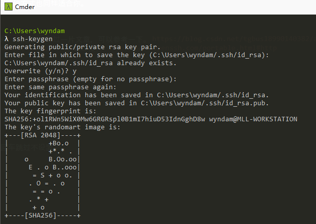
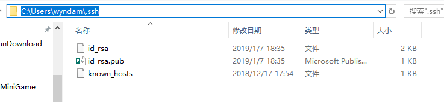
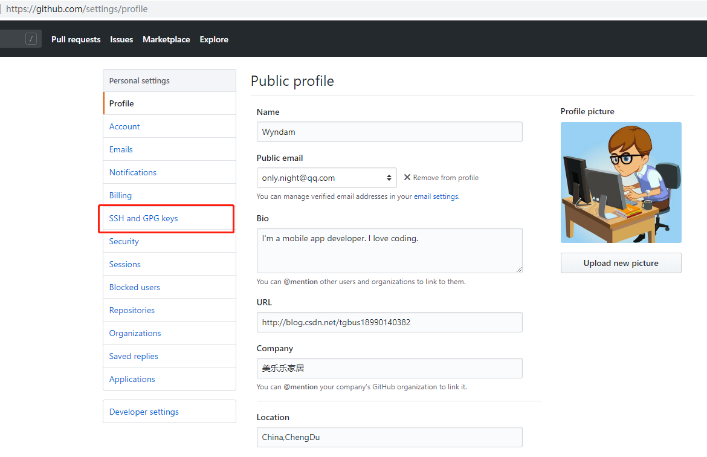
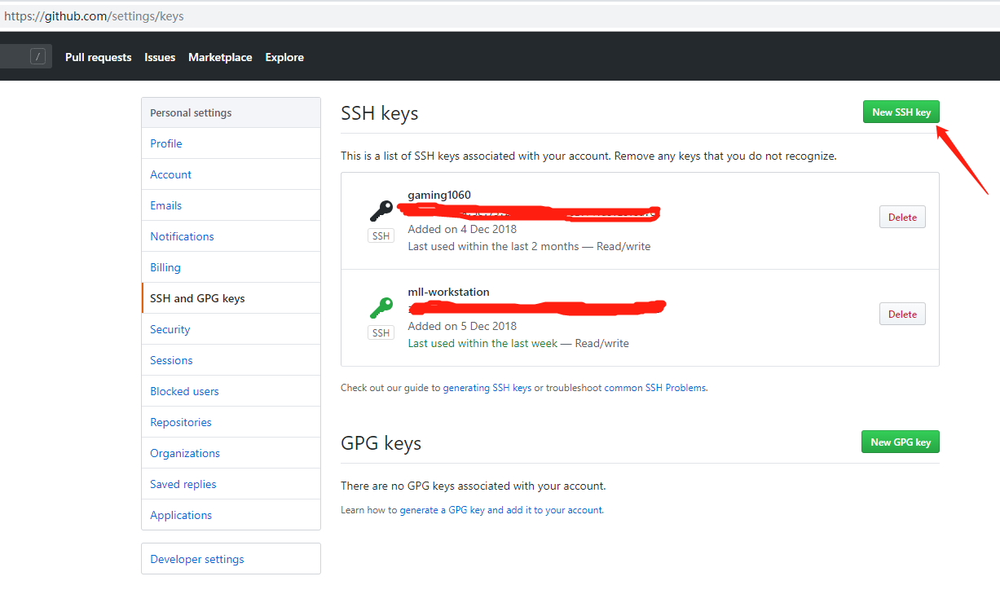
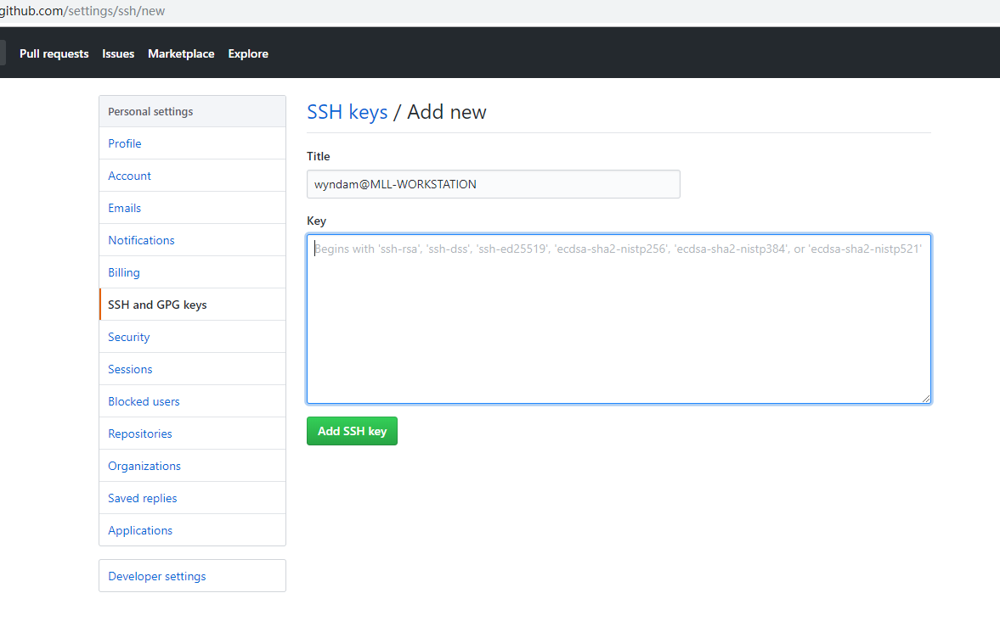
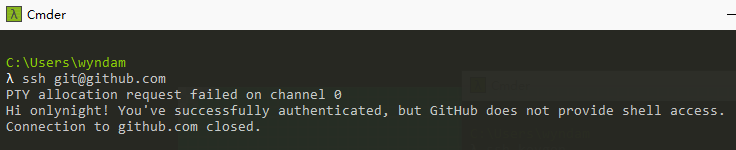
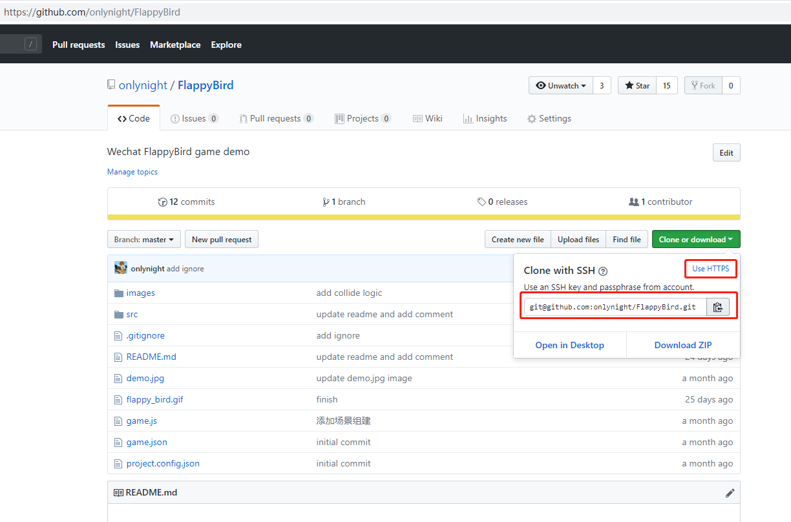

Github 无法提交&提交缓慢
=======================

由于特殊原因，国内访问 github 总是不能很顺利的进行，有时候我们需要使用特殊的上网技巧才能正常访问。

	这里笔者公司的网络经常会遇到能够访问 github 但是经常提示 443 禁止访问错误，或者提交缓慢网络中断导致提交失败。

下面我们说一种特殊的技巧，在不使用科学上网的情况下提高提交成功率，当然只是提高成功率并不能保证百分百提交成功。

## 原理

一般我们使用 git 时通常会使用 https 访问服务器，https本省就存在建立连接慢的问题，再加上国内特殊情况，TTL超时也很正常。这里我们改用 SSH 的方式访问服务器，减少中间的建立连接的损耗。
经笔者测试，修改后还没有出现过443超时问题，希望这种方式也同样适合你。

## 准备

1. 保证你的网络可以访问github，如果不能正常访问，我之前还写过一片文章，可以参考一下。 https://blog.csdn.net/tgbus18990140382/article/details/81145339
2. 下载 ssh 工具 OpenSSH； 官网 http://www.openssh.com/ ； 下载连接： http://www.openssh.com/portable.html#http
2. 安装完成 OpenSSH 后配置好环境变量

## 生成 SSH key 并在 github 中配置公钥

### 生成 key

```bash
~ ssh-keygen
```

命令行中会要求我们配置文件名和密码，我们全部以回车跳过不设置。



然后，会在用户目录下新建一个 .ssh 文件夹，并将密钥文件放在其中，如下图：



### github 中配置公钥








这里填入 id_rsa.pub 文件中的内容

### 测试 ssh 是否配置成功

输入如下命令行测试是否配置成功：

```bash
~ ssh git@github.com
```

配置成功后会得到如下输出:



## 使用

以后我们使用 git 的时候就要选用 ssh 连接即可：

