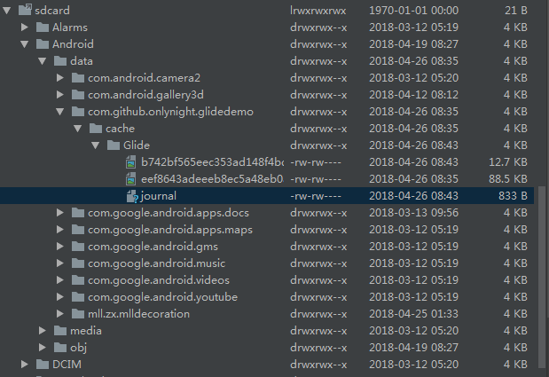
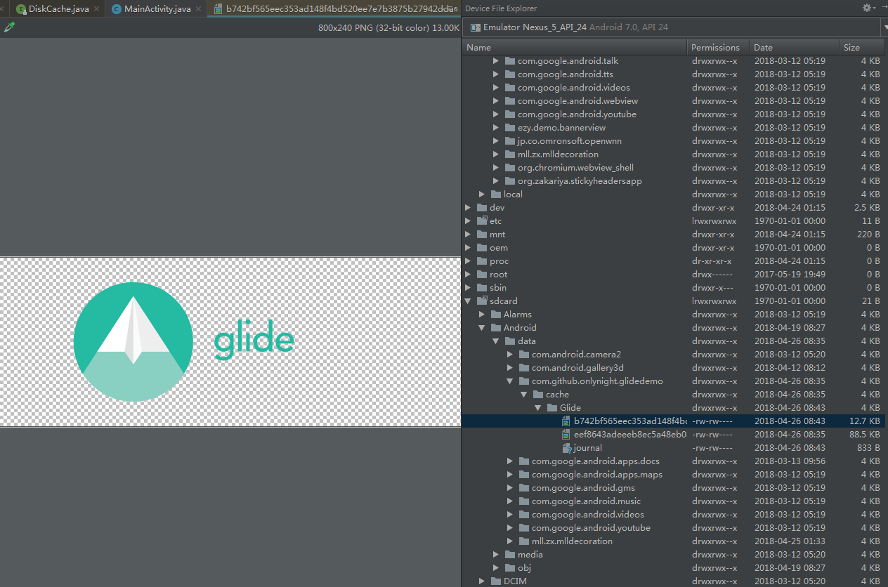

Glide DiskCache 原理分析
========================

# 1.感性认识DiskCache

### DiskCache默认设置:

#### a.内部存储位置

> 内部存储位置: /data/{package}/cache/image_manager_disk_cache/

```java
public interface DiskCache {

  /**
   * An interface for lazily creating a disk cache.
   */
  interface Factory {
    /** 250 MB of cache. */
    int DEFAULT_DISK_CACHE_SIZE = 250 * 1024 * 1024;
    String DEFAULT_DISK_CACHE_DIR = "image_manager_disk_cache";

    /** Returns a new disk cache, or {@code null} if no disk cache could be created. */
    @Nullable
    DiskCache build();
  }
}

public final class InternalCacheDiskCacheFactory extends DiskLruCacheFactory {

  public InternalCacheDiskCacheFactory(final Context context, final String diskCacheName, long diskCacheSize) {
    super(new CacheDirectoryGetter() {
      @Override
      public File getCacheDirectory() {
        File cacheDirectory = context.getCacheDir();
        if (cacheDirectory == null) {
          return null;
        }
        if (diskCacheName != null) {
          return new File(cacheDirectory, diskCacheName);
        }
        return cacheDirectory;
      }
    }, diskCacheSize);
  }
}

```

#### b.外部存储位置

> 外部存储位置: /sdcard/Android/data/{package}/cache/{path}

```java
public final class ExternalPreferredCacheDiskCacheFactory extends DiskLruCacheFactory {

  public ExternalPreferredCacheDiskCacheFactory(final Context context, final String diskCacheName,
                                                final long diskCacheSize) {
    super(new CacheDirectoryGetter() {
      @Nullable
      private File getInternalCacheDirectory() {
        File cacheDirectory = context.getCacheDir();
        if (cacheDirectory == null) {
          return null;
        }
        if (diskCacheName != null) {
          return new File(cacheDirectory, diskCacheName);
        }
        return cacheDirectory;
      }
    }, diskCacheSize);
  }
}
```

#### c.存储目录结构如下





可以看到类似MD5编码命名的文件就是缓存的图片文件了，然后我们看到还有一个叫做**journal**的文件，journal一般会用做为操作日志，我们尝试以文本文件打开它。

```
libcore.io.DiskLruCache
1
1
1

DIRTY eef8643adeeeb8ec5a48eb0aba1671afaca7c1b35b850eb772136df314e753aa
CLEAN eef8643adeeeb8ec5a48eb0aba1671afaca7c1b35b850eb772136df314e753aa 90642
READ eef8643adeeeb8ec5a48eb0aba1671afaca7c1b35b850eb772136df314e753aa
DIRTY 0dfde9b300ee5723ee1a3686c2c96c0e60db1a8723cc4b3c4f551c79c51fc0d7
CLEAN 0dfde9b300ee5723ee1a3686c2c96c0e60db1a8723cc4b3c4f551c79c51fc0d7 54978
READ eef8643adeeeb8ec5a48eb0aba1671afaca7c1b35b850eb772136df314e753aa
DIRTY b742bf565eec353ad148f4bd520ee7e7b3875b27942ddae7237c6fed691baee9
CLEAN b742bf565eec353ad148f4bd520ee7e7b3875b27942ddae7237c6fed691baee9 13002
READ eef8643adeeeb8ec5a48eb0aba1671afaca7c1b35b850eb772136df314e753aa
DIRTY b742bf565eec353ad148f4bd520ee7e7b3875b27942ddae7237c6fed691baee9
CLEAN b742bf565eec353ad148f4bd520ee7e7b3875b27942ddae7237c6fed691baee9 13002
```

再没看源码的情况下，也能大概猜到这些操作的功能，接下来我们通过源码对LRUDiskCache做一个理性的认识。


# 2.理性认识DiskCache

### LinkedHashMap复习

首先我们来复习一下LinkedHashMap的作用，以及其使用场景。

LinkedHashMap内部维护了一个双链表，用来保证元素的访问顺序固定。

```java
/**
 * Constructs an empty <tt>LinkedHashMap</tt> instance with the
 * specified initial capacity, load factor and ordering mode.
 *
 * @param  initialCapacity the initial capacity
 * @param  loadFactor      the load factor
 * @param  accessOrder     the ordering mode - <tt>true</tt> for
 *         access-order, <tt>false</tt> for insertion-order
 * @throws IllegalArgumentException if the initial capacity is negative
 *         or the load factor is nonpositive
 */
public LinkedHashMap(int initialCapacity,
                     float loadFactor,
                     boolean accessOrder) {
  super(initialCapacity, loadFactor);
  this.accessOrder = accessOrder;
}
```

```LinkedHashMap``` 有这样一个构造函数，最后一个参数 ```accessOrder```。当 ```accessOrder``` 为true时候表示链表已访问顺序排序，最后访问的元素将会放到链表的末尾；当 ```accessOrder``` 为false时表示元素访问顺序为插入顺序。

这样根据传入参数的不同就可用LinkedHashMap实现不同的算法：

```accessOrder=true``` LRU，最后被访问的元素将会放到链尾。
```accessOrder=false``` FIFO，最先插入的元素在链头，最后插入的元素在链尾，实现了队列的功能。

> 很显然我们使用的是LinkedHashMap的LRU特性，我们把accessOrder设置为true，从头开始遍历即访问到的元素即是最少访问的元素。

### DiskLruCache

#### DiskLruCache 如何保证磁盘缓存不超过最大值

```java

private long maxSize;
private final int valueCount;
private long size = 0;
private Writer journalWriter;
private final LinkedHashMap<String, Entry> lruEntries =
    new LinkedHashMap<String, Entry>(0, 0.75f, true);
private int redundantOpCount;

private void trimToSize() throws IOException {
  while (size > maxSize) {
    Map.Entry<String, Entry> toEvict = lruEntries.entrySet().iterator().next();
    remove(toEvict.getKey());
  }
}

```

以上这段代码就是保证磁盘缓存size的核心代码，利用了LinkedHashMap的accessOrder的特性实现LRU，移除访问最少的entity。


#### journal文件解析

```java
/*
 * This cache uses a journal file named "journal". A typical journal file
 * looks like this:
 *     libcore.io.DiskLruCache
 *     1
 *     100
 *     2
 *
 *     CLEAN 3400330d1dfc7f3f7f4b8d4d803dfcf6 832 21054
 *     DIRTY 335c4c6028171cfddfbaae1a9c313c52
 *     CLEAN 335c4c6028171cfddfbaae1a9c313c52 3934 2342
 *     REMOVE 335c4c6028171cfddfbaae1a9c313c52
 *     DIRTY 1ab96a171faeeee38496d8b330771a7a
 *     CLEAN 1ab96a171faeeee38496d8b330771a7a 1600 234
 *     READ 335c4c6028171cfddfbaae1a9c313c52
 *     READ 3400330d1dfc7f3f7f4b8d4d803dfcf6
 *
 * The first five lines of the journal form its header. They are the
 * constant string "libcore.io.DiskLruCache", the disk cache's version,
 * the application's version, the value count, and a blank line.
 *
 * Each of the subsequent lines in the file is a record of the state of a
 * cache entry. Each line contains space-separated values: a state, a key,
 * and optional state-specific values.
 *   o DIRTY lines track that an entry is actively being created or updated.
 *     Every successful DIRTY action should be followed by a CLEAN or REMOVE
 *     action. DIRTY lines without a matching CLEAN or REMOVE indicate that
 *     temporary files may need to be deleted.
 *   o CLEAN lines track a cache entry that has been successfully published
 *     and may be read. A publish line is followed by the lengths of each of
 *     its values.
 *   o READ lines track accesses for LRU.
 *   o REMOVE lines track entries that have been deleted.
 *
 * The journal file is appended to as cache operations occur. The journal may
 * occasionally be compacted by dropping redundant lines. A temporary file named
 * "journal.tmp" will be used during compaction; that file should be deleted if
 * it exists when the cache is opened.
 */
```

其中第一行固定为libcore.io.DiskLruCache；第二行是DiskLruCache的版本，目前固定为1；第三行表示所属应用的版本号；第四行valueCount表示一个缓存key可能对应多少个缓存文件，它决定了后面一个CLEAN状态记录最多可以size大小数据；第五行是空行。此后记录的就是DiskLruCache针对磁盘缓存的操作记录了。其中几个状态表示如下：

**CLEAN** 表示缓存处于一个稳定状态，即当前没有对该缓存数据进行写操作，在该状态下，对缓存文件的读写都是安全的。
**DIRTY** 表示当前该key对应的缓存文件正在被修改，该状态下对缓存文件的读写都是不安全的，需要阻塞到对文件的修改完成，使该key对应的状态转变成CLEAN为止。
**REMOVE** 表示该key对应的缓存文件被删除了，在缓存整理的过程中可能会出现多条这样的记录。
**READ** 表示一个对key对应的缓存文件进行读取的操作记录。
每个操作记录状态后面都有一个字符串，表示缓存的key，其中CLEAN状态在后面还会有一个或者多个数字，这些数字表示对应缓存文件的大小。之所以允许一个key对应多个文件，主要是考虑到满足类似于一张图片可能存在多个大小和分辨率不同的缓存的功能。

#### DiskLruCache 缓存文件管理

根据存储结构的不同我们知道，DiskCache不能像MemoryCache一样是一整块的，一整块的文件操作就会存在文件内部的有效数据移动操作，这样反而效率很低；所以将每个图片单独缓存到文件中，便于删除。

从 ```DiskLruCache``` 的源码可以看出，```DiskLruCache``` 实际上就是一个文件管理器，添加了LRU策略的文件管理器。并通过journal文件保存缓存文件的操作记录，配合LinkedHashMap实现LRU策略。

```java
private void readJournal() throws IOException {
  StrictLineReader reader = new StrictLineReader(new FileInputStream(journalFile), Util.US_ASCII);
  try {
    String magic = reader.readLine();
    String version = reader.readLine();
    String appVersionString = reader.readLine();
    String valueCountString = reader.readLine();
    String blank = reader.readLine();
    if (!MAGIC.equals(magic)
        || !VERSION_1.equals(version)
        || !Integer.toString(appVersion).equals(appVersionString)
        || !Integer.toString(valueCount).equals(valueCountString)
        || !"".equals(blank)) {
      throw new IOException("unexpected journal header: [" + magic + ", " + version + ", "
          + valueCountString + ", " + blank + "]");
    }

    int lineCount = 0;
    while (true) {
      try {
        readJournalLine(reader.readLine());
        lineCount++;
      } catch (EOFException endOfJournal) {
        break;
      }
    }
    redundantOpCount = lineCount - lruEntries.size();

    // If we ended on a truncated line, rebuild the journal before appending to it.
    if (reader.hasUnterminatedLine()) {
      rebuildJournal();
    } else {
      journalWriter = new BufferedWriter(new OutputStreamWriter(
          new FileOutputStream(journalFile, true), Util.US_ASCII));
    }
  } finally {
    Util.closeQuietly(reader);
  }
}

private void readJournalLine(String line) throws IOException {
  int firstSpace = line.indexOf(' ');
  if (firstSpace == -1) {
    throw new IOException("unexpected journal line: " + line);
  }

  int keyBegin = firstSpace + 1;
  int secondSpace = line.indexOf(' ', keyBegin);
  final String key;
  if (secondSpace == -1) {
    key = line.substring(keyBegin);
    if (firstSpace == REMOVE.length() && line.startsWith(REMOVE)) {
      lruEntries.remove(key);
      return;
    }
  } else {
    key = line.substring(keyBegin, secondSpace);
  }

  Entry entry = lruEntries.get(key);
  if (entry == null) {
    entry = new Entry(key);
    lruEntries.put(key, entry);
  }

  if (secondSpace != -1 && firstSpace == CLEAN.length() && line.startsWith(CLEAN)) {
    String[] parts = line.substring(secondSpace + 1).split(" ");
    entry.readable = true;
    entry.currentEditor = null;
    entry.setLengths(parts);
  } else if (secondSpace == -1 && firstSpace == DIRTY.length() && line.startsWith(DIRTY)) {
    entry.currentEditor = new Editor(entry);
  } else if (secondSpace == -1 && firstSpace == READ.length() && line.startsWith(READ)) {
    // This work was already done by calling lruEntries.get().
  } else {
    throw new IOException("unexpected journal line: " + line);
  }
}

/**
 * Computes the initial size and collects garbage as a part of opening the
 * cache. Dirty entries are assumed to be inconsistent and will be deleted.
 */
private void processJournal() throws IOException {
  deleteIfExists(journalFileTmp);
  for (Iterator<Entry> i = lruEntries.values().iterator(); i.hasNext(); ) {
    Entry entry = i.next();
    if (entry.currentEditor == null) {
      for (int t = 0; t < valueCount; t++) {
        size += entry.lengths[t];
      }
    } else {
      entry.currentEditor = null;
      for (int t = 0; t < valueCount; t++) {
        deleteIfExists(entry.getCleanFile(t));
        deleteIfExists(entry.getDirtyFile(t));
      }
      i.remove();
    }
  }
}
```

将**journal**文件中的操作记录映射到**lruEntries**中。


```java
/**
 * Drops the entry for {@code key} if it exists and can be removed. Entries
 * actively being edited cannot be removed.
 *
 * @return true if an entry was removed.
 */
public synchronized boolean remove(String key) throws IOException {
  checkNotClosed();
  Entry entry = lruEntries.get(key);
  if (entry == null || entry.currentEditor != null) {
    return false;
  }

  for (int i = 0; i < valueCount; i++) {
    File file = entry.getCleanFile(i);
    if (file.exists() && !file.delete()) {
      throw new IOException("failed to delete " + file);
    }
    size -= entry.lengths[i];
    entry.lengths[i] = 0;
  }

  redundantOpCount++;
  journalWriter.append(REMOVE);
  journalWriter.append(' ');
  journalWriter.append(key);
  journalWriter.append('\n');

  lruEntries.remove(key);

  if (journalRebuildRequired()) {
    executorService.submit(cleanupCallable);
  }

  return true;
}
```

删除超出size的缓存文件，添加REMOVE操作记录，并且提交线程池重构journal文件。


```java
private final Callable<Void> cleanupCallable = new Callable<Void>() {
  public Void call() throws Exception {
    synchronized (DiskLruCache.this) {
      if (journalWriter == null) {
        return null; // Closed.
      }
      trimToSize();
      if (journalRebuildRequired()) {
        rebuildJournal();
        redundantOpCount = 0;
      }
    }
    return null;
  }
};
```

通过closeable重构缓存文件。


```java
/**
 * Creates a new journal that omits redundant information. This replaces the
 * current journal if it exists.
 */
private synchronized void rebuildJournal() throws IOException {
  if (journalWriter != null) {
    journalWriter.close();
  }

  Writer writer = new BufferedWriter(
      new OutputStreamWriter(new FileOutputStream(journalFileTmp), Util.US_ASCII));
  try {
    writer.write(MAGIC);
    writer.write("\n");
    writer.write(VERSION_1);
    writer.write("\n");
    writer.write(Integer.toString(appVersion));
    writer.write("\n");
    writer.write(Integer.toString(valueCount));
    writer.write("\n");
    writer.write("\n");

    for (Entry entry : lruEntries.values()) {
      if (entry.currentEditor != null) {
        writer.write(DIRTY + ' ' + entry.key + '\n');
      } else {
        writer.write(CLEAN + ' ' + entry.key + entry.getLengths() + '\n');
      }
    }
  } finally {
    writer.close();
  }

  if (journalFile.exists()) {
    renameTo(journalFile, journalFileBackup, true);
  }
  renameTo(journalFileTmp, journalFile, false);
  journalFileBackup.delete();

  journalWriter = new BufferedWriter(
      new OutputStreamWriter(new FileOutputStream(journalFile, true), Util.US_ASCII));
}
```

trim完成后将剩余的entity重新写入journal文件中。


**以上即完成了DiskLruCache的LRU策略的本地文件缓存功能，希望我的解析能够让你能快速理解Glide的磁盘缓存策略的实现。**

