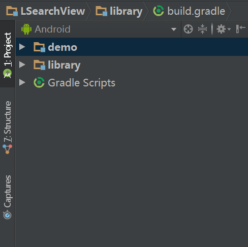
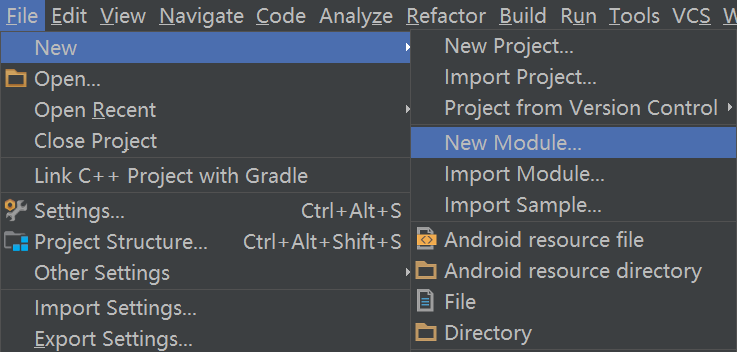
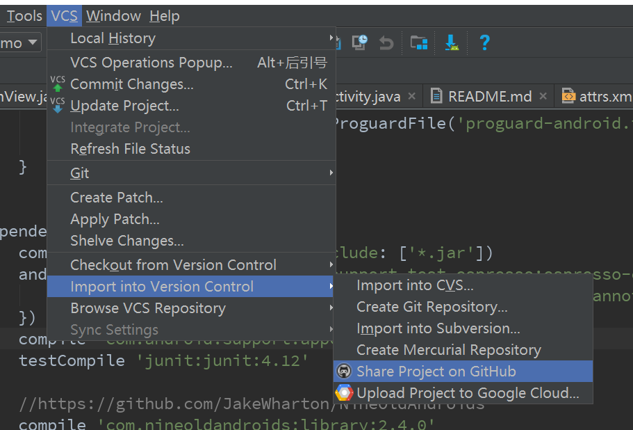
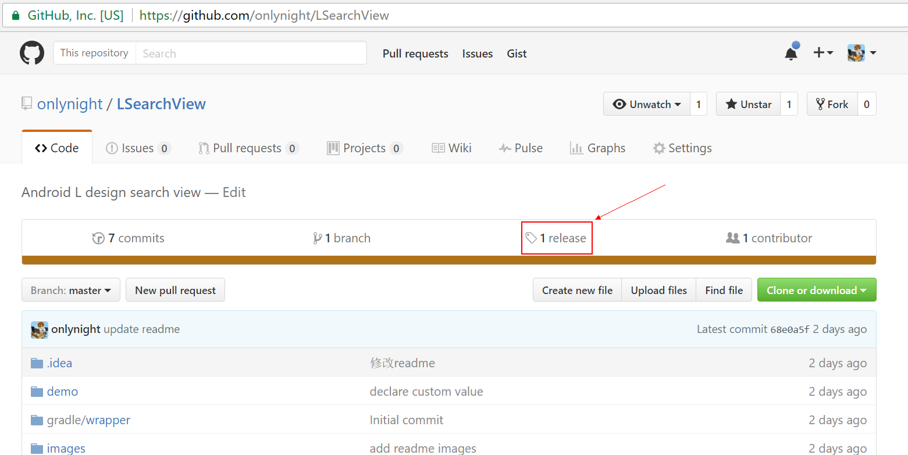
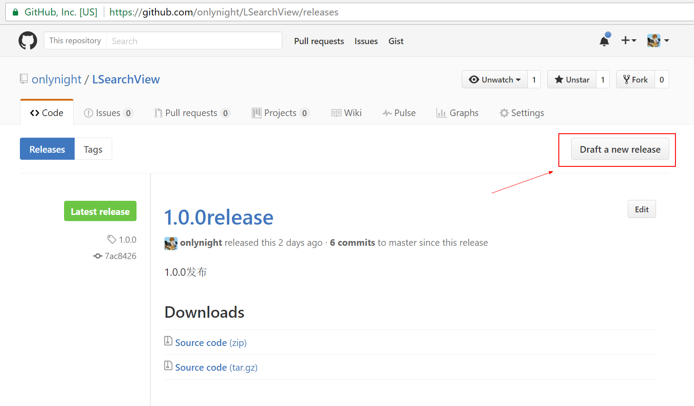
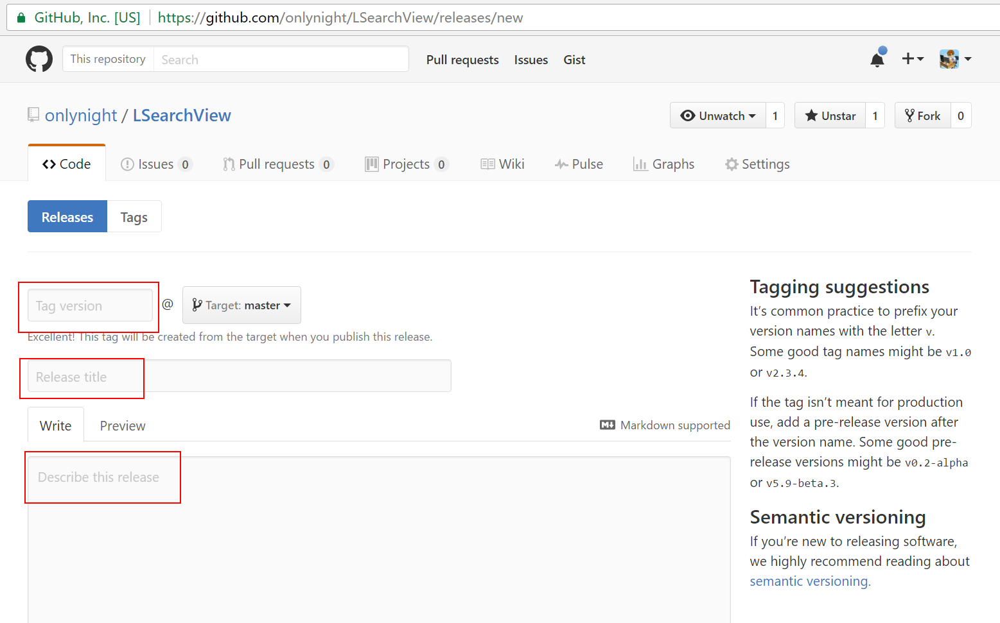
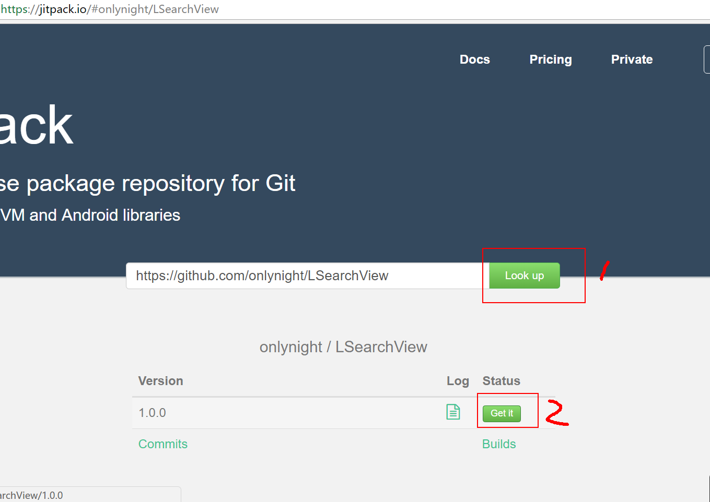
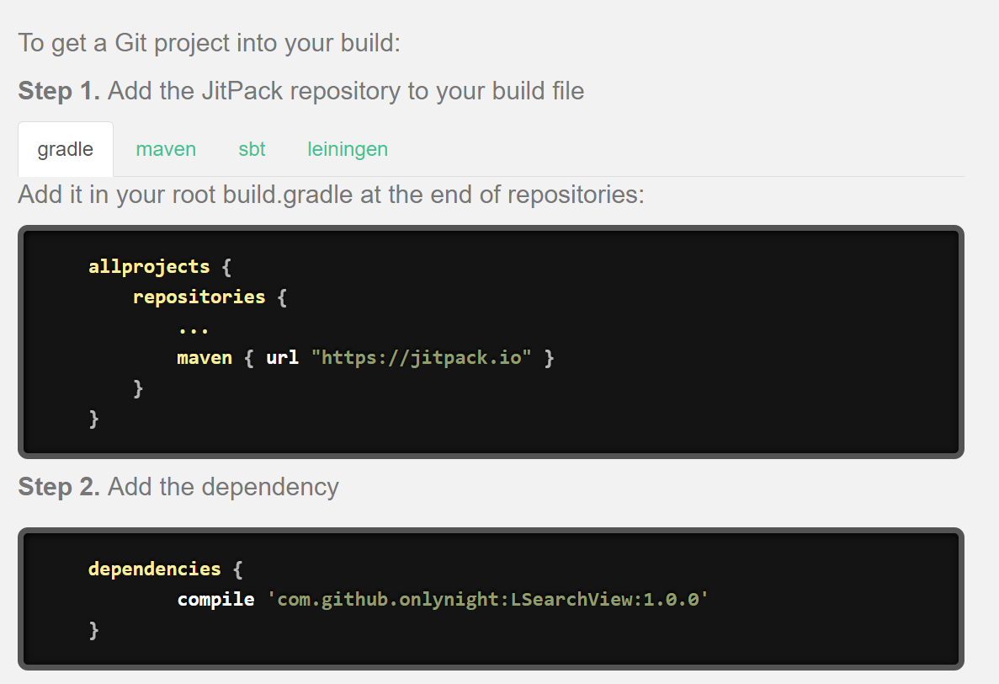

Android创建自己的gradle依赖包
===========================

相信在用Android Studio的同学对gradle都不陌生吧：

```groovy
dependencies {
        compile 'com.github.onlynight:RulerSurfaceView:0.0.1'
}
```

通过这样的代码引入外部依赖是在正常不过的了，但是我们都是用的别人制作好的库，有没有办法自己制作一个库呢，办法是有的而且相当简单，下面我就来详细说一下。

#工具
首先，我们需要用到两个网站：

- Github 代码托管网站（全球最大男性社交网站，你们懂的）
	你需要有一个github账号，并把你想要制作的库上传到github中去，代码上传成功后需要创建发布（确定发布版本号）。
- jitpack java类库依赖包生成网站
	jitpack会通过github中项目的release生成对应的gradle依赖包，同样也可以在maven, sbt以及leiningen中使用。

#步骤

1. **使用android studio新建项目**
	用android studio创建你的依赖库项目。如果你不想有额外的代码生成那么请删除默认的app module即可。添加一个android library module命名为Libaray，module的名称可以随便但是一般这么些大家就知道这是一个类库了。如果你需要给别人看如何使用你可以在项目中添加一个demo module方便使用的人查看demo。结构如下：

	项目模块截图：

	

	添加library请选择new module，如果你已经有了线程的module你也可以使用import module:

	

2. **上传项目到github**
	使用android studio自带的cvs工具上传代码到github上：

	

	根据提示填写github账号密码即可完成上传。

3. **在Github上创建release**
	
	

	

	

4. **使用jitpack生成gradle依赖**
	将我们的github项目地址复制到jitpack中：

	

	点击生成依赖，下面就生成好啦：

	

	由于没有使用mavencentral所以直接在gradle添加依赖会导致找不到依赖，所以需要把jitpack的源路径添加到根目录的gradle中去。

#自己搭建服务器

jitpack也在github上开源了，如果你觉得jitpack的私有源要收费不想用，那么你可以自己搭建服务器，只需要把jitpack网站的源码部署一下就可以啦。如何搭建不是我们关注的重点，又需要的朋友可以去github上下载源码：https://github.com/jitpack/jitpack.io