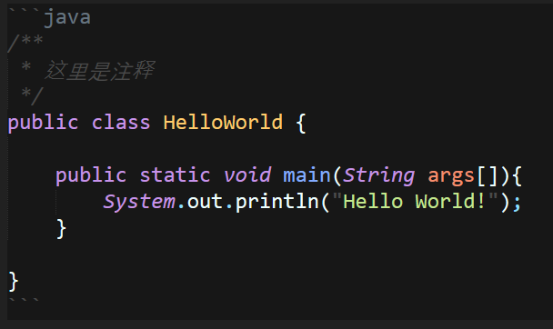
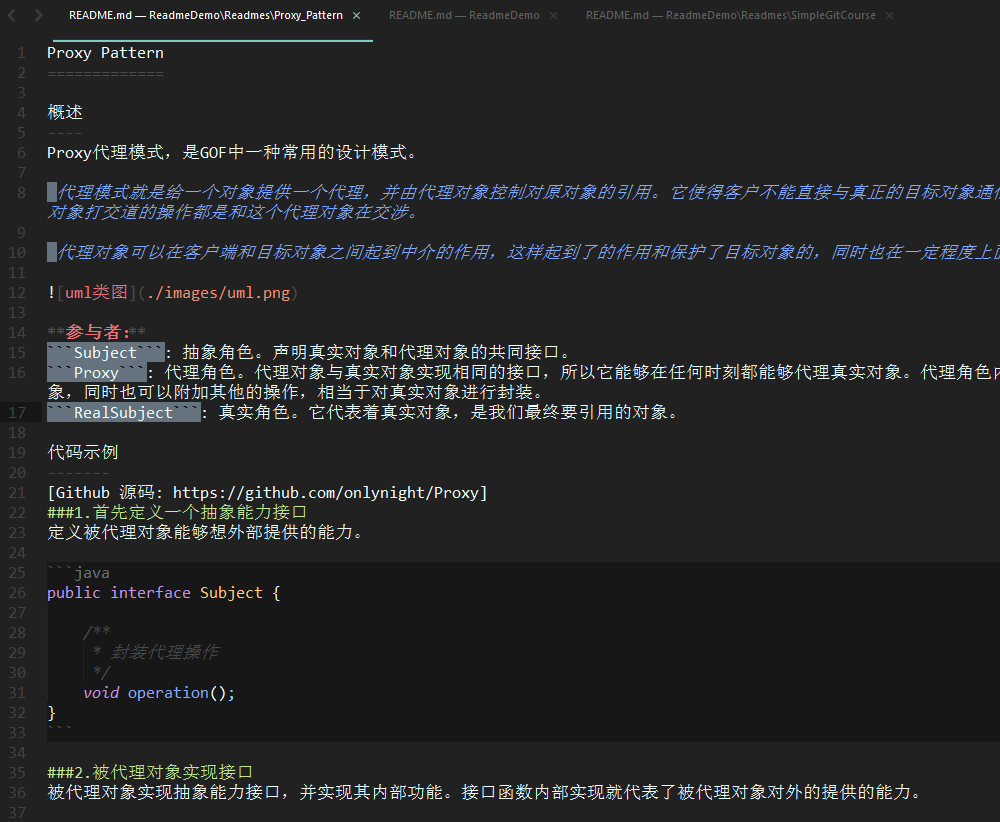
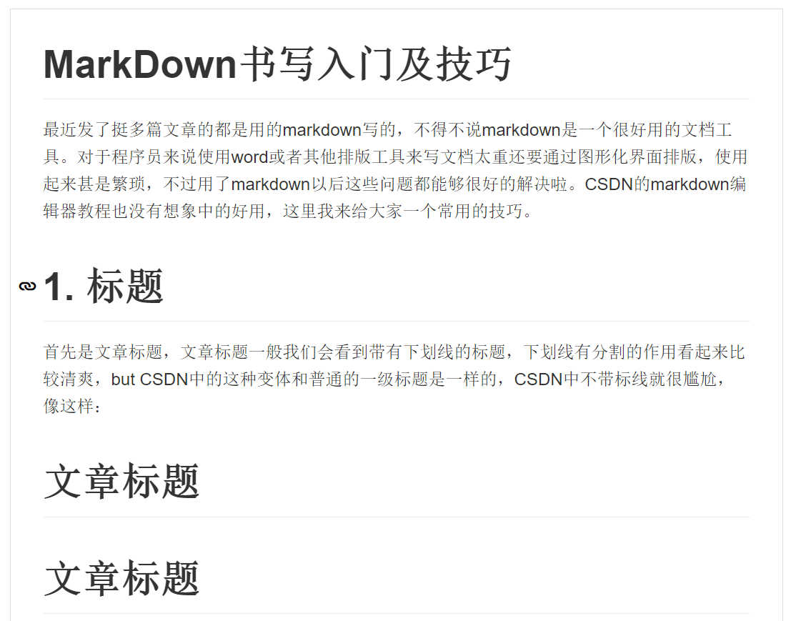

#MarkDown入门及技巧

最近发了挺多篇文章的都是用的markdown写的，不得不说markdown是一个很好用的文档工具。对于程序员来说使用word或者其他排版工具来写文档太重还要通过图形化界面排版，使用起来甚是繁琐，不过用了markdown以后这些问题都能够很好的解决啦。CSDN的markdown编辑器教程也没有想象中的好用，这里我来给大家一个常用的技巧。

#1. 标题

首先是文章标题，文章标题一般我们会看到带有下划线的标题，下划线有分割的作用看起来比较清爽，but CSDN中的这种变体和普通的一级标题是一样的，CSDN中不带标线就很尴尬，像这样：

文章标题
=======

#文章标题

纯文本是这样的：

```
文章标题
=======

#文章标题
```

这两种写法都是一级标题，第一种更适合用在文章标题，第二种适合用在段落标题，不过markdown也没有固定的写法，markdown的作者也不鼓励标准格式，看个人爱好使用就好。

#一级标题
##二级标题
###三级标题
####四级标题
#####五级标题
######六级标题

```
#一级标题
##二级标题
###三级标题
####四级标题
#####五级标题
######六级标题
```

下一级标题只需要加个```#```即可缩小一号标题。CSDN的markdown显示标题的使用用的细体，如果要强调标题的话可以使用加粗，效果这样：

#**加粗标题**

```
#**加粗标题**
```


#2. 强调（斜体，加粗）

*斜体*
**加粗**

```
*斜体*
**加粗**
```

斜体和加粗一般用做强调，如果你需要强调某一部分你就可以使用斜体和加粗。

#3. 序号
序号分为无顺序标签和有顺序标签，像这样

- 无序标签
+ 无序标签
* 无序标签

1. 标签1
2. 标签2
3. 标签3
4. 标签4

```
- 无序标签
+ 无序标签
* 无序标签

1. 标签1
2. 标签2
3. 标签3
4. 标签4
```

无序标签中```-```=```+```=```*```三种写法是一样的。

你还可以嵌套使用，像这样：

1. 标签1
	- 无序标签
	+ 无序标签
	* 无序标签
2. 标签2
	- 无序标签
	+ 无序标签
	* 无序标签
3. 标签3
	- 无序标签
	+ 无序标签
	* 无序标签
4. 标签4
	- 无序标签
	+ 无序标签
	* 无序标签

```
1. 标签1
	- 无序标签
	+ 无序标签
	* 无序标签
2. 标签2
	- 无序标签
	+ 无序标签
	* 无序标签
3. 标签3
	- 无序标签
	+ 无序标签
	* 无序标签
4. 标签4
	- 无序标签
	+ 无序标签
	* 无序标签
```

下一级标签中要使用tab将其往后推，否则格式会比较混乱，不过不建议使用多级标签这样格式看起来会比较难看，建议做多使用两级。一般情况下，我是这样实现分级的：

#1. 标题1
##无序标题

内容内容内容内容内容内容内容内容内容内容内容内容内容内容内容

内容内容内容内容内容内容内容内容内容内容内容内容内容内容内容内容内容内容内容内容内容内容内容内容内容内容内容内容内容内容内容内容内容内容内容内容内容内容

##无序标题

内容内容内容内容内容内容内容内容内容内容内容内容内容内容内容内容内容内容内容内容内容内容内容内容内容内容内容内容内容内容内容内容内容内容内容内容内容内容内容内容内容内容

内容内容内容内容内容内容内容内容内容内容内容

#2. 标题2

内容内容内容内容内容内容内容内容内容内容内容内容内容内容内容

内容内容内容内容内容内容内容内容内容内容内容内容内容内容内容内容内容内容内容内容内容内容内容内容内容内容内容内容内容内容内容内容内容内容内容内容内容内容

##1. 有序标题1

内容内容内容内容内容内容内容内容内容内容内容内容内容内容内容内容内容内容内容内容内容内容内容内容内容内容内容内容内容内容内容内容内容内容内容内容内容内容内容内容内容内容

内容内容内容内容内容内容内容内容内容内容内容

##2. 有序标题2

内容内容内容内容内容内容内容内容内容内容内容内容内容内容内容内容内容

内容内容内容内容内容内容内容内容内容内容内容内容内容内容内容内容内容内容内容内容内容内容内容内容内容内容内容内容内容内容内容内容内容内容内容内容

```
#1. 标题1
##无序标题

内容内容内容内容内容内容内容内容内容内容内容内容内容内容内容

内容内容内容内容内容内容内容内容内容内容内容内容内容内容内容内容内容内容内容内容内容内容内容内容内容内容内容内容内容内容内容内容内容内容内容内容内容内容

##无序标题

内容内容内容内容内容内容内容内容内容内容内容内容内容内容内容内容内容内容内容内容内容内容内容内容内容内容内容内容内容内容内容内容内容内容内容内容内容内容内容内容内容内容

内容内容内容内容内容内容内容内容内容内容内容

#2. 标题2

内容内容内容内容内容内容内容内容内容内容内容内容内容内容内容

内容内容内容内容内容内容内容内容内容内容内容内容内容内容内容内容内容内容内容内容内容内容内容内容内容内容内容内容内容内容内容内容内容内容内容内容内容内容

##1. 有序标题1

内容内容内容内容内容内容内容内容内容内容内容内容内容内容内容内容内容内容内容内容内容内容内容内容内容内容内容内容内容内容内容内容内容内容内容内容内容内容内容内容内容内容

内容内容内容内容内容内容内容内容内容内容内容

##2. 有序标题2

内容内容内容内容内容内容内容内容内容内容内容内容内容内容内容内容内容

内容内容内容内容内容内容内容内容内容内容内容内容内容内容内容内容内容内容内容内容内容内容内容内容内容内容内容内容内容内容内容内容内容内容内容内容
```

通过标题字号区分级别，这样格式看起来比较舒服，没有形成Z字形的文本块。

#4. 格式化文本快
这个标签的用法就跟html中div标签类似，会将你的所有空格tab等保留可以用来展示代码，像这样：

```
/**
 * 这里是注释
 */
public class HelloWorld {

	public static void main(String args[]){
		System.out.println("Hello World!");
	}

}
```

这样就可以展示你文本原始格式啦。



markdown还提供代码高亮，只需要在开头的"```"后加上语言的名称即可:

```java
/**
 * 这里是注释
 */
public class HelloWorld {

	public static void main(String args[]){
		System.out.println("Hello World!");
	}

}
```

像这样就可以使用java高亮啦。

#5. 图片
你的文档中可能会使用图片，你可以直接引入网络图片，像这样：


```

```

```

```

Github比较特殊，你可以使用相对地址引入图片，像这样：

```

```

#6. 链接
你可以直接把链接复制到文本中，这样链接会自动被解析为a标签，像这样：

http://blog.csdn.net/tgbus18990140382

像这样直接放链接快速方便，当然有的时候你不想这样写，可以把链接隐藏起来，像这样：

[我的博客主页]

[我的博客主页]: http://blog.csdn.net/tgbus18990140382

```
[我的博客主页]

[我的博客主页]: http://blog.csdn.net/tgbus18990140382
```

一般的我们将这些引用的链接放在文章的末尾，在需要使用的时候引用```[我的博客主页]```就好了。

#我的markdown编辑器

些markdown的时候有点类似于写代码，有时候你需要代码提示，高亮提示，检查自己写的是否正确，在线的编辑器就不说了各有各的长处和缺点，我们来看下怎么样构建一个本地的编写环境，帮助你快速书写文档、博客。

##Sublime Text

Sublime Text相信大家都不陌生了吧，它是一款文本编辑器，支持插件拓展。现在它的生态相当的好，你想要的插件基本上都有。比如，这里我们需要markdown高亮显示一级快速解析markdown生成preview的html让我们查看效果，SublimeText都有很好的支持，下面我们先来看小效果图：



是不是很酷炫，还有跟酷炫的快速生成预览，只需按下快捷键就可以生成预览：



- 预览生成插件名称叫```Markdown-Preview```
	[https://github.com/revolunet/sublimetext-markdown-preview]
- 高亮插件名称叫```Markdown-extended```
	[https://github.com/jonschlinkert/sublime-markdown-extended]

如何给sublime text安装插件这里就不再赘述了，百度可以搜到很多。有了这个本地编辑利器，写博客更简单啦，还不快来试试。


#写在最后

markdown是写文档的利器，在CSDN上写写博客不但能分享知识，重要的你需要将你掌握的知识再次结构化并通过文字表述给其他人，这里对自己又是一次升华。


[https://github.com/revolunet/sublimetext-markdown-preview]: https://github.com/revolunet/sublimetext-markdown-preview
[https://github.com/jonschlinkert/sublime-markdown-extended]: https://github.com/jonschlinkert/sublime-markdown-extended