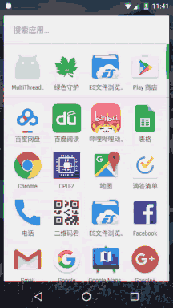

android 多线程下载，断点续传，线程池
=================================

你可以在这里看到这个demo的源码:
https://github.com/onlynight/MultiThreadDownloader

#效果图



这张效果图是同时开启三个下载任务，限制下载线程数量的效果图。

#多线程下载原理

多线程下载的原理就是将下载任务分割成一个个小片段再将每个小片段分配给各个线程进行下载。
例如一个文件大小为100M，我们决定使用4个线程下载，那么每个线程下载的大小即为25M，每个线程的起始以及结束位置依次如下：

0: 0-25M
1: 25-50M
2: 50-75M
3: 75-END

下载请求使用的是Http GET方法，GET请求允许我们设置参数请求的数据的范围：

```java
HttpURLConnection conn = (HttpURLConnection)
                        new URL("download url").openConnection();
// 设置http为get方法
conn.setRequestMethod("GET");
// 设置http请求的范围
conn.setRequestProperty("Range", "bytes=" + startPos + "-" + endPos);
```

多线程访问文件需要创建RandamAccessFile：

```java
RandomAccessFile threadFile = new RandomAccessFile(
                        fileDownloader.getFileSavePath() + File.separator +
                                fileDownloader.getFilename(), "rwd");
threadFile.seek(startPos);
```

#断点续传原理

端点续传要求我们将之前下载过的文件片段保存下来，并且记录上次最后的下载位置。下次继续下载的时候从上次记录的位置开始下载即可，无需再从头下载。

#线程池作用

线程池的原理分析和使用请查看者几篇文章：
http://blog.csdn.net/u010687392/article/details/49850803
http://blog.csdn.net/qq_17250009/article/details/50906508

试想如果我们有100个下载任务，我们让每个任务分成3个线程下载，那么每个任务都需要4个线程，如果100个任务同时开启下载那么就意味着需要同时启动400个线程执行下载任务，这样势必会影响app性能。

像上面这样大量的创建线程的操作势必会影响操作系统的性能，等这些任务执行完成后销毁线程同样也会消耗很多的系统资源，所以java中提出了线程池的概念。

下面我们来分析线程池是如何节约系统资源的。

从时间角度：

+ 创线程的时间我们假定它为: t1
+ 线程执行的时间我们假定为: t2
+ 销毁线程的时间我们假定为: t3

就用上例我们计算其耗时为：

T = 100(t1+t2+t3)

我们使用固定上限线程数量的线程池耗时为：

T1 = 5(t1+t3)+100t2

显然固定线程上限线程池所需的时间短了很多，固定数量线程池节约了线程创建和销毁的时间，使用线程复用方法避免了线程的频繁创建和销毁，不仅节约了时间同时节约了系统资源。

#关键代码

下载线程：

```java
import java.io.File;
import java.io.IOException;
import java.io.InputStream;
import java.io.RandomAccessFile;
import java.net.HttpURLConnection;
import java.net.URL;

/**
 * Created by lion on 2017/2/10.
 */

public class DownloadRunnable implements Runnable {
    private int threadId = -1;
    private FileDownloader fileDownloader;
    private int downloadedSize = 0;

    private int startPos = -1;
    private int endPos = -1;
    private int downloadLength = 0;

    private boolean isFinish;
    private boolean isStart;

    public DownloadRunnable(FileDownloader fileDownloader, int threadId, int blockSize,
                            int downloadedSize) {
        this.fileDownloader = fileDownloader;
        this.threadId = threadId;
        int fileSize = fileDownloader.getFileSize();
        this.startPos = blockSize * threadId + downloadedSize;
        this.endPos = blockSize * (threadId + 1) < fileSize ?
                blockSize * (threadId + 1) : fileSize;
        this.downloadedSize = downloadedSize;
    }

    @Override
    public void run() {
        if (startPos >= endPos) {
            isFinish = true;
        } else {
            try {
                isStart = true;
                isFinish = false;
                HttpURLConnection conn = (HttpURLConnection)
                        new URL(fileDownloader.getDownloadUrl()).openConnection();
                conn.setConnectTimeout(FileDownloader.getConnectionTimeOut());
                conn.setRequestMethod("GET");

                //set accept file meta-data type
                conn.setRequestProperty("Accept", "image/gif, image/jpeg, image/pjpeg," +
                        " image/pjpeg, application/x-shockwave-flash, application/xaml+xml, " +
                        "application/vnd.ms-xpsdocument, application/x-ms-xbap, " +
                        "application/x-ms-application, application/vnd.ms-excel, " +
                        "application/vnd.ms-powerpoint, application/msword, */*");

                conn.setRequestProperty("Accept-Language", "zh-CN");
                conn.setRequestProperty("Referer", fileDownloader.getDownloadUrl());
                conn.setRequestProperty("Charset", "UTF-8");
                conn.setRequestProperty("User-Agent", "Mozilla/4.0 (compatible; MSIE 8.0; " +
                        "Windows NT 5.2; Trident/4.0; .NET CLR 1.1.4322; .NET CLR 2.0.50727; " +
                        ".NET CLR 3.0.04506.30; .NET CLR 3.0.4506.2152; .NET CLR 3.5.30729)");
                conn.setRequestProperty("Connection", "Keep-Alive");

                conn.setRequestProperty("Range", "bytes=" + startPos + "-" + endPos);
                conn.connect();

                RandomAccessFile threadFile = new RandomAccessFile(
                        fileDownloader.getFileSavePath() + File.separator +
                                fileDownloader.getFilename(), "rwd");
                threadFile.seek(startPos);
                InputStream inputStream = conn.getInputStream();
                byte[] buffer = new byte[10240];
                int offset;
                downloadLength = downloadedSize;
                while ((offset = inputStream.read(buffer, 0, 10240)) != -1) {
                    threadFile.write(buffer, 0, offset);
                    downloadLength += offset;
                    fileDownloader.appendDownloadSize(offset);
                }
                threadFile.close();
                inputStream.close();

                isFinish = true;
                isStart = false;
            } catch (IOException e) {
                e.printStackTrace();
                downloadLength = -1;
            }
        }
    }

    public int getDownloadLength() {
        return downloadLength;
    }

    public int getThreadId() {
        return threadId;
    }

    public boolean isFinish() {
        return isFinish;
    }

    public boolean isStart() {
        return isStart;
    }
}
```

下载器：

```java
import android.content.Context;
import android.util.SparseIntArray;

import java.io.IOException;
import java.net.HttpURLConnection;
import java.net.URL;
import java.util.Date;
import java.util.UUID;
import java.util.regex.Matcher;
import java.util.regex.Pattern;

/**
 * Created by lion on 2017/2/7.
 */

public class FileDownloader {

    public static final String TAG = "FileDownloader";

    /**
     * http connection timeout
     */
    private static int CONNECTION_TIME_OUT = 10 * 1000;

    private DownloadProgressManager downloadProgressManager;

    private DownloadRunnable[] downloadThreads;

    private String tagName = "";

    private String downloadUrl;
    private String fileSavePath;
    private String filename;
    private int threadNum = 1;
    private int fileSize = 0;
    private int currentDownloadSize = 0;

    private SparseIntArray currentDownloads;

    public DownloadRunnable[] getDownloadThreads() {
        return downloadThreads;
    }

    public DownloadProgressManager getDownloadProgressManager() {
        return downloadProgressManager;
    }

    public int getFileSize() {
        return fileSize;
    }

    public String getFileSavePath() {
        return fileSavePath;
    }

    public String getFilename() {
        return filename;
    }

    public String getDownloadUrl() {
        return downloadUrl;
    }

    public int getCurrentDownloadSize() {
        return currentDownloadSize;
    }

    public int getThreadNum() {
        return threadNum;
    }

    synchronized int appendDownloadSize(int size) {
        currentDownloadSize += size;
        return currentDownloadSize;
    }

    public FileDownloader(Context context) {
        this.currentDownloads = new SparseIntArray();
        this.downloadProgressManager = new DownloadProgressManager(context);
    }

    private void requestFileInfo(String downloadUrl) throws RuntimeException {
        try {
            HttpURLConnection connection = (HttpURLConnection)
                    new URL(downloadUrl).openConnection();
            connection.setConnectTimeout(CONNECTION_TIME_OUT);
            connection.setRequestMethod("GET");

            //set accept file meta-data type
            connection.setRequestProperty("Accept", "image/gif, image/jpeg, image/pjpeg," +
                    " image/pjpeg, application/x-shockwave-flash, application/xaml+xml, " +
                    "application/vnd.ms-xpsdocument, application/x-ms-xbap, " +
                    "application/x-ms-application, application/vnd.ms-excel, " +
                    "application/vnd.ms-powerpoint, application/msword, */*");

            connection.setRequestProperty("Accept-Language", "zh-CN");
            connection.setRequestProperty("Referer", downloadUrl);
            connection.setRequestProperty("Charset", "UTF-8");
            connection.setRequestProperty("User-Agent", "Mozilla/4.0 (compatible; MSIE 8.0; " +
                    "Windows NT 5.2; Trident/4.0; .NET CLR 1.1.4322; .NET CLR 2.0.50727; " +
                    ".NET CLR 3.0.04506.30; .NET CLR 3.0.4506.2152; .NET CLR 3.5.30729)");
//            connection.setRequestProperty("Connection", "Keep-Alive");

            connection.connect();

            if (connection.getResponseCode() == 200) {
                fileSize = connection.getContentLength();
                if (fileSize <= 0) {
                    throw new RuntimeException(TAG + " Unknown file size");
                }

                filename = getFilename(connection);
            } else {
                throw new RuntimeException(TAG + " Server Response Code is "
                        + connection.getResponseCode());
            }
        } catch (IOException e) {
            e.printStackTrace();
        }
    }

    private String getFilename(HttpURLConnection connection) {
        String filename = downloadUrl != null ?
                downloadUrl.substring(downloadUrl.lastIndexOf("/") + 1) : null;
        if (filename == null || "".equals(filename.trim())) {//如果获取不到文件名称
            for (int i = 0; ; i++) {
                String mine = connection.getHeaderField(i);
                if (mine == null) break;
                if ("content-disposition".equals(connection.getHeaderFieldKey(i).toLowerCase())) {
                    Matcher m = Pattern.compile(".*filename=(.*)").
                            matcher(mine.toLowerCase());
                    if (m.find()) return m.group(1);
                }
            }
            filename = UUID.randomUUID() + ".tmp";//默认取一个文件名
        }
        return filename;
    }

    public void prepare(String downloadUrl, String fileSavePath, int threadNum) {
        this.downloadUrl = downloadUrl;
        this.fileSavePath = fileSavePath;
        requestFileInfo(downloadUrl);
        SparseIntArray progresses = downloadProgressManager.getProgress(downloadUrl);

        if (threadNum <= 0) {
            threadNum = this.threadNum;
        } else {
            this.threadNum = threadNum;
        }

        if (progresses != null && progresses.size() > 0) {
            threadNum = progresses.size();
            for (int i = 0; i < progresses.size(); i++) {
                currentDownloadSize += progresses.get(i);
            }
        }

        int block = fileSize % threadNum == 0 ?
                fileSize / threadNum : fileSize / threadNum + 1;

        downloadThreads = new DownloadRunnable[threadNum];

        for (int i = 0; i < threadNum; i++) {
            downloadThreads[i] = new DownloadRunnable(this, i, block,
                    progresses != null && progresses.size() == threadNum ?
                            progresses.valueAt(progresses.keyAt(i)) == -1 ? 0 :
                                    progresses.valueAt(progresses.keyAt(i)) : 0);
        }
    }

    public void start(OnDownloadListener listener) {
        boolean isFinish = false;
        int lastDownloadSize = 0;
        int speed = 0;
        Date current = new Date();
        while (!isFinish) {
            if (listener != null) {
                int percent = (int) (currentDownloadSize / (float) fileSize * 100);
                long time = new Date().getTime() - current.getTime();
                speed = (int) ((currentDownloadSize - lastDownloadSize) / 1024f / time * 1000f);
                listener.onUpdate(fileSize, currentDownloadSize, speed, percent);
                if (percent == 100) {
                    downloadProgressManager.finishDownload(downloadUrl);
                    break;
                }
            }
            current = new Date();
            lastDownloadSize = currentDownloadSize;
            updateProgress();
            isFinish = checkFinish();
            try {
                Thread.sleep(100);
            } catch (InterruptedException e) {
                e.printStackTrace();
            }
        }

//        System.out.println(tagName + " DOWNLOAD FINISH");
        if (listener != null) {
            listener.onUpdate(fileSize, fileSize, 0, 100);
        }
    }

    private boolean checkFinish() {
        if (downloadThreads != null && downloadThreads.length > 0) {
            for (DownloadRunnable downloadThread : downloadThreads) {
                if (!downloadThread.isFinish()) {
                    System.out.println("checkFinish false");
                    return false;
                }
            }

            return true;
        }
        System.out.println("checkFinish true");
        return false;
    }

    public boolean isFinish() {
        return checkFinish();
    }

    void updateProgress() {
        for (DownloadRunnable downloadThread : downloadThreads) {
            updateProgress(downloadThread.getThreadId(), downloadThread.getDownloadLength());
        }
    }

    synchronized void updateProgress(int threadId, int downloaded) {
        currentDownloads.put(threadId, downloaded);
        downloadProgressManager.saveProgress(downloadUrl, currentDownloads);
//        SparseIntArray progress = downloadProgressManager.getProgress(downloadUrl);
//        for (int i = 0; i < progress.size(); i++) {
//            System.out.println("prepare progress = " + progress.valueAt(progress.keyAt(i)));
//        }
    }

    public boolean isStart() {
        for (DownloadRunnable runnable : downloadThreads) {
            if (runnable.isStart()) {
                return true;
            }
        }

        return false;
    }

    static int getConnectionTimeOut() {
        return CONNECTION_TIME_OUT;
    }

    static void setConnectionTimeOut(int timeOut) {
        CONNECTION_TIME_OUT = timeOut;
    }

    public interface OnDownloadListener {
        void onUpdate(int totalSize, int currentSize, int speed, int percent);
    }

    public void setTagName(String tagName) {
        this.tagName = tagName;
    }
}
```

下载管理器：

```java
import android.content.Context;

import java.util.ArrayList;
import java.util.concurrent.Executor;
import java.util.concurrent.Executors;

/**
 * Created by lion on 2017/2/8.
 */

public class DownloadManager {

    private static int PARALLEL_DOWNLOAD_SIZE = 6;
    private static DownloadManager instance;

    private Context context;
    private Executor downloadExecutor;
    private ArrayList<FileDownloader> fileDownloaders;

    public static DownloadManager getInstance(Context context) {
        if (instance == null) {
            instance = new DownloadManager(context);
        }
        return instance;
    }

    public DownloadManager(Context context) {
        this.context = context;
        downloadExecutor = Executors.newFixedThreadPool(PARALLEL_DOWNLOAD_SIZE);
//        downloadExecutor = Executors.newCachedThreadPool();
        fileDownloaders = new ArrayList<>();
    }

    public void download(String name, final String downloadUrl, final String fileSavePath, final int threadNum,
                         final FileDownloader.OnDownloadListener listener) {
        for (FileDownloader downloader : fileDownloaders) {
            if (downloader.isFinish()) {
                downloader.setTagName(name);
                startDownload(downloader, downloadUrl, fileSavePath, threadNum, listener);
                return;
            }
        }

        FileDownloader currentDownloader = new FileDownloader(context);
        currentDownloader.setTagName(name);
        fileDownloaders.add(currentDownloader);
        startDownload(currentDownloader, downloadUrl, fileSavePath, threadNum, listener);
    }

    public void download(final String downloadUrl, final String fileSavePath, final int threadNum,
                         final FileDownloader.OnDownloadListener listener) {
        for (FileDownloader downloader : fileDownloaders) {
            if (downloader.isFinish()) {
                startDownload(downloader, downloadUrl, fileSavePath, threadNum, listener);
                return;
            }
        }

        FileDownloader currentDownloader = new FileDownloader(context);
        fileDownloaders.add(currentDownloader);
        startDownload(currentDownloader, downloadUrl, fileSavePath, threadNum, listener);
    }

    private synchronized void startDownload(final FileDownloader currentDownloader,
                                            final String downloadUrl, final String fileSavePath,
                                            final int threadNum,
                                            final FileDownloader.OnDownloadListener listener) {
        downloadExecutor.execute(new Runnable() {
            @Override
            public void run() {
                currentDownloader.prepare(downloadUrl, fileSavePath,
                        threadNum);
                if (currentDownloader.getDownloadThreads() != null) {
                    for (DownloadRunnable runnable :
                            currentDownloader.getDownloadThreads()) {
                        downloadExecutor.execute(runnable);
                    }
                }
                currentDownloader.start(listener);
            }
        });
    }

    public static void setConnectionTimeOut(int timeOut) {
        FileDownloader.setConnectionTimeOut(timeOut);
    }

    public static void setParallelDownloadSize(int size) {
        PARALLEL_DOWNLOAD_SIZE = size;
    }
}
```
