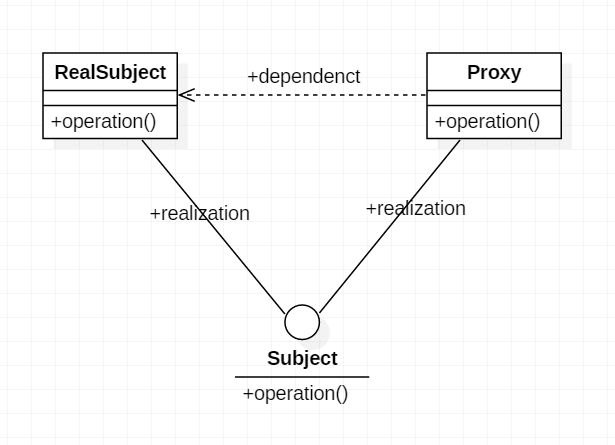

Proxy Pattern
=============

概述
----
Proxy代理模式，是GOF中一种常用的设计模式。

>代理模式就是给一个对象提供一个代理，并由代理对象控制对原对象的引用。它使得客户不能直接与真正的目标对象通信。代理对象是目标对象的代表，其他需要与这个目标对象打交道的操作都是和这个代理对象在交涉。

>代理对象可以在客户端和目标对象之间起到中介的作用，这样起到了的作用和保护了目标对象的，同时也在一定程度上面减少了系统的耦合度。



**参与者:**
```Subject```: 抽象角色。声明真实对象和代理对象的共同接口。
```Proxy```: 代理角色。代理对象与真实对象实现相同的接口，所以它能够在任何时刻都能够代理真实对象。代理角色内部包含有对真实对象的引用，所以她可以操作真实对象，同时也可以附加其他的操作，相当于对真实对象进行封装。
```RealSubject```: 真实角色。它代表着真实对象，是我们最终要引用的对象。

代码示例
-------
[Github 源码: https://github.com/onlynight/Proxy]
###1.首先定义一个抽象能力接口
定义被代理对象能够想外部提供的能力。

```java
public interface Subject {

    /**
     * 封装代理操作
     */
    void operation();
}
```

###2.被代理对象实现接口
被代理对象实现抽象能力接口，并实现其内部功能。接口函数内部实现就代表了被代理对象对外的提供的能力。

```java
public class RealSubject implements Subject {
    @Override
    public void operation() {
        // 调用内部函数，实现改函数的真正功能
        operation1();
        System.out.println("real operation");
    }

    private void operation1() {
        //todo real operation1
    }
}
```

###3.代理实现接口

```java
/**
 * Created by lion on 2016/10/11.
 * 这类的构造函数需要从外部传入被代理对象，这种不太符合真实的使用场景
 */
public class Proxy implements Subject {

    private Subject subject;

    public Proxy(Subject subject) {
        this.subject = subject;
    }

    @Override
    public void operation() {
        System.out.println("before operation");
        subject.operation();
        System.out.println("end operation");
    }
}
```

一般采用代理就是不想让真正的对象直接和外部接触，通过代理代码解耦和。

```java
/**
 * Created by lion on 2016/10/14.
 * 通过静态方法获取代理，这里可以设计成单例，也可以从远程服务中获取被代理对象。
 */
public class Proxy implements Subject {

    private Proxy() {
    }

    public static Proxy getDefault() {
        // 这里又很多想象空间，具体怎么使用就留给大家啦。
        return new Proxy();
    }

    /**
     * 这里演示内部构造方式，控制外部访问权限。
     * 只要不把对象本身能直接外部访问即可。
     */
    private Subject subject = new RealSubject();

    @Override
    public void operation() {
        System.out.println("Proxy start");
        subject.operation();
        System.out.println("Proxy end");
    }
}
```

测试代码如下

```java
public class Main {

    public static void main(String[] args) {
        System.out.println("demo1>");
        demo1();
        System.out.println("\ndemo2>");
        demo2();
    }

    private static void demo1() {
        Subject subject = new RealSubject();
        Proxy proxy = new Proxy(subject);
        proxy.operation();
    }

    private static void demo2() {
        com.github.onlynight.proxy.privacy.Proxy.getDefault().operation();
    }
}
```

输出结果

```text
demo1>
before operation
real operation
end operation

demo2>
Proxy start
real operation
Proxy end
```

使用场景
-------
在需要用比较通用和复杂的对象指针代替简单的指针的时候，使用 Proxy模式。下面是一些可以使用Proxy模式常见情况：
###1.远程代理（Remote  Proxy）
远程代理为一个位于不同的地址空间的对象提供一个本地的代理对象。这个不同的地址空间可以是在同一台主机中，也可是在另一台主机中，远程代理又叫做大使(Ambassador)。
这中代理模式比较常用，后续的Android的Binder通信中使用了远程代理模式，在其中有很好的应用，感兴趣的朋友可以查看我后续的代码分析。[Github AIDL]
###2.虚拟代理（Virtual Proxy）
虚拟代理根据需要创建开销很大的对象。如果需要创建一个资源消耗较大的对象，先创建一个消耗相对较小的对象来表示，真实对象只在需要时才会被真正创建。 
###3.保护代理（Protection Proxy）
保护代理控制对原始对象的访问。保护代理用于对象应该有不同的访问权限的时候。
###4.智能指引（Smart Reference）
智能指引取代了简单的指针，它在访问对象时执行一些附加操作。
###5.Copy-on-Write代理
Copy-on-Write代理它是虚拟代理的一种，把复制（克隆）操作延迟到只有在客户端真正需要时才执行。一般来说，对象的深克隆是一个开销较大的操作，Copy-on-Write代理可以让这个操作延迟，只有对象被用到的时候才被克隆。

由于笔者阅历有限暂时不能提供相应的栗子，后续的开发中如果遇到合适的栗子会持续更新，谢谢大家的支持。

[Github 源码: https://github.com/onlynight/Proxy]: https://github.com/onlynight/Proxy
[Github AIDL]: https://github.com/onlynight/AIDL_demo