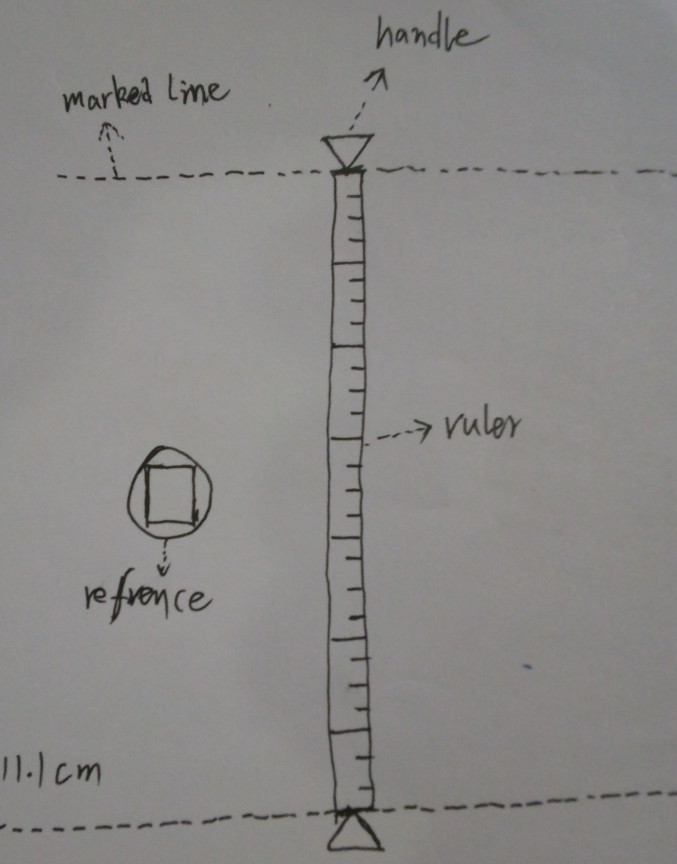
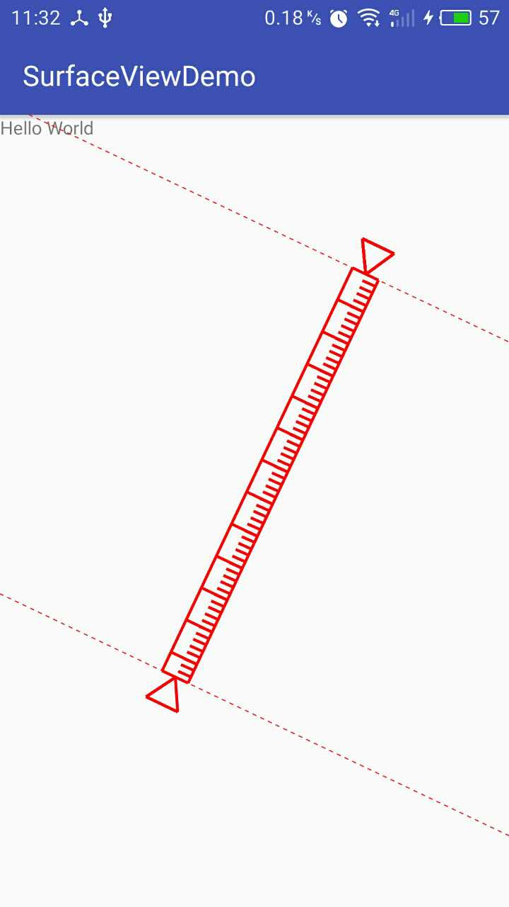
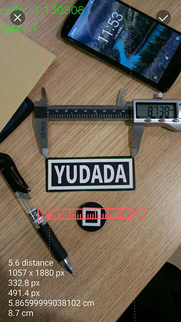
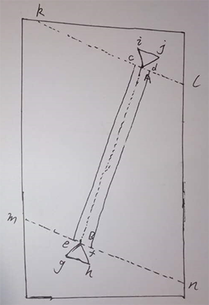

自定义RulerView
==============

你可以在Github上看到这篇文章以及源码：https://github.com/onlynight/RulerView

#概述
本文主要讲如何继承View实现一个自定义View，然后通过实例RulerView的实现逻辑帮助读者更好的理解自定义View的设计与实现。开讲之前先给博客大神打个广告《Android开发艺术探索》的作者任玉刚的这本书会给想要进阶学习的一个好的开始，带你入门带你飞。

#功能描述
RulerView的具体功能如下：

1. 首先要绘制一把尺子带大小刻度的，这样看起来才像尺子。
2. 尺子的两段要绘制操作手柄，操作手柄起到装饰和提醒的作用，告诉用户两段是可以操作的。
3. 尺子的两头分别带有标线，这样方便用户测量时对齐。
4. 尺子操作手柄实现两点触控操作，提升用户体验，操作简单方便。
5. 在左下角显示测量结果。

示意图如下：



字写的略丑，大家见谅（233）。

效果图如下：



##《鱼哒哒》app中的应用
**来一波硬广，这是我们公司现在正做的一个app《鱼哒哒》，各大应用市场都有下载，欢迎钓鱼爱好者体验我们公司的app，来一张效果图：**



有没有很酷炫啊，测量的是不是很准确啊，测量用的尺子是优化过的体验一流；其实它的使用场景不仅限于测量鱼，你可以测量身高，测量任何你想测测量的东西，只要用尺子的地方《鱼哒哒》都可以排上用场也许可以替代尺子。废话不多说啦，下面我们来看看```RulerView```的设计与实现。

#设计与实现

##设计思路
这样一个不规则的图形用常规的布局加控件的方式很难实现，这时候自定义控件就排上用场了。自定义控件分为自定义View和自定义ViewGroup两种，ViewGroup侧重的是自定义布局，View侧重的是自定义绘制，显然这里我们使用的是自定义View。

再来我们说一下尺子绘制的思路，第一种是一张png位图，通过在view上绘制位图的方法讲尺子绘制到控件上，但是经过多种尝试这种方式被放弃，原因是旋转尺子的时候通过尺子的两个端点计算尺子偏差的角度老是出现问题，故没有采用这种方式；第二种是通过绘制直线最终拼接成一把尺子，这种实现计算坐标稍复杂，但是经过实践证明这种实现方法比较靠谱，并且可移植性较强，写了一套代码逻辑即可移植到android和ios两个平台。下面来具体讲一下第二种方式的设计思想和实现。

1. 首先，现在屏幕上指定两个点，这两个点就是尺子两个端点，同时也是尺子两端的操作手柄的基准点，同时它还是标线的基准点，这两个点可响应touch事件这样就可以在屏幕上任意移动了。
2. 然后根据这两个基准点计算尺子上各个点的左边，计算操作手柄的坐标，计算标线的坐标，具体如何计算我们在代码分析中会详细说明。
3. 复写onTouchEvent函数处理其中的事件使得两个基准点能够跟着用户的手指移动，这样尺子的基本功能就完成啦。
4. 当然其中还有一些坑，在实现的过程中会详细说明。

##实现与源码分析

###添加自定义View
新建RulerSurfaceView类继承自SurfaceView，这里我们使用SurfaceView而不是普通的View是因为由于绘制内容较多且绘制的内容多为动态绘制需要实时刷新，为了保证良好的用户体验所有绘制过程不能放在主线程中。SurfaceView的绘制过程是独立在主线程之外的，所以即便是做大量的绘制工作也不会导致主线程卡顿。除此之外还要实现一个Runnable接口，我们所有的绘制操作都将在这个Runnable中完成。你还需要实现一个SurfaceCallback接口，我们会把SurfaceView的回调设置在这个View上。简要代码如下：

```java
/**
 * Created by lion on 2016/10/25.
 * 现在这个类基本上就是这样
 */
public class RulerSurfaceView extends SurfaceView implements
        SurfaceHolder.Callback, Runnable {

    public RulerSurfaceView(Context context) {
        super(context);
        ...
    }

    public RulerSurfaceView(Context context, AttributeSet attrs) {
        super(context, attrs);
        ...
    }

    public RulerSurfaceView(Context context, AttributeSet attrs, int defStyleAttr) {
        super(context, attrs, defStyleAttr);
        ...
    }

    @Override
    public void surfaceCreated(SurfaceHolder holder) {
        ...
    }

    @Override
    public void surfaceChanged(SurfaceHolder holder, int format, int width, int height) {
    }

    @Override
    public void surfaceDestroyed(SurfaceHolder holder) {
        ...
    }

    @Override
    public void run() {
    	...
    }
}
```

###SurfaceView的使用
既然用到了SurfaceView，这里就说一下SurfaceView的基本用法。SurfaceView继承自View但是又和普通的View有所不同，它的绘制过程不是在主线程中进行的，需要我们令启线程完成绘制，这里就会涉及到线程同步以及更新UI线程的问题，不过SurfaceView都为我们完成了这些工作，我们只需要关心我们关心的事情就好了，要使用SurfaceView你需要做如下操作：

```java
//你需要从SurfaceView中获取SurfaceHolder，这个holder
private SurfaceHolder surfaceHolder;

//需要新建一个线程用于绘图
private Thread drawThread;

//初始化的时候你需要获取holder，并且设置surfaceview的背景为透明，当然你也可以设置成其他的颜色。
private void init(TypedArray typedArray) {
    setZOrderOnTop(true);
    surfaceHolder = getHolder();
    surfaceHolder.setFormat(PixelFormat.TRANSLUCENT);
    surfaceHolder.addCallback(this);
}

//控制绘制线程循环
public void setDrawFlag(boolean drawFlag) {
    this.drawFlag = drawFlag;
}

//当surfaceview创建的时候我们新建线程并且启动线程开始绘制
@Override
public void surfaceCreated(SurfaceHolder holder) {
    setDrawFlag(true);
    drawThread = new Thread(this);
    drawThread.start();
}

@Override
public void surfaceChanged(SurfaceHolder holder, int format, int width, int height) {
}

//当surfaceview销毁的时候，需要停止绘制
@Override
public void surfaceDestroyed(SurfaceHolder holder) {
    setDrawFlag(false);
    drawThread = null;
}

//这里面是主要的绘制过程
@Override
public void run() {
	while (drawFlag) {
        Canvas canvas = null;
        synchronized (surfaceHolder) {
            try {
            	//获取canvas
                canvas = surfaceHolder.lockCanvas();
                //设置透明背景，这里是清楚背景，如果不清除背景SurfaceView的默认缓存机制会把上次绘制的内容保存。
                canvas.drawColor(Color.TRANSPARENT, PorterDuff.Mode.CLEAR);
                //绘制图形
                innerDraw(canvas);
            } catch (Exception e) {
                e.printStackTrace();
            } finally {
            	//lockcanvas和unlockcanvas成对出现，要绘制的时候需要锁定canvas，绘制完成后需要释放canvas
                if (null != canvas) {
                    surfaceHolder.unlockCanvasAndPost(canvas);
                }
            }
        }
    }
}
```

可以看到我们需要做以下几件事：

1. 初始化时获取SurfaceHolder，用于获取canvas。
2. 在绘制线程中使用surfaceHolder获取canvas并且完成绘制。
3. surfaceCreated的时候启动绘制线程。
4. surfaceDestoryed的时候停止绘制线程。

###为RulerSurfaceView添加自定义属性
为了方便使用这里我们给RulerSurfaceView添加几个自定义属性，在values文件夹中新建```attrs.xml```资源文件添加如下代码：

```xml
<?xml version="1.0" encoding="utf-8"?>
<resources>

    <declare-styleable name="RulerSurfaceView">
        <attr name="line_type" format="enum">
            <enum name="dash_line" value="1"/>
            <enum name="line" value="2"/>
        </attr>
        <attr name="dash_line_blank" format="dimension"/>
        <attr name="line_height" format="dimension"/>
        <attr name="line_color" format="color"/>
        <attr name="ruler_color" format="color"/>
        <attr name="ruler_line_height" format="dimension"/>
        <attr name="measure_text_size" format="dimension"/>
        <attr name="measure_text_color" format="color"/>
        <attr name="measure_ruler_width" format="dimension"/>
        <attr name="measure_ruler_scale_width" format="dimension"/>
        <attr name="measure_icon_size" format="dimension"/>
    </declare-styleable>

</resources>
```

- ```line_type```
绘制标线的类型，是虚线还是实线，```enum```类型是自定义类型其value为int类型，代码中获取到的值即为这里我们定义的整形值。
- ```dash_line_blank```
标线如果是虚线，虚线的空白是多长，```dimension```就是android中的长度值例如：dp、px等。
- ```line_height```
标线的粗细
- ```ruler_color```
尺子的颜色，```color```类型有很多种定义，例如```refrence```、整形的color、rgb模式color都可以
- ```ruler_line_height```
尺子的线粗细
- ```measure_text_size```
测量结果字体的尺寸
- ```measure_text_color```
测量结果字体的颜色
- ```measure_ruler_width```
尺子的宽度
- ```measure_ruler_scale_width```
尺子上每个刻度的宽度
- ```measure_icon_size```
尺子两端操作手柄的尺寸

添加完xml以后需要在SurfaceView中进行读取这些值，代码如下：

```java
public RulerSurfaceView(Context context, AttributeSet attrs) {
    super(context, attrs);
    TypedArray typedArray = getContext().obtainStyledAttributes(attrs,
            R.styleable.FreeMeasureView);
    init(typedArray);
}

private void init(TypedArray typedArray) {
    lineHeight = typedArray.getDimension(R.styleable.RulerSurfaceView_line_height,
            dp2px(getContext(), 1));
    rulerLineHeight = typedArray.getDimension(R.styleable.RulerSurfaceView_ruler_line_height,
            dp2px(getContext(), 2));
    lineType = typedArray.getInt(R.styleable.RulerSurfaceView_line_type, LINE_TYPE_DASH_LINE);
    lineColor = typedArray.getColor(R.styleable.RulerSurfaceView_line_color, Color.WHITE);
    rulerColor = typedArray.getColor(R.styleable.RulerSurfaceView_ruler_color, Color.WHITE);
    dashLineBlank = typedArray.getDimension(R.styleable.RulerSurfaceView_dash_line_blank,
            dp2px(getContext(), DASH_LINE_BLANK_DEFAULT));
    rulerWidth = typedArray.getDimension(
            R.styleable.RulerSurfaceView_measure_ruler_width,
            dp2px(getContext(), RULER_WIDTH));
    rulerScaleWidth = typedArray.getDimension(
            R.styleable.RulerSurfaceView_measure_ruler_scale_width,
            dp2px(getContext(), RULER_SCALE_WIDTH));
    measureIconSize = typedArray.getDimension(
            R.styleable.RulerSurfaceView_measure_icon_size,
            dp2px(getContext(), MEASURE_ICON_SIZE));
}
```

需要注意的是，如果我们在xml布局中没有设置这些属性我们需要为他们设置默认值。下面我们看看如果在xml布局中使用：

```xml
<?xml version="1.0" encoding="utf-8"?>
<RelativeLayout
    xmlns:android="http://schemas.android.com/apk/res/android"
    xmlns:app="http://schemas.android.com/apk/res-auto"
    xmlns:tools="http://schemas.android.com/tools"
    android:id="@+id/activity_main"
    android:layout_width="match_parent"
    android:layout_height="match_parent"
    tools:context="com.github.onlynight.surfaceviewdemo.MainActivity">

    <TextView
        android:layout_width="wrap_content"
        android:layout_height="wrap_content"
        android:text="Hello World"/>

    <com.github.onlynight.surfaceviewdemo.RulerSurfaceView
        android:id="@+id/surfaceView"
        android:layout_width="match_parent"
        android:layout_height="match_parent"
        app:dash_line_blank="3dp"
        app:line_color="#ff0000"
        app:line_height="2px"
        app:line_type="dash_line"
        app:measure_icon_size="25dp"
        app:measure_ruler_scale_width="5dp"
        app:measure_ruler_width="20dp"
        app:measure_text_color="@color/colorAccent"
        app:measure_text_size="18sp"
        app:ruler_color="#ff0000"
        app:ruler_line_height="2dp"/>

</RelativeLayout>
```

我们看到最外层的```RelativeLayout```中的这行代码```xmlns:app="http://schemas.android.com/apk/res-auto"```当你使用自定义属性的时候只需要引入这个就可以了```xmlns:app```这个namespace可以自定义名称。引入这个namespace以后你就可以像使用android系统定义的属性一样使用自定义属性了。

###标尺坐标计算
前面讲了一大堆的基础知识，下面来说一下尺子的坐标计算。文章开头我们已经讲过了基本思路，我们这里来说一下具体实现。



显示坐标系：
我们直到显示系统的坐标系一般都是左上角为原点坐标，向右为x正向，向下为y正向。

各个点说明：

- 两个基准点为A,B
- 尺子的四个顶点为c,d,e,f
- 操作手柄分别为A,i,j和B,g,h
- 标线坐标分别为k,l和m,n

直线斜率说明：

- k(AB)两个基准点之间的斜率
- k(ce),k(df)尺子两条竖线斜率
- k(cd),k(ef)尺子两天横线斜率
- k(gh),k(ij)两个操作手柄的斜率
- k(kl),k(mn)两条标线的斜率

从图上可以看出k(cd)=k(ef)=k(gh)=k(ij)=k(kl)=k(mn)，我们将它命名为kRulerLine。k(AB)=k(ce)=k(df)我们将它命名为kTouchPoint。

标线与坐标轴的焦点我们记作bRulerLine1,bRulerLine2。基准点与坐标轴的焦点我们记作bRuler1,尺子两条竖线与y轴的焦点记作bRuler2,bRuler3。

由直线方程可得：

- 基准点的直线方程为： y = kTouchPoint * x + bRuler1;
- 尺子两条竖线的直线方程为： y = kTouchPoint * x + bRuler2, y = kTouchPoint * x + bRuler3
- 两条标线的直线方程为：y = kRulerLine * x + bRulerLine1,y = kRulerLine * x + bRulerLine2

现在已知两个基准点的坐标，通过以上直线方程列出二元一次方程组即可解得最终的结果。计算尺子上的刻度先设置一个刻度的宽度，刻度宽度为已知值，同时直线斜率已知，通过三角函数计算出刻度的一个坐标。解坐标的过程会稍微复杂些，你需要使用一元二次方程组根的求根公式标识计算出x或者y，再将其带入方程解得最终的坐标。我们先看一下尺子的四个基准点的解法。

```java
double angle = Math.atan(k) * 180 / Math.PI;
if (-1 < -1 / k && -1 / k < 1) {
    try {
    	//linear_a即为二元一次方程组中的a,
    	//二元一次方程组求根公式为 x1=[-b+根号下（b^2-4ac)]/2a
        float linear_a = (float) (Math.pow(1 / k, 2) + 1);
        float linear_b = (float) -(2 * btn1.x / k + 2 * b1 / Math.pow(k, 2) + 2 * btn1.y);
        float linear_c = (float) (Math.pow(btn1.x, 2) + Math.pow(btn1.y, 2) +
                Math.pow(b1 / k, 2) + 2 * b1 * btn1.x / k - Math.pow(rulerWidth / 2f, 2));

        int y1 = (int) ((-linear_b - Math.sqrt((Math.pow(linear_b, 2) -
                4 * linear_a * linear_c))) / (2 * linear_a));
        int y2 = (int) ((-linear_b + Math.sqrt((Math.pow(linear_b, 2) -
                4 * linear_a * linear_c))) / (2 * linear_a));

        PointO pt1 = new PointO();
        PointO pt2 = new PointO();

        if (btn1.x < btn2.x &&
                (-90 < angle && angle < -45 || 45 < angle && angle < 90)) {
            pt1.y = y2;
            pt2.y = y1;
        } else {
            pt1.y = y1;
            pt2.y = y2;
        }

        pt1.x = (int) ((pt1.y - b1) / k);
        pt2.x = (int) ((pt2.y - b1) / k);

        linear_a = (float) (Math.pow(1 / k, 2) + 1);
        linear_b = (float) -(2 * btn2.x / k + 2 * b2 / Math.pow(k, 2) + 2 * btn2.y);
        linear_c = (float) (Math.pow(btn2.x, 2) + Math.pow(btn2.y, 2) +
                Math.pow(b2 / k, 2) + 2 * b2 * btn2.x / k - Math.pow(rulerWidth / 2f, 2));

        y1 = (int) ((-linear_b - Math.sqrt((Math.pow(linear_b, 2) -
                4 * linear_a * linear_c))) / (2 * linear_a));
        y2 = (int) ((-linear_b + Math.sqrt((Math.pow(linear_b, 2) -
                4 * linear_a * linear_c))) / (2 * linear_a));

        PointO pt3 = new PointO();
        PointO pt4 = new PointO();

        if (btn1.x < btn2.x &&
                (-90 < angle && angle < -45 || 45 < angle && angle < 90)) {
            pt3.y = y2;
            pt4.y = y1;
        } else {
            pt3.y = y1;
            pt4.y = y2;
        }

        pt3.x = (int) ((pt3.y - b2) / k);
        pt4.x = (int) ((pt4.y - b2) / k);

        points.add(pt1);
        points.add(pt2);
        points.add(pt3);
        points.add(pt4);
    } catch (Exception e) {
        e.printStackTrace();
    }
} else {
    try {
        float linear_a = (float) (Math.pow(k, 2) + 1);
        float linear_b = 2 * k * b1 - 2 * btn1.x - 2 * k * btn1.y;
        float linear_c = (float) (Math.pow(btn1.x, 2) + Math.pow(b1, 2) - 2 * b1 * btn1.y +
                Math.pow(btn1.y, 2) - Math.pow(rulerWidth / 2f, 2));

        int x1 = (int) ((-linear_b - Math.sqrt((Math.pow(linear_b, 2) -
                4 * linear_a * linear_c))) / (2 * linear_a));
        int x2 = (int) ((-linear_b + Math.sqrt((Math.pow(linear_b, 2) -
                4 * linear_a * linear_c))) / (2 * linear_a));
        PointO pt1 = new PointO();
        PointO pt2 = new PointO();
        if (btn1.x > btn2.x && -45 < angle && angle < 0 ||
                btn1.x < btn2.x && 0 < angle && angle < 45) {
            pt1.x = x2;
            pt2.x = x1;
        } else {
            pt1.x = x1;
            pt2.x = x2;
        }
        pt1.y = (int) (k * pt1.x + b1);
        pt2.y = (int) (k * pt2.x + b1);

        linear_a = (float) (Math.pow(k, 2) + 1);
        linear_b = 2 * k * b2 - 2 * btn2.x - 2 * k * btn2.y;
        linear_c = (float) (Math.pow(btn2.x, 2) + Math.pow(b2, 2) - 2 * b2 * btn2.y +
                Math.pow(btn2.y, 2) - Math.pow(rulerWidth / 2f, 2));

        x1 = (int) ((-linear_b - Math.sqrt((Math.pow(linear_b, 2) -
                4 * linear_a * linear_c))) / (2 * linear_a));
        x2 = (int) ((-linear_b + Math.sqrt((Math.pow(linear_b, 2) -
                4 * linear_a * linear_c))) / (2 * linear_a));
        PointO pt3 = new PointO();
        PointO pt4 = new PointO();
        if (btn1.x > btn2.x && -45 < angle && angle < 0 ||
                btn1.x < btn2.x && 0 < angle && angle < 45) {
            pt3.x = x2;
            pt4.x = x1;
        } else {
            pt3.x = x1;
            pt4.x = x2;
        }
        pt3.y = (int) (k * pt3.x + b2);
        pt4.y = (int) (k * pt4.x + b2);

        points.add(pt1);
        points.add(pt2);
        points.add(pt3);
        points.add(pt4);
    } catch (Exception e) {
        e.printStackTrace();
    }
}
```

这段代码里有两个分支，理论上只有计算一个即可，但是在实际应用中，但直线斜率无线趋近y轴的时候，直线与y轴的焦点就趋近正无穷或者负无穷，这时候直线就会从屏幕上消失，所以这时候不能在通过与y轴焦点计算了，这时候我们需要通过与x轴焦点来计算坐标点。

上面都只考虑了直线斜率不为0的情况，如果直线斜率为0或者1这时候坐标点无法通过直线方程直接得出，我们需要单独处理这两种情况：

```java
if (btn1.y - btn2.y == 0) {
    points.add(new PointO(btn1.x, (int) (btn1.y - rulerWidth / 2)));
    points.add(new PointO(btn1.x, (int) (btn1.y + rulerWidth / 2)));
    points.add(new PointO(btn2.x, (int) (btn2.y - rulerWidth / 2)));
    points.add(new PointO(btn2.x, (int) (btn2.y + rulerWidth / 2)));
} else if (btn1.x - btn2.x == 0) {
    points.add(new PointO((int) (btn1.x - rulerWidth / 2), btn1.y));
    points.add(new PointO((int) (btn1.x + rulerWidth / 2), btn1.y));
    points.add(new PointO((int) (btn2.x - rulerWidth / 2), btn2.y));
    points.add(new PointO((int) (btn2.x + rulerWidth / 2), btn2.y));
} else {
	...
}
```

这里还有一点需要注意，使用的坐标点为自定义的类而没有使用android的point类是为了方便移植。

###绘制图形
讲上一步中计算的左边绘制到view上，这里我们都是直线直接调用Canvas#drawLine函数即可，现在就可以看到一把静态的标尺出现啦。

```java
//画标尺
List<Point> points = Tools.pointfs2Points(rulerCalculator.getRulerLinePoints());
if (points != null && points.size() == 4) {
    Path pathRuler1 = new Path();
    pathRuler1.moveTo(points.get(0).x, points.get(0).y);
    pathRuler1.lineTo(points.get(1).x, points.get(1).y);
    canvas.drawPath(pathRuler1, linePaint);

    Path pathRuler2 = new Path();
    pathRuler2.moveTo(points.get(2).x, points.get(2).y);
    pathRuler2.lineTo(points.get(3).x, points.get(3).y);
    canvas.drawPath(pathRuler2, linePaint);
}
```

###移动尺子
接下来我们要处理下控件中的点击事件让我们定义的基准点能够跟随手指移动已达到移动尺子的目的。前面我们说了要支持两个点同时移动的功能，就是说要支持多点触控，所以不能简单的处理touch事件了，下面我们详细分析下：

- ```MotionEventCompat#getPointerCount```获取当前点击屏幕上点的数量
- ```MotionEventCompat#getActionIndex```获取当前点击点的index索引
- ```MotionEventCompat#getPointerId```获取当前激活点的index索引

要控制touch事件首先我们需要复写onTouchEvent函数，并处理其中的几个事：

- MotionEvent.ACTION_DOWN手指按下事件
- MotionEvent.ACTION_MOVE手指移动事件
- MotionEvent.ACTION_UP手指放开事件

我们讲手指按下到松开的过程中的这一连串的事件称之为事件流，一个事件流总是以ACTION_DOWN开始，其中可能包含多个ACTION_MOVE事件，也可能不包含ACTION_MOVE事件，并且以ACTION_UP结束。例如click事件就是ACTION_MOVE开始ACTION_UP结束，中间不包含ACTION_MOVE事件。

我们处理坐标点移动的思路就是当接受到ACTION_DOWN事件后判断当前点击的坐标是不是在我们的基准点的响应范围之内，如果在响应范围内则标记基准点为可移动，当ACTION_MOVE事件来的时候移动被标记为可移动的基准点，当ACITON_UP事件来的时候取消基准点的可移动标记。需要注意的是，多点触控中不光有这三个基本事件，还包含：

- ACTION_POINTER_DOWN 多点触控中，第二个手指按下时这个事件被触发。
- ACTION_POINTER_UP 多点出空中，当不是最后一个手指离开屏幕时候这个事件被触发。

伪代码如下：

```java
int pointerCount = MotionEventCompat.getPointerCount(event);
final int action = MotionEventCompat.getActionMasked(event);
switch (action) {
    case MotionEvent.ACTION_DOWN: {
        if (pointerCount > 2) {
            break;
        }
        int pointerIndex = MotionEventCompat.getActionIndex(event);
        int activePointerId = MotionEventCompat.getPointerId(event, pointerIndex);
        TouchPoint tpoint = getTouchPoint(activePointerId);
        if (tpoint != null) {
            float x = MotionEventCompat.getX(event, activePointerId);
            float y = MotionEventCompat.getY(event, activePointerId);
            tpoint.x = x;
            tpoint.y = y;
            tpoint.pointerId = activePointerId;
        }
        break;
    }
    case MotionEvent.ACTION_MOVE: {
        if (pointerCount > 2) {
            break;
        }
        moveMeasureBtn(tpoints, event);
        invalidate();
        break;
    }
    case MotionEvent.ACTION_UP: {
        isMeasureBtn1CanMove = false;
        isMeasureBtn2CanMove = false;

        for (TouchPoint tp : tpoints) {
            if (tp != null) {
                tp.pointerId = INVALID_POINTER_ID;
                tp.inArea = null;
            }
        }
        break;
    }
    case MotionEvent.ACTION_POINTER_DOWN: {
        if (pointerCount > 2) {
            break;
        }
        int pointerIndex = MotionEventCompat.getActionIndex(event);
        int activePointerId = MotionEventCompat.getPointerId(event, pointerIndex);
        TouchPoint tpoint = getTouchPoint(activePointerId);
        if (tpoint != null) {
            float x = MotionEventCompat.getX(event, activePointerId);
            float y = MotionEventCompat.getY(event, activePointerId);
            tpoint.x = x;
            tpoint.y = y;
            tpoint.pointerId = activePointerId;
        }
        break;
    }
    case MotionEvent.ACTION_POINTER_UP: {
        int pointerIndex = MotionEventCompat.getActionIndex(event);
        for (TouchPoint tp : tpoints) {
            if (tp != null && tp.pointerId == pointerIndex) {
                tp.pointerId = INVALID_POINTER_ID;
            }
        }
        break;
    }
}
```

这里我们处理完了所有的功能，如果对代码的细节有什么疑问可以查看源码解答你的疑惑，希望这篇文章能够帮到你。
（实际上这里还有些东西没有处理，wrap_content没有做特殊处理，如果你设置wrap_content将会和match_parent是同样的效果，还有padding也没有在绘图的时候处理，导致padding参数失效，后续更新文章中将会解决这两个问题）
