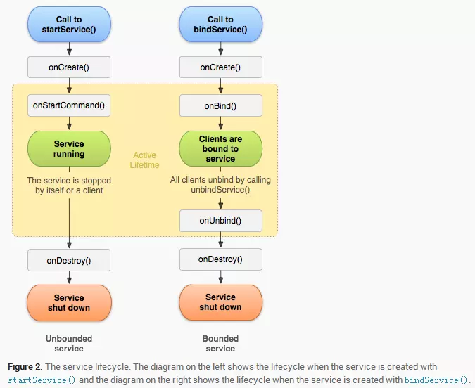
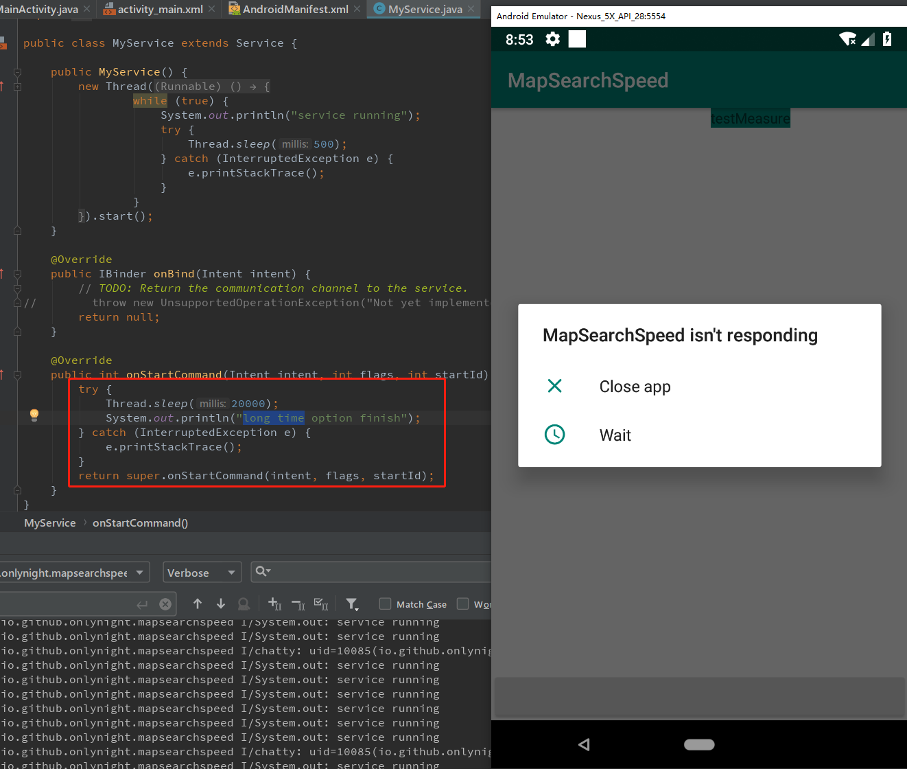

OPPO 高级 Android 开发面试题汇总
===============================

## 一、 Android 基础

### 1. Service 的两种启动方式

简单的来说就是 **直接启动** 和 **绑定启动** 两种方式。

```java
// 直接启动
Context.startService()

// 直接启动后需要手动调用停止服务才会停止
Context.stopService()
Service.selfStop()
```

```java
// 绑定启动
Context.bindService()
```

两种启动方式的生命周期不同，下面詳細说明下生命周期。

官方生命周期图如下：




从上图可以看出，无论是哪种启动方式，都会调用 onCreate 方法，服务第一次创建时会调用该方法，以后再调用 ```startService``` 也不会调用 ```onCreate``` 方法，这里面适合做初始化操作。当处于激活状态时，由 ```startService``` 启动 Service 需要自己停止或者外部客户端停止服务；由 ```bindService``` 启动的服务，当所连接的客户端都调用 ```unbindService``` 后停止。

根据不同的使用场景选择合适的启动方式，例如音乐播放器需要后台播放以及 widget 控制播放这时候就要使用 ```startService``` 启动服务，在用户退出应用的时候结束服务。再比如，某个 Service 的作用范围只在某个 activity 或几个 activity中时，使用bindService方式会比较合适。

#### 题外话：Service 保活

1. 在 onStartCommand 中返回 START_STICKY

这种方式并不能保证 Service 不被杀死，只是提高 Service 被杀死后快速重启概率。

2. 提高 Service 优先级

3. 设置为前台服务

在service中设置常驻通知栏，这样服务就可以在后台常驻，但是通知栏会显示一个通知。

4. 双进程守护

为后台常驻 Service 设置守护进程，相互监听对方的状态，当监测到对方被杀死后立即重启对方 Service 达到守护 service 的目的。

上述方法中通常情况下只能在原声 Android 中实现，国内修改过的系统为了让系统有更好的续航通常都会阻止应用自启动，因此上述方法基本失效。

关于上述方法失效问题很多人会换一种方式解决这个问题，通过第三方推送sdk启动应用，例如 友盟、极光等。具体操作方法就是在自定义推送中启动我们应用的后台服务从而启动应用。具体使用中发现也只能在部分系统中生效，flyme，miui杜绝了这种全家桶式的自启动方式。

终极解决办法，通过微信服务号向用户推送关键信息并通过浏览器打开应用。微信服务号的推送不能滥用，滥用微信会停止服务号的推送功能。

其他相关文章：

[Android Service两种启动方式详解（总结版）](https://www.jianshu.com/p/4c798c91a613)

[Service的两种启动方式](https://www.jianshu.com/p/8a1bdb5062f6)

### 2. IntentService原理分析

普通 Service 在未指定进程的情况下和主线程运行在同一进程，并且也在主线程中，因此在这样的 Service 中做过多耗时操作也会阻塞UI线程。



这种情况下如果我们不想出现跨进程的情况，我们就不能指定 Service 在独立的进程中，我们可以在 Service 中创建 Thread 来处理这些耗时的操作，Android官方给我们提供了一种便利的方式，我们只需要继承IntentService即可，IntentService 会自动我们的操作创建 Thread 并执行。具体实现如下：

```java
public abstract class IntentService extends Service {
    private volatile Looper mServiceLooper;
    private volatile ServiceHandler mServiceHandler;
    private String mName;
    private boolean mRedelivery;

    private final class ServiceHandler extends Handler {
        public ServiceHandler(Looper looper) {
            super(looper);
        }

        @Override
        public void handleMessage(Message msg) {
            onHandleIntent((Intent)msg.obj);
            stopSelf(msg.arg1);
        }
    }

    /**
     * Creates an IntentService.  Invoked by your subclass's constructor.
     *
     * @param name Used to name the worker thread, important only for debugging.
     */
    public IntentService(String name) {
        super();
        mName = name;
    }

    /**
     * Sets intent redelivery preferences.  Usually called from the constructor
     * with your preferred semantics.
     *
     * <p>If enabled is true,
     * {@link #onStartCommand(Intent, int, int)} will return
     * {@link Service#START_REDELIVER_INTENT}, so if this process dies before
     * {@link #onHandleIntent(Intent)} returns, the process will be restarted
     * and the intent redelivered.  If multiple Intents have been sent, only
     * the most recent one is guaranteed to be redelivered.
     *
     * <p>If enabled is false (the default),
     * {@link #onStartCommand(Intent, int, int)} will return
     * {@link Service#START_NOT_STICKY}, and if the process dies, the Intent
     * dies along with it.
     */
    public void setIntentRedelivery(boolean enabled) {
        mRedelivery = enabled;
    }

    @Override
    public void onCreate() {
        // TODO: It would be nice to have an option to hold a partial wakelock
        // during processing, and to have a static startService(Context, Intent)
        // method that would launch the service & hand off a wakelock.

        super.onCreate();
        HandlerThread thread = new HandlerThread("IntentService[" + mName + "]");
        thread.start();

        mServiceLooper = thread.getLooper();
        mServiceHandler = new ServiceHandler(mServiceLooper);
    }

    @Override
    public void onStart(@Nullable Intent intent, int startId) {
        Message msg = mServiceHandler.obtainMessage();
        msg.arg1 = startId;
        msg.obj = intent;
        mServiceHandler.sendMessage(msg);
    }

    /**
     * You should not override this method for your IntentService. Instead,
     * override {@link #onHandleIntent}, which the system calls when the IntentService
     * receives a start request.
     * @see android.app.Service#onStartCommand
     */
    @Override
    public int onStartCommand(@Nullable Intent intent, int flags, int startId) {
        onStart(intent, startId);
        return mRedelivery ? START_REDELIVER_INTENT : START_NOT_STICKY;
    }

    @Override
    public void onDestroy() {
        mServiceLooper.quit();
    }

    /**
     * Unless you provide binding for your service, you don't need to implement this
     * method, because the default implementation returns null.
     * @see android.app.Service#onBind
     */
    @Override
    @Nullable
    public IBinder onBind(Intent intent) {
        return null;
    }

    /**
     * This method is invoked on the worker thread with a request to process.
     * Only one Intent is processed at a time, but the processing happens on a
     * worker thread that runs independently from other application logic.
     * So, if this code takes a long time, it will hold up other requests to
     * the same IntentService, but it will not hold up anything else.
     * When all requests have been handled, the IntentService stops itself,
     * so you should not call {@link #stopSelf}.
     *
     * @param intent The value passed to {@link
     *               android.content.Context#startService(Intent)}.
     *               This may be null if the service is being restarted after
     *               its process has gone away; see
     *               {@link android.app.Service#onStartCommand}
     *               for details.
     */
    @WorkerThread
    protected abstract void onHandleIntent(@Nullable Intent intent);
}
```

从上面的源码中我们可以看出 IntentService 使用了 Handler 来处理发送过来的任务，调用 ```startService``` 后首先会进入 ```onStartCommand``` 接着我们看到 ```onStart``` 方法中将 intent 封装成 Message 丢给 handler ，handler 中的 handleMessage 方法调用 onHandleIntent，我们只需要在 onHandleIntent 完成我们要做的操作即可。 我们看到 onHandleIntent 有一个自定义的注解 ```@WorkerThread```, 添加了该注解的方法系统会自动为我们创建一个线程然后再执行 onHandleIntent 方法。

因此，IntentService 中的消息是依次执行的，如果有很多任务并发执行，这些任务都会放在消息队列中，等待前一个任务执行完成后才能执行下一个任务。

相关文章：

[Android中IntentService实现原理详解](https://blog.csdn.net/woshizisezise/article/details/79939270)

[IntentService的原理和实例分析](https://www.jianshu.com/p/4dd46616564d)

### 3. 静态广播和动态广播的区别？

静态广播需要在 androidManifest.xml 文件中申明组件，否则无法接收广播；
动态广播需要在运行的时候动态注册，有很多系统广播只能用动态注册的方式使用。

1. 动态注册的广播永远要快于静态注册的广播,不管静态注册的优先级设置的多高,不管动态注册的优先级有多低
2. 生存期，静态广播的生存期可以比动态广播的长很多，因为静态广播很多都是用来对系统时间进行监听，比如我们可以监听手机开机。而动态广播会随着context的终止而终止
3. 动态广播无需在AndroidManifest.xml中声明即可直接使用，也即动态；而静态广播则需要，有时候还要在AndroidManifest.xml中加上一些权限的声明

## 二、 Java 基础

### 1. 重载和重写

#### 重写 override

重写故名思意重新写父类已经实现的方法，即覆盖父类的方法子类重新实现。这样子类可以灵活的定义自己的行为。重写规则：

- 参数列表必须完全与被重写方法的相同；
- 返回类型必须完全与被重写方法的返回类型相同；
- 访问权限不能比父类中被重写的方法的访问权限更低。例如：如果父类的一个方法被声明为public，那么在子类中重写该方法就不能声明为protected。
- 父类的成员方法只能被它的子类重写。
- 声明为final的方法不能被重写。
- 声明为static的方法不能被重写，但是能够被再次声明。
- 子类和父类在同一个包中，那么子类可以重写父类所有方法，除了声明为private和final的方法。
- 子类和父类不在同一个包中，那么子类只能够重写父类的声明为public和protected的非final方法。
- 重写的方法能够抛出任何非强制异常，无论被重写的方法是否抛出异常。但是，重写的方法不能抛出新的强制性异常，或者比被重写方法声明的更广泛的强制性异常，反之则可以。
- 构造方法不能被重写。
- 如果不能继承一个方法，则不能重写这个方法。

#### 重载 overload

重载，同一个类中函数名相同参数不同的函数记为重写，java中一般不加 @Overload 注解，直接写重载函数即可，需要注意的重载规则：


- 被重载的方法必须改变参数列表(参数个数或类型或顺序不一样)；
- 被重载的方法可以改变返回类型；
- 被重载的方法可以改变访问修饰符；
- 被重载的方法可以声明新的或更广的检查异常；
- 方法能够在同一个类中或者在一个子类中被重载。
- 无法以返回值类型作为重载函数的区分标准


相关文章:

[Java重写与重载之间的区别](https://www.cnblogs.com/guweiwei/p/6288068.html)

[Java—重写与重载的区别](https://blog.csdn.net/wintershii/article/details/80558739)

## 三、 开源框架

### 1. 网络框架

### 2. 图片加载框架

### 3. 数据库 ORM 框架

## 四、 Android 进阶


## OPPO 面试相关文章

[大厂OPPO面试— Android 开发技术面总结](http://www.jcodecraeer.com/plus/view.php?aid=12576)

[OppoAndroid面试小记](https://www.cnblogs.com/wenjianes/p/10023517.html)

[OPPO Android开发技术面总结](https://www.jianshu.com/p/b110f9c1384c)

[Android 高级架构开发工程师常见的面试题(腾讯,百度,平安,OPPO,招商银行)](https://blog.csdn.net/wolfking0608/article/details/83111340)
