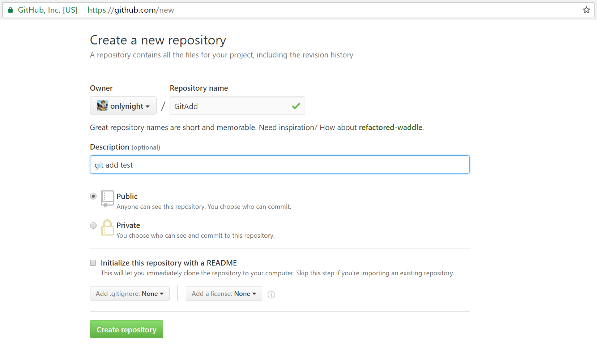

#Simple Git Course 简要Git教程

##Git是什么
Git是一个开源的分布式版本控制系统，用于敏捷高效地处理任何或小或大的项目。
Git是 Linus Torvalds 为了帮助管理 Linux 内核开发而开发的一个开放源码的版本控制软件。
Git与常用的版本控制工具 CVS, Subversion 等不同，它采用了分布式版本库的方式，不必服务器端软件支持。

##Git与SVN的区别
GIT不仅仅是个版本控制系统，它也是个内容管理系统(CMS),工作管理系统等。
如果你是一个具有使用SVN背景的人，你需要做一定的思想转换，来适应GIT提供的一些概念和特征。
Git 与 SVN 区别点：

1. GIT是分布式的，SVN不是：这是GIT和其它非分布式的版本控制系统，例如SVN，CVS等，最核心的区别。
2. GIT把内容按元数据方式存储，而SVN是按文件：所有的资源控制系统都是把文件的元信息隐藏在一个类似.svn,.cvs等的文件夹里。
3. GIT分支和SVN的分支不同：分支在SVN中一点不特别，就是版本库中的另外的一个目录。
4. GIT没有一个全局的版本号，而SVN有：目前为止这是跟SVN相比GIT缺少的最大的一个特征。
5. GIT的内容完整性要优于SVN：GIT的内容存储使用的是SHA-1哈希算法。这能确保代码内容的完整性，确保在遇到磁盘故障和网络问题时降低对版本库的破坏。

##Git详细教程以及命令行查询
你可以去github上fork一份：[Git详细教程&命令行查询Github]
同样你也可以去CSDN博客：[Git详细教程&命令行查询CSDN]
（Github上格式看着舒服些。）
这一篇教程基本上涵盖了git的所有操作，还有详细的小白教程，或者大神突然忘了某个命令怎么玩可以当文档使使。

##Git工作流说明


下面我们根据这幅图来举两个例子：

###栗子1
假设现在已经有了一个成熟的项目托管在github上，github就是我们的远程仓库，假设是这个项目 https://github.com/onlynight/Proxy 。项目的所有者邀请你一起参与项目的开发与维护，将你添加为协作伙伴。

####**1.clone远程仓库**

首先，你需要讲远程仓库的代码clone到本地。

```bash
$ git clone https://www.github.com/onlynight/Proxy
```

会更具实际的情况要求你输入Github用户名和密码，执行完成以上命令行出现以下类似代码就证明克隆成功了：

```bash
Cloning into 'Proxy'...
remote: Counting objects: 54, done.
remote: Compressing objects: 100% (30/30), done.
remote: Total 54 (delta 15), reused 51 (delta 12), pack-reused 0
Unpacking objects: 100% (54/54), done.
Checking connectivity... done.
```

####**2.修改代码，提交本地仓库**
然后，确定你要修改代码的分支，你可以通过branch命令查看分支，切换分支，比如我们要修改master分支：

查看当前所有分支：

```bash
$ git branch
* master
```

比如我们要修改develop分支我们通过checkout命令切换分支（注意切换份之前必须将当前分支的修改全部提交或者保存到stage中去）

```bash
$ git checkout "develop"
```

然后，我们会根据实际任务修改代码，假设我们新建了一个test.txt文件在项目的根目录并且修改README.md的标题为"Proxy"。接下来我们要做的就是先把新建的文件添加到缓存，然后将缓存提交到本地仓库。

修改的文件添加到缓存:

```bash
$ git add test.txt README.md
```

或者将工作目录下所有的新添加的文件都添加到缓存：

```bash
$ git add .
```

提交缓存到本地仓库：

```bash
$ git commit -m "添加test.txt 修改README.md标题"
[master b8b4924] 添加test.txt 修改README.md标题
 1 file changed, 0 insertions(+), 0 deletions(-)
 create mode 100644 test.txt
```

引号中的文本即为本次提交的描述。

这时候你的代码就正确提交到了你的本地仓库了，但是远程仓库还没有。我们可以使用push命令将代码直接提交到远程仓库，但是这里存在一个问题，如果你和你的协作伙伴同时添加了一行代码到同一个函数的同一行，代码是顺序执行的，但是要求你的代码先执行才行，而在你提交之前你的协作伙伴先提交了，如果这时候直接push的话git很有可能将冲突的代码自动合并，就会对代码造成损坏，所以在你push之前首先将远程仓库的代码pull下来，这时候如果有冲突就可以人工解决冲突，就不会出现上面的问题啦。

####**3.1推送代码到远程仓库（无冲突）**
说这么一大堆废话其实想要说的就是，在你提交到本地仓库以后准备push之前最好先pull一次远程仓库代码：

```bash
$ git pull
Already up-to-date.
```

出现以上的情况就说明你的本地仓库已经是最新的代码啦，这时候你就可以放心的提交远程仓库有啦：

```
$ git push origin master
Username for 'https://github.com': onlynight
Password for 'https://onlynight@github.com':
Counting objects: 3, done.
Delta compression using up to 4 threads.
Compressing objects: 100% (2/2), done.
Writing objects: 100% (3/3), 315 bytes | 0 bytes/s, done.
Total 3 (delta 1), reused 0 (delta 0)
remote: Resolving deltas: 100% (1/1), completed with 1 local objects.
To https://www.github.com/onlynight/Proxy
   82f428e..b8b4924  master -> master
```

上面我们是通过https clone的git仓库，所以push的时候需要输入用户名和密码（每次push都需要，如果觉得麻烦你可以配置下ssh，ssh设置密码就不用每次都输入用户名和密码啦，详细配置方法查看我的另外一篇教程[Git详细教程&命令行查询Github]）

第二个参数```origin```默认origin。
第三个参数```master```表示你要推送的分支。


####**3.2推送代码到远程仓库（有冲突）**
为了模拟冲突我们去github上修改README.md的标题为"Proxy Pattern"，这个修改假设值你的协作伙伴修改的，然后我们再修改RAEDME.md的标题为"Proxy1"。这时候就模拟了你和你的协作伙伴同时修改同一个地方的情况了，这样就会有冲突。修改完成以后先提交本地仓库。然后将远程仓库代码pull到本地：

```bash
$ git pull
remote: Counting objects: 3, done.
remote: Compressing objects: 100% (3/3), done.
remote: Total 3 (delta 2), reused 0 (delta 0), pack-reused 0
Unpacking objects: 100% (3/3), done.
From https://www.github.com/onlynight/Proxy
   122aa0e..f7eac81  master     -> origin/master
Auto-merging README.md
CONFLICT (content): Merge conflict in README.md
Automatic merge failed; fix conflicts and then commit the result.
```

查看以上信息可知git自动合并"README.md"失败，需要手动合并。打开README.md文件，搜索"<<<<<<< HEAD"就可以快速定位到冲突的地方：

```
<<<<<<< HEAD
Proxy1
=======
Proxy Pattern
>>>>>>> f7eac81a3a3e981f0ef7f3e1532c309c9c893981
```

等号两侧的即时冲突的代码，经过你和你的协作伙伴讨论决定使用等号以下的作为最终结果，然后你需要修改这一段冲突的文本为：

```
Proxy Pattern
```

然后再次将你的修改缓存到本地仓库:

```bash
$ git add README.md
$ git commit -m "merge README.md"
[master 7c6909f] merge README.md
```

最后，再将所有的改动push到远程仓库就完成啦：

```
$ git push origin master
Username for 'https://github.com': onlynight
Password for 'https://onlynight@github.com':
Counting objects: 6, done.
Delta compression using up to 4 threads.
Compressing objects: 100% (6/6), done.
Writing objects: 100% (6/6), 607 bytes | 0 bytes/s, done.
Total 6 (delta 4), reused 0 (delta 0)
remote: Resolving deltas: 100% (4/4), completed with 2 local objects.
To https://www.github.com/onlynight/Proxy
   f7eac81..7c6909f  master -> master
```

##栗子2
你想要自己新建一个项目，然后托管到远程git仓库上分享给大家。

###**1.初始化本地仓库**
如果你已经有项目那么就在你的项目目录下完成以下操作，如果没有新建一个项目目录：

```bash
$ git init
Initialized empty Git repository in C:/Users/lion/Desktop/MyFirstGitProj/.git/
# C:/Users/lion/Desktop/MyFirstGitProj/ 就是我的项目路径
```

这样本地仓库就新建完成啦。

然后我们为项目添加一个README.md文件：

```bash
$ touch README.md
```

这时候我们可以查看以下本地git的状态：

```bash
$ git status
On branch master

Initial commit

Untracked files:
  (use "git add <file>..." to include in what will be committed)

        README.md

nothing added to commit but untracked files present (use "git add" to track)
```

上面的信息说我们有一个文件没有添加到缓存中去。

###**2.将项目中的文件提交到本地仓库**
然后将项目目录下所有的文件添加到缓存中去：

```bash
$ git add .
```

这时候我们再次查看以下本地git的状态：

```bash
$ git status
On branch master

Initial commit

Changes to be committed:
  (use "git rm --cached <file>..." to unstage)

        new file:   README.md
```

上面的这个状态就是已提交缓存，现在你可以将缓存中的文件移除，或者将缓存提交到本地仓库。

将缓存提交到本地仓库：

```bash
$ git commit -m "inital commit"
[master (root-commit) abff941] inital commit
 1 file changed, 0 insertions(+), 0 deletions(-)
 create mode 100644 README.md
```

这样我们的本地仓库就完成啦。

###**3.新建远程仓库**
这里我们使用github作为远程托管仓库，你需要先去https://www.github.com注册并登陆账号。
之后登录后点击" New repository " 如下图所示：


之后在在Repository name 填入 GitAdd(远程仓库名) ，description中填写描述"git add test"，其他保持默认设置，点击"Create repository"按钮，就成功地创建了一个新的Git仓库：



创建成功后，显示如下信息：


###**4.将本地仓库提交到远程仓库**
首先，将本地仓库与远程仓库连接：

```bash
$ git remote add origin https://github.com/onlynight/MyFirstGitProj
```

第三个参数```origin```为该远程仓库的别名，默认为origin
第四个参数就是远程仓库的url

然后将本地仓库push到远程仓库：

```
$ git push origin master
Username for 'https://github.com': onlynight
Password for 'https://onlynight@github.com':
Counting objects: 3, done.
Writing objects: 100% (3/3), 210 bytes | 0 bytes/s, done.
Total 3 (delta 0), reused 0 (delta 0)
To https://github.com/onlynight/MyFirstGitProj
 * [new branch]      master -> master
```

第二个参数是说要push到哪个远程仓库
第三个参数是说要push到远程仓库的哪个分支，默认为master

以上就完成了栗子2的全部内容，你现在就可以把你的项目 https://github.com/onlynight/MyFirstGitProj 分享给你的小伙伴啦。


[Git详细教程&命令行查询Github]: https://github.com/onlynight/GitCourse
[Git详细教程&命令行查询CSDN]: http://blog.csdn.net/tgbus18990140382/article/details/52886786
