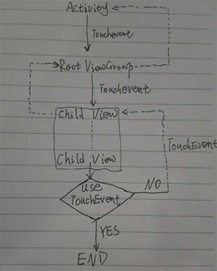
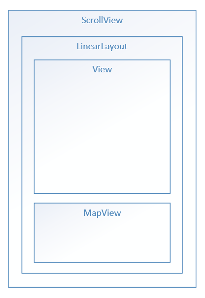
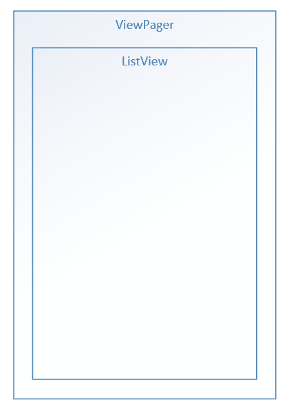
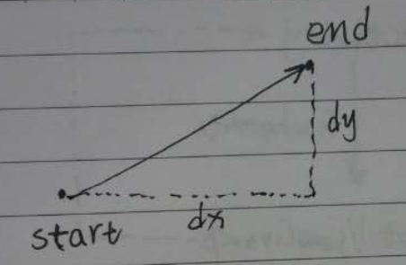

Android滑动冲突解决方法
======================

# 滑动冲突

首先讲解一下什么是滑动冲突。当你需要在一个ScrollView中嵌套使用ListView或者RecyclerView的时候你会发现只有ScrollView能够滑动，而ListView或RecyclerView不能滑动，这个就违背了我们写这段代码的意愿。我们想要的结果是当我们滑动ListView的时候ListView滑动，滑动ListView以外的地方的时候ScrollView滑动。这时候滑动冲突就产生了，我们需要想办法解决这个冲突。

# View Touch事件分发

首先我们了解下Android的控件组织结构。View是显示组件的基类，ViewGroup继承自View是布局的基类。ViewGroup中可包含View和ViewGroup，这样就形成了View树。View的Touch事件总是从View根节点开始向下传递的，根据点击的位置判断该传递给哪个子View，直到子节点再没有子节点这时候，如果这个事件被该View消耗那么事件的传递就此结束，如果该View没有使用这个事件那么这个事件会依次向上传递直到有View消耗了这个事件，如果没有View消耗这个事件，那么该事件就会被传递给Activity处理。以上就是Vieww Touch事件传递的过程。

我们来看View的dispatchEvent方法：

```java
//View.java
/**
 * Pass the touch screen motion event down to the target view, or this
 * view if it is the target.
 *
 * @param event The motion event to be dispatched.
 * @return True if the event was handled by the view, false otherwise.
 */
public boolean dispatchTouchEvent(MotionEvent event) {
    boolean result = false;

    if (onFilterTouchEventForSecurity(event)) {
        //noinspection SimplifiableIfStatement
        ListenerInfo li = mListenerInfo;
        if (li != null && li.mOnTouchListener != null
                && (mViewFlags & ENABLED_MASK) == ENABLED
                && li.mOnTouchListener.onTouch(this, event)) {
            result = true;
        }

        if (!result && onTouchEvent(event)) {
            result = true;
        }
    }

    return result;
}
```

从这段代码我们可以看出OnTouchListener的优先级高于onTouchEvent。
下面我们再来看看ViewGroup的dispatchTouchEvent方法:

```java
//ViewGroup.java
@Override
public boolean dispatchTouchEvent(MotionEvent ev) {
    ...

    boolean handled = false;
    if (actionMasked == MotionEvent.ACTION_DOWN
            || mFirstTouchTarget != null) {
        final boolean disallowIntercept = (mGroupFlags & FLAG_DISALLOW_INTERCEPT) != 0;
        if (!disallowIntercept) {
            intercepted = onInterceptTouchEvent(ev);
            ev.setAction(action); // restore action in case it was changed
        } else {
            intercepted = false;
        }
    } else {
        // There are no touch targets and this action is not an initial down
        // so this view group continues to intercept touches.
        intercepted = true;
    }

    // Check for cancelation.
    final boolean canceled = resetCancelNextUpFlag(this)
            || actionMasked == MotionEvent.ACTION_CANCEL;

    //如果没有拦截再分发下去处理
    if (!canceled && !intercepted) {
        ...
        if (dispatchTransformedTouchEvent(ev, false, child, idBitsToAssign)) {
            ...
        }
        ...
    }

    return handled;
}

/**
 * Transforms a motion event into the coordinate space of a particular child view,
 * filters out irrelevant pointer ids, and overrides its action if necessary.
 * If child is null, assumes the MotionEvent will be sent to this ViewGroup instead.
 */
private boolean dispatchTransformedTouchEvent(MotionEvent event, boolean cancel,
        View child, int desiredPointerIdBits) {
    final boolean handled;

    // Canceling motions is a special case.  We don't need to perform any transformations
    // or filtering.  The important part is the action, not the contents.
    final int oldAction = event.getAction();
    if (cancel || oldAction == MotionEvent.ACTION_CANCEL) {
        event.setAction(MotionEvent.ACTION_CANCEL);
        if (child == null) {
            handled = super.dispatchTouchEvent(event);
        } else {
            handled = child.dispatchTouchEvent(event);
        }
        event.setAction(oldAction);
        return handled;
    }

    ...
}
```

可以看到ViewGroup在处理事件前有一个touch事件是否被拦截onInterceptTouchEvent的判断，如果被拦截则不再向下一级分发；如果没有拦截则向下分发，处理方式会根据ViewGroup中是否包含子元素来判断，如果包含子元素则将事件交由子元素处理touch事件```handled = child.dispatchTouchEvent(event);```，如果不包含子元素则由自身处理```handled = child.dispatchTouchEvent(event);```处理流程和View相同。



实线箭头为touch事件正向传递，虚线为向上传递touch事件。

通过上面的分发的逻辑我们可以知道父控件有能力把事件不传递给子View，从而不让子控件接收Touch事件，那么子控件有没有能力让父控件失去响应Touch事件的能力呢，下面我们来看看具体的源码，看源码的顺序是由下而上的，这回我们反其道而行，我们知道事件的入口然后依次向下找。

# Activity分发事件到ViewGroup
根据上面的图我们知道View的touch事件是由Activity传递过来的，那么我们先看看Activity有没有类似的方法，正如我们所料，Activity的dispatchTouchEvent函数如下：

```java
/**
 * Called to process touch screen events.  You can override this to
 * intercept all touch screen events before they are dispatched to the
 * window.  Be sure to call this implementation for touch screen events
 * that should be handled normally.
 *
 * @param ev The touch screen event.
 *
 * @return boolean Return true if this event was consumed.
 */
public boolean dispatchTouchEvent(MotionEvent ev) {
    if (ev.getAction() == MotionEvent.ACTION_DOWN) {
        onUserInteraction();
    }
    if (getWindow().superDispatchTouchEvent(ev)) {
        return true;
    }
    return onTouchEvent(ev);
}
```

显而易见我们要看的是```getWindow().superDispatchTouchEvent(ev)```，我们深入进去看到Window类中的这个方法：

```java
//Window.java
/**
 * Used by custom windows, such as Dialog, to pass the touch screen event
 * further down the view hierarchy. Application developers should
 * not need to implement or call this.
 *
 */
public abstract boolean superDispatchTouchEvent(MotionEvent event);
```

Window类是个抽象类，它的唯一实现类是PhoneWindow，PhoneWindow类中的实现如下：

```java
//PhoneWindow.java
@Override
public boolean superDispatchTouchEvent(MotionEvent event) {
    return mDecor.superDispatchTouchEvent(event);
}
```

mDecor是DecorView，我们看看这个DectorView是从哪里来的：

```java
//PhoneWindow.java
private void installDecor() {
    if (mDecor == null) {
        mDecor = generateDecor();
        ...
    }

    ...

    if (mContentParent == null) {
        mContentParent = generateLayout(mDecor);
    }

    ...
}

protected DecorView generateDecor() {
    return new DecorView(getContext(), -1);
}

@Override
public void setContentView(int layoutResID) {
    // Note: FEATURE_CONTENT_TRANSITIONS may be set in the process of installing the window
    // decor, when theme attributes and the like are crystalized. Do not check the feature
    // before this happens.
    if (mContentParent == null) {
        installDecor();
    } else if (!hasFeature(FEATURE_CONTENT_TRANSITIONS)) {
            mContentParent.removeAllViews();
    }

    if (hasFeature(FEATURE_CONTENT_TRANSITIONS)) {
        final Scene newScene = Scene.getSceneForLayout(mContentParent, layoutResID,
                getContext());
        transitionTo(newScene);
    } else {
        mLayoutInflater.inflate(layoutResID, mContentParent);
    }
    final Callback cb = getCallback();
    if (cb != null && !isDestroyed()) {
        cb.onContentChanged();
    }
}

protected ViewGroup generateLayout(DecorView decor) {
    ...

    View in = mLayoutInflater.inflate(layoutResource, null);
    decor.addView(in, new ViewGroup.LayoutParams(MATCH_PARENT, MATCH_PARENT));
    mContentRoot = (ViewGroup) in;

    ViewGroup contentParent = (ViewGroup)findViewById(ID_ANDROID_CONTENT);
    if (contentParent == null) {
        throw new RuntimeException("Window couldn't find content container view");
    }

    ...

    return contentParent;
}

//Activity.java
/**
 * Set the activity content from a layout resource.  The resource will be
 * inflated, adding all top-level views to the activity.
 *
 * @param layoutResID Resource ID to be inflated.
 *
 * @see #setContentView(android.view.View)
 * @see #setContentView(android.view.View, android.view.ViewGroup.LayoutParams)
 */
public void setContentView(int layoutResID) {
    getWindow().setContentView(layoutResID);
    initWindowDecorActionBar();
}
```

这里我们就看出了mDecorView中包含了mContentParent，并且DecorView继承自FramLayout，所以touch事件的分发也符合View的事件分发，mDecorView之后会添加到Activity关联的Window上（这里我们不再深究），下面我们来看DecorView的superDispatchTouchEvent：

```java
//PhoneWindow.java#DecorView
public boolean superDispatchTouchEvent(MotionEvent event) {
    return super.dispatchTouchEvent(event);
}
```

至此，activity的dispatchTouchEvent方法就最终分发到了我们的布局上，最后总结一下：

```java
Activity#dispatchTouchEvent -> PhoneWindow#superDispatchTouchEvent ->
DecorView#superDispatchTouchEvent -> ViewGroup#dispatchTouchEvent -> View#dispatchTouchEvent
```


# 解决滑动冲突的原理

看了上面的源码解析，我们知道Viewtouch事件分发过程中重要的三个函数：

- ```dispatchTouchEvent``` 负责touch事件的分发
- ```onIntercepterTouchEvent``` 负责拦截touch事件
- ```onTouchEvent``` 最终处理touch事件

其中dispatchTouchEvent和onIntercepterTouchEvent可以控制touch事件流不传递给子控件，这两个方法中可以控制事件流的向下分发，那么是不是有方法控制事件流向上分发呢？我们找到ViewGroup中有这样一个函数：

```java
//ViewGroup.java
@Override
public boolean dispatchTouchEvent(MotionEvent ev) {
    ...

    boolean handled = false;
    if (actionMasked == MotionEvent.ACTION_DOWN
            || mFirstTouchTarget != null) {
        final boolean disallowIntercept = (mGroupFlags & FLAG_DISALLOW_INTERCEPT) != 0;
        if (!disallowIntercept) {
            intercepted = onInterceptTouchEvent(ev);
            ev.setAction(action); // restore action in case it was changed
        } else {
            intercepted = false;
        }
    } else {
        // There are no touch targets and this action is not an initial down
        // so this view group continues to intercept touches.
        intercepted = true;
    }

    // Check for cancelation.
    final boolean canceled = resetCancelNextUpFlag(this)
            || actionMasked == MotionEvent.ACTION_CANCEL;

    //如果没有拦截再分发下去处理
    if (!canceled && !intercepted) {
        ...
        if (dispatchTransformedTouchEvent(ev, false, child, idBitsToAssign)) {
            ...
        }
        ...
    }

    return handled;
}

/**
 * {@inheritDoc}
 */
public void requestDisallowInterceptTouchEvent(boolean disallowIntercept) {

    if (disallowIntercept == ((mGroupFlags & FLAG_DISALLOW_INTERCEPT) != 0)) {
        // We're already in this state, assume our ancestors are too
        return;
    }

    if (disallowIntercept) {
        mGroupFlags |= FLAG_DISALLOW_INTERCEPT;
    } else {
        mGroupFlags &= ~FLAG_DISALLOW_INTERCEPT;
    }

    // Pass it up to our parent
    if (mParent != null) {
        mParent.requestDisallowInterceptTouchEvent(disallowIntercept);
    }
}
```

实际上requestDisallowInterceptTouchEvent是修改了disallowIntercept的状态，再结合ViewGroup的dispatchTouchEvent方法查看，我们就明白这个方法的最终意义。ViewGroup的子元素可以通过调用这个方法禁止ViewGroup拦截touch事件。到这里我们就找到了自下而上的touch事件的拦截方法。

# 滑动冲突两种解决办法

## 1. 外部拦截法

通过上面的原理分析我们知道我们可以在dispatchTouchEvent的时候不分发事件或者onInterceptTouchEvent时候拦截事件，实际上onInterceptTouchEvent方法是一个空方法，是android专门提供给我们处理touch事件拦截的方法，所以这里我们在onInterceptTouchEvent方法中拦截touch事件。

具体做法就是当你不想把事件传递给子控件的时候在onInterceptTouchEvent方法中返回true即可拦截事件，这时候子控件将不会再接收到这一次的touch事件流（所谓touch事件流是以ACTION_DOWN开始，中间包含若干个ACTION_MOVE，以ACTION_UP结束的一连串事件）。伪代码如下：

```java
public boolean onInterceptTouchEvent(MotionEvent ev) {
    if ( condition ) {
        return true;
    }
    return false;
}
```

这里的condition将会再下一章节中具体讲解。

## 2. 内部拦截法

首先，我们让父控件拦截除了ACTION_DOWN以外的所有事件，如果连ACTION_DOWN都拦截那么子控件将无法收到任何touch事件：

```java
@Override
public boolean onInterceptTouchEvent(MotionEvent event) {
    int action = event.getAction();
    if (action == MotionEvent.ACTION_DOWN) {
        return false;
    } else {
        return true;
    }
}
```

然后，在控件的内部分发事件的时候请求需要的事件（实际上就是禁止父控件拦截事件）：

```java
@Override
public boolean dispatchTouchEvent(MotionEvent ev) {
    switch (ev.getAction()){
        case MotionEvent.ACTION_DOWN:
            //通知父容器不要拦截事件
            parent.requestDisallowInterceptTouchEvent(true);
            break;
        case MotionEvent.ACTION_MOVE:

            if ( <condition> ){
                //通知父容器拦截此事件
                parent.requestDisallowInterceptTouchEvent(false);
            }
            break;
        case MotionEvent.ACTION_UP:
            parent.requestDisallowInterceptTouchEvent(false);
            break;
        default:
            break;
    }

    return super.dispatchTouchEvent(ev);
}
```

这样，就可以解决touch事件的冲突问题，从控件本身解决。内部拦截法使用起来稍显复杂，需要修改两个控件，一般情况下我们都通过外部拦截法解决滑动冲突，如果有特殊情况需要使用内部拦截法才会使用内部拦截法。

# 事件拦截Condition

试想以下情况：



MapView的功能是内部可以任意滑动（包括上下，左右以及任意方向滑动），ScrollView需要上下滑动。这时候我们在MapView内部上下滑动时会出现什么结果？我们期望的结果是MapView内部滑动，但是我们看到的实际情况却是ScrollView在上下滑动，滑动冲突就产生了，解决这个滑动冲突的方法很简单，直接上代码：

```java
@Override
    public boolean onInterceptTouchEvent(MotionEvent ev) {
        if (isMapViewTouched(ev)) {
            return false;
        } else {
            return super.onInterceptTouchEvent(ev);
        }
    }

private boolean isMapViewTouched(MotionEvent ev) {
    if (getChildCount() == 1) {
        float touchX = ev.getX();
        float touchY = ev.getY() + getScrollY();

        LinearLayout baseLinear = (LinearLayout) getChildAt(0);
        for (int i = 0; i < baseLinear.getChildCount(); i++) {
            View child = baseLinear.getChildAt(i);

            // add map view you want ignore
            if (isMapView(child)) {
                if (touchX < child.getRight() && touchX > child.getLeft() &&
                        touchY < child.getBottom() && touchY > child.getTop()) {
                    return true;
                }
            }
        }
    }
    return false;
}

private boolean isMapView(View child) {
    return child instanceof MapView ||
            child instanceof com.google.android.gms.maps.MapView;
}
```

isMapViewTouched这个函数就是我们这个情况下的condition，具体的含义就是当前点击的是MapView那么所有的touch事件都不允许拦截，交由MapView处理。

这是一种很简单的滑动冲突情况，没有判断滑动的方向以及速度等因素，一般的我们通过判断滑动的方向作为判断条件，下面我们再来看一种情况：



ViewPager需要左右滑动，ListView需要上下滑动，当我们斜向滑动时就出现了滑动冲突。实际上ViewPage已经解决了这种滑动冲突，这里我们假定它没有解决这种滑动冲突，我们自己来解决这个滑动冲突。当我们斜向滑动时候示意图如下：



当我们从start滑动到end时，x方向的坐标变化我们称之为dx，y方向的坐标变化我们称之为dy。

1. 当dx > dy时我们视其为水平滑动
2. 当dx < dy时我们视其为竖直滑动

通过外部拦截法的代码如下：

```java
//ViewPager.java
int lastX = -1;
int lastY = -1;
boolean isHorizontal = false;
boolean hasDirection = false;

@Override
public boolean onInterceptTouchEvent(MotionEvent ev) {
    final int action = ev.getAction() & MotionEventCompat.ACTION_MASK;

    switch( action ){
        case MotionEvent.ACTION_DOWN:
            lastX = ev.getX();
            lastY = ev.getY();
            break;
        case MotionEvent.ACTION_MOVE:
            int currentX = ev.getX();
            int currentY = ev.getY();
            int dx = Math.abs(currentX - lastX);
            int dy = Math.abs(currentY - lastY);

            // 这里为了保证用户体验，当我们第一次滑动的方向即为这次touch事件流的滑动方向
            if ( hasDirection ) {
                return isHorizontal;
            } else {
                if ( dx > dy ) { // 水平滑动
                    isHorizontal = true;
                    return true;
                } else { // 竖直滑动
                    isHorizontal = false;
                    return false;
                }
            }

            hasDirection = true;

            break;
        case MotionEvent.ACTION_UP:
            hasDirection = false;
            break;
    }

    return super.onInterceptTouchEvent(ev);
}
```

# 滑动冲突解决拓展

滑动冲突的解决方法我们已经知道了，以后无论遇到多么复杂的情况解决滑动冲突的原则都是不变的，根据你的业务需求进行不同的事件拦截即可。
