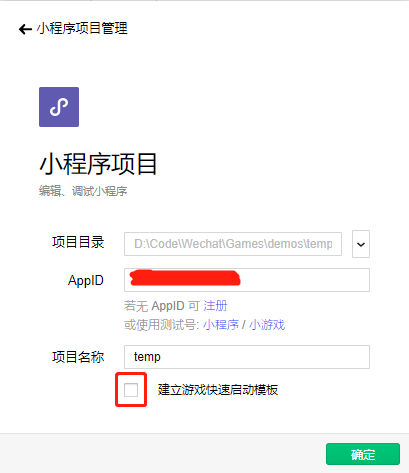
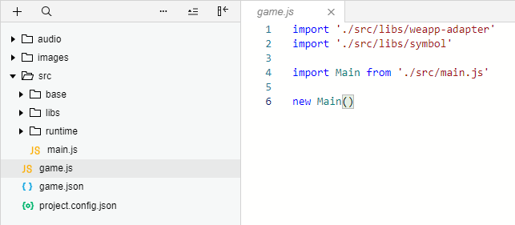

微信小游戏开发教程-新建项目
=======================

## 1. 新建小游戏项目



我们这回使用空项目，不要勾选使用模板创建。

## 2. 添加小游戏必要文件

项目创建好以后我们发现缺少一些必要的文件，我们手动添加即可：

1. game.json 

	这个文件是小游戏的配置文件，我们只做如下设置即可：

	```json
	{
	  "deviceOrientation": "portrait",
	  "showStatusBar": false
	}
	```

	这个文件需要在项目根目录下；
	詳細的其他配置参数，请查看微信的官方文档。

2. game.js 

	这个是小游戏的入口文件，相当于main函数，这里我们先新建一个空文件放着这里，稍后添加必要代码。

## 3. 导入必要的库

为了让游戏引擎感知不到运行js的环境变化，微信提供了 weapp-adapter.js 用来适配微信内置浏览器不知道的 dom api。当然这个适配器不是必须的，你可以不适用这个适配器。

1. 项目根目录下新建 ```src/libs``` 文件夹；
2. 将 ```weapp-adapter.js``` 文件复制到 ```src/libs``` 目录下；
3. 还有一个库，为了模拟 ES6 中的私有变量，可是可选添加，代码如下：

	```javascript
	// symbol.js

	/**
	 * 对于ES6中Symbol的极简兼容
	 * 方便模拟私有变量
	 */

	let Symbol  = window.Symbol
	let idCounter = 0

	if (!Symbol) {
	  Symbol = function Symbol(key) {
	    return `__${key}_${Math.floor(Math.random() * 1e9)}_${++idCounter}__`
	  }

	  Symbol.iterator = Symbol('Symbol.iterator')
	}

	window.Symbol = Symbol

	```

4. 在 ```game.js``` 中导入这两个库

```javascript
// file: game.js
import './src/libs/weapp-adapter'
import './src/libs/symbol'
```

## 4. 添加资源文件夹

目录结构如下：

```
├─audio				// 方音频资源文件
├─images			// 方图片资源文件
└─src				// 代码资源文件
    ├─base			// 基类
    ├─libs			// 库
    └─runtime		// 运行时组建
```




我们在 src 目录下添加代码资源入口文件 ```main.js```，并创建一个类：

```javascript
// filename: main.js

export default class Main {
}
```

在 game.js 中应用这个类，这样整个工程就算创建好啦。