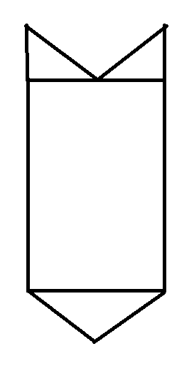
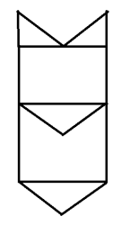
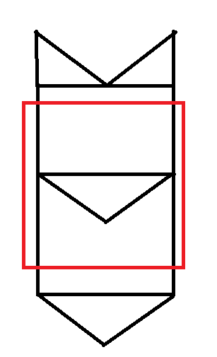

微信小游戏开发教程-2D游戏原理讲解

## 原理

为了更加形象的描述，这里先上一张图：

1. 背景

	首先，我们看到背景好像是一张无限长的图片在向下移动。实际则不然，这是一张顶部和底部刚好重叠的图片。这是一种节省资源讨巧的做法，然后绘制的时候同时绘制两张刚好拼接在一起，下面我们画一张图来形象的说明。

	

	我们看到这张图片是首尾可以拼接到一起的一张图片，然后两张图拼一起一起是下面这样：

	

	下面红色的框代表屏幕显示的区域，就飞机大战的情况我们将背景图的初始状态设置如下：

	

	然后让图片逐渐往下移，我们看到中途的状态是这样：

	

	最后移动到最顶部的时候重置到最初的状态，这样就实现了背景图的无限循环。这是2D游戏中常用的背景图技巧。