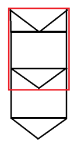

微信小游戏开发教程-2D游戏原理讲解
==============================

## 原理

为了更加形象的描述，这里先上一张图：

1. 背景

	a. 首先，我们看到背景好像是一张无限长的图片在向下移动。实际则不然，这是一张顶部和底部刚好重叠的图片。这是一种节省资源讨巧的做法，然后绘制的时候同时绘制两张刚好拼接在一起，下面我们画一张图来形象的说明。

	

	b. 我们看到这张图片是首尾可以拼接到一起的一张图片，然后两张图拼一起一起是下面这样：

	

	c. 下面红色的框代表屏幕显示的区域，就飞机大战的情况我们将背景图的初始状态设置如下：

	

	d. 然后让图片逐渐往下移，我们看到中途的状态是这样：

	

	e. 最后移动到最顶部的时候重置到最初的状态，这样就实现了背景图的无限循环。这是2D游戏中常用的背景图技巧。

	

2. 物体移动

	游戏中敌人的移动和子弹的移动还有玩家自身机体的移动我们统一称为物体的移动。

	先来看敌人和子弹的移动，这实际上就是一张图片在屏幕上竖直方向上移动。然后不断刷新位置，人眼看到就像是在移动一样。

3. 边缘检测

	玩家操控的机体我们要控制它在屏幕内，超出屏幕外就会很奇怪，所以这里要做以下边缘检测，当玩家移动到屏幕外时限制到屏幕边缘无法往边缘外移动。

4. 碰撞检测

	游戏中我们看到，子弹打中敌人的时候就代表了消灭敌人，什么情况下才是打中了敌人呢？当子弹和敌人机体碰撞的时候即代表打中了敌人。如何判断子弹打中了敌人？这里我们用一种较为简单的方法判断，旨在说明碰撞检测原理。

	我们假设敌人飞机在屏幕上是一个放快，子弹也是一个方块。这两个方块在屏幕上都有绝对坐标，当这两个方块的区域有重合的时候即发生了碰撞。这样碰撞检测就很容易做，即判断两个矩形的区域是否重合即可。以上就是所谓的碰撞检测。
