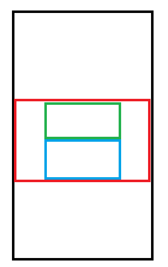
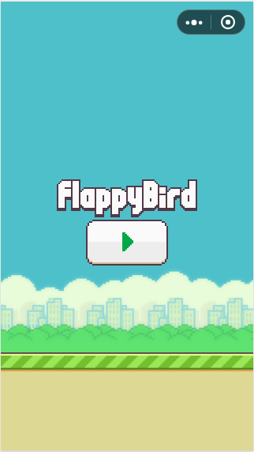

微信小游戏开发教程-游戏实现2
==========================

## 绘制地面

类似于绘制背景，读者自行完成代码。```src/runtime/land.js```

## 简易View系统

坐标布局对于复杂的页面来说维护相当困难，因此这里我们引入布局的概念。我们定义一个 ```Group``` 类（ base/group.js ），该类就可包含 ```Sprite``` 实现树形控件结构。布局即控件在某个区域内的相对位置。以下是 ```Group``` 类的源码:

```javascript
// filename: group.js
// @author: wyndam
// @email: only.night@qq.com

import Sprite from './sprite.js'

export default class Group extends Sprite {
  constructor(settings) {
    let defaultSetting = {
      x: 0,
      y: 0,
      width: 0,
      height: 0,
    }
    let temp = Object.assign(defaultSetting, settings)
    super('', temp.x, temp.y, temp.width, temp.height, false)
  }

  layout() {}

  draw(ctx) {
    this.layout()
  }
}
```

可以看到 Group 自省并不需要绘制图片，构造函数中设置不需要 Image 。其余并不做任何处理，由不同的具体布局实现不同的 layout 和 draw 方法。

### FrameLayout

我们以一种框架布局为例，讲解布局的具体实现。 FrameLayout 的布局形式是其内部只有一个控件，可以通过设置对齐方式设置控件的显示位置，例如居中、左对齐、底部对齐等。代码如下：

```javascript
// filename: frameLayout.js
// @author: wyndam
// @email: only.night@qq.com

import Group from './group.js'

// 定义对其方式，使用移位操作是为了可以用一个值表示队中对其方式，
// 例如靠右下角对其我们可以写成： Gravity.RIGHT | Gravity.BOTTOM
// 居中对齐由于和其他对其方式冲突，所以单独设置一个值不使用移位
window.Gravity = {
  LEFT: 1,
  RIGHT: 1 << 1,
  TOP: 1 << 2,
  BOTTOM: 1 << 3,
  CENTER_X: 1 << 4,
  CENTER_Y: 1 << 5,
  CENTER: -1
}

export default class FrameLayout extends Group {

  constructor(x, y, width, height) {
    super({
      x: x,
      y: y,
      width: width,
      height: height
    })

    this.gravity = Gravity.LEFT | Gravity.TOP
    this.sprite = null
  }

  setGravity(gravity) {
    this.gravity = gravity
  }

  setSprite(sprite) {
    this.sprite = sprite
  }

  layout() {
    if (!this.visible) {
      return
    }

    if (this.sprite != null) {
      // FrameLayout 的布局依赖 this.sprite 的尺寸，所以这里要先对子控件进行布局
      // 否则可能会出现闪烁的情况
      if (this.sprite instanceof Group) {
        this.sprite.layout()
      }

      // 根据不同的对其方式设置 this.sprite 的坐标来达到布局的效果
      if (this.gravity === Gravity.CENTER) {
        let x = (this.width - this.sprite.width) / 2
        let y = (this.height - this.sprite.height) / 2
        this.sprite.x = x
        this.sprite.y = y
      } else {
        if (this.gravity & Gravity.LEFT) {}
        if (this.gravity & Gravity.TOP) {}

        if (this.gravity & Gravity.RIGHT) {
          let x = (this.width - this.sprite.width)
          this.sprite.x = x
        }

        if (this.gravity & Gravity.BOTTOM) {
          let y = (this.height - this.sprite.height)
          this.sprite.y = y
        }

        if (this.gravity & Gravity.CENTER_X) {
          let x = (this.width - this.sprite.width) / 2
          this.sprite.x = x
        }

        if (this.gravity & Gravity.CENTER_Y) {
          let y = (this.height - this.sprite.height) / 2
          this.sprite.y = y
        }
      }
    }
  }

  draw(ctx) {
    if (!this.visible) {
      return
    }
    super.draw(ctx)

    if (this.sprite != null) {
      this.sprite.draw(ctx)
    }
  }

}
```

其中重点在 ```layout``` 函数中，我们看一下右对齐：

我们知道:

```
1 & 1 = 1
1 & 0 = 0
0 & 0 = 0
```

因此只有当 this.gravity 中包含某种对其方式的时候才能执行判断中的代码。

```javascript
let x = (this.width - this.sprite.width)
this.sprite.x = x
```

用自己的当前宽度减去自控件的宽度，计算出子控件的x坐标。依次类推，根据对其方式计算子控件坐标即可。

引入布局的好处就是坐标由布局自动计算，而不再为每个控件计算位置。下面我们看一个实例。


### 窗口

所有需要显示的控件都直接或间接继承自 ```Sprite``` ，本例中使用的窗口并没有显示的内容，其实质就是一个控件容器，所以我们继承子 ```Group``` 。

```javascript
// filename: startGame.js
// @author: wyndam
// @email: only.night@qq.com

import Button from '../base/button.js'
import Group from '../base/group.js'
import Sprite from '../base/sprite.js'
import LinearLayout from '../base/linearLayout.js'
import FrameLayout from '../base/frameLayout.js'

export default class StartGameWindow extends Group {

  constructor() {
    super()
    this.startCallback = null

    this.startButton = new Button('images/button_play.png', 0, 0, 116, 70)
    this.logo = new Sprite('images/title.png', 0, 0, 178, 48)

    let that = this
    this.startButton.setOnClickListener(function(view) {
      if (that.visible) {
        if (that.startCallback != null) {
          that.startCallback()
        }

        that.visible = false
        databus.running = true
      }
    })

    this.contentLayout = new LinearLayout(0, 0, window.innerWidth, window.innerHeight)
    this.frame = new FrameLayout(0, 0, window.innerWidth, window.innerHeight)
    this.frame.setGravity(Gravity.CENTER)
    this.contentLayout.addSprite(this.logo, Gravity.CENTER)
    this.contentLayout.addSprite(this.startButton, Gravity.CENTER)
    this.frame.setSprite(this.contentLayout)
  }

  draw(ctx) {
    if (!this.visible) {
      return
    }

    // this.startButton.draw(ctx)
    // this.logo.draw(ctx)
    this.frame.draw(ctx)
  }

  setOnStartListener(callback) {
    this.startCallback = callback
  }

}
```

窗口的布局如下：



	黑色：FrameLayout
	红色：LinearLayout
	绿色：图片Logo
	蓝色：按钮

居中对其的 FrameLayout 内部包含一个竖直方向的 LinearLayout，LinearLayout 中包含一个图片控件和一个按钮，在给 LinearLayout 添加子控件时为每个控件设置居中。

