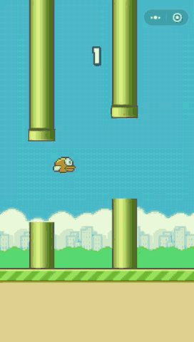

微信小游戏开发教程-游戏实现4
==========================

## 玩家

在游戏中玩家扮演一直傻鸟，玩家不点击屏幕时候它会自动下落，玩家每次点击屏幕都会给小鸟一个向上的速度，然后小鸟会向上冲。这里我们模拟实现重力加速度下物体的速度变化。

下面几个重要的公式：

```javascript
// 通过加速度计算当前速度公式
vt = v0 + a * t

// 变速直线运动位移计算公式
s = (v0 + vt) / 2 * t

// 推导出
s = (v0 + v0 + a * t) / 2 * t
```

玩家的代码如下：

```javascript
// player.js
// @author: wyndam
// @email: only.night@qq.com

import Sprite from '../base/sprite.js'

const PLAYER_WIDTH = 34
const PLAYER_HEIGHT = 24
const PLAYER_GRAVITY_ACC = 0.25
const PLAYER_ACT_V0 = -6

export default class Player extends Sprite {

  constructor(imgSrc, x, y) {
    super(imgSrc, x, y, px2dp(PLAYER_WIDTH), px2dp(PLAYER_HEIGHT))
    this.x = this.x - this.width / 2
    this.y = this.y - this.height / 2
    this.orgY = this.y
    this.act = false
    this.start = 0
    this.actY = 0
    this.acted = false

    let that = this
    canvas.addEventListener('touchstart', ((e) => {
      if (that.visible) {
        this.act = true
        this.acted = true
        // 点击后将当前的帧数设置为初始帧数，用于重新计算时间
        this.start = databus.frame
        // 记下点击时候的纵坐标为作为位移增量的初始值
        this.actY = this.y
      }
    }).bind(this))

    canvas.addEventListener('touchmove', ((e) => {
      // this.x = e.touches[0].clientX - PLAYER_WIDTH / 2
      // this.y = e.touches[0].clientY - PLAYER_HEIGHT / 2
    }).bind(this))

    canvas.addEventListener('touchend', ((e) => {}).bind(this))
  }

  vt(acc, t) {
    return acc * t
  }

  sFall(t) {
    return this.vt(PLAYER_GRAVITY_ACC, t) * t / 2
  }

  sAct(t) {
    return ((PLAYER_ACT_V0 + this.vt(PLAYER_GRAVITY_ACC, t)) + PLAYER_ACT_V0) * t / 2
  }

  s(t) {
    if (this.act) {
      if ((PLAYER_ACT_V0 + this.vt(PLAYER_GRAVITY_ACC, t)) <= 0) {
        return this.actY + this.sAct(t)
      } else {
        this.act = false
        this.actY = this.y
        this.start = databus.frame

        return this.actY + this.sFall(0)
      }
    } else {
      return this.actY + this.sFall(t)
    }
  }

  update() {
    if (!this.visible) {
      return
    }

    // 当前帧数减去初始帧数就得到了一个相对帧数，即是相对时间
    this.y = (this.acted ? 0 : this.orgY) + this.s(databus.frame - this.start)

    if (this.y <= 0) {
      this.y = 0
    }
  }

}
```

实际中我们看的的效果就是在玩家不操作的时，小鸟以自由落体向下运动，当玩家点击屏幕后小鸟会有一个向上的初速度，做向上的减速运动，当速度减到0时，再重复自由落体运动。为了优化体验允许玩家重复点击，每次点击都是以相同的初速度向上运行。

### 组合所有组件完成游戏

记得我们之前在 main.js 中的 loop 函数吗？我们需要在这个函数中处理更新，并且绘制图像。我们添加如下代码：

```javascript
  loop() {

    if (databus.running) {
      databus.frame++;

      // 更新
      this.update()
    }

    // 绘制
    this.render()
    window.requestAnimationFrame(
      this.bindLoop,
      canvas
    )

  }
```

在更新中我们需要更新游戏中物体的位置，以及做一些游戏逻辑的判断，该游戏主要是碰撞检测。完整的组合代码如下：

```javascript
// filename: main.js
// @author: wyndam
// @email: only.night@qq.com

import Background from './runtime/background.js'
import Land from './runtime/land.js'
import BarrierManager from './runtime/barrier-manager.js'
import Player from './player/player.js'
import StartGameWindow from './window/startGame.js'
import GameOverWindow from './window/gameOver.js'

import Number from './base/number.js'
import FrameLayout from './base/frameLayout.js'

let ctx = canvas.getContext('2d')

export default class Main {

  constructor() {

    this.onCreate()

  }

  onCreate() {
    let that = this

    this.bg = new Background()
    this.land = new Land()
    this.player = new Player('images/bird.png', window.innerWidth / 3, window.innerHeight / 2 - 25)
    this.player.visible = false

    this.barrierManager = new BarrierManager()
    this.startGameWindow = new StartGameWindow()
    this.gameOverWindow = new GameOverWindow()
    this.gameOverWindow.setOnRestartListener(function() {
      that.player = new Player('images/bird.png', window.innerWidth / 3, window.innerHeight / 2 - 25)
      databus.barriers.length = 0
      that.gameStart()
      that.gameOverWindow.visible = false
      that.score.setNumber(0)
    })
    this.gameOverWindow.visible = false

    this.score = new Number(0);
    this.scoreFrame = new FrameLayout(0, 0, window.innerWidth, window.innerHeight / 3)
    this.scoreFrame.setSprite(this.score)
    this.scoreFrame.setGravity(Gravity.CENTER)
    this.scoreFrame.visible = false

    this.startGameWindow.setOnStartListener(function() {
      that.player.visible = true
      that.scoreFrame.visible = true
    })

    this.bindLoop = this.loop.bind(this)
    window.cancelAnimationFrame(this.aniId);
    databus.running = false

    window.requestAnimationFrame(
      this.bindLoop,
      canvas
    )
  }

  loop() {

    if (databus.running) {
      databus.frame++;

      // 更新
      this.update()
    }

    // 绘制
    this.render()
    window.requestAnimationFrame(
      this.bindLoop,
      canvas
    )

  }

  render() {
    this.bg.draw(ctx)
    this.barrierManager.draw(ctx)
    this.land.draw(ctx)
    this.player.draw(ctx)
    this.startGameWindow.draw(ctx)

    this.scoreFrame.draw(ctx)
    this.gameOverWindow.draw(ctx)

    if (databus.gameOver) {
      this.gameOverWindow.visible = true
    }
  }

  update() {
    this.bg.update()
    this.land.update()
    this.barrierManager.update()
    this.barrierManager.generateBarriers(databus.frame)
    this.player.update()

    // collide with land
    if (this.land.isCollideEdgeWith(this.player)) {
      this.gameOver()
    }

    // collide with barriers
    for (let i = 0; i < databus.barriers.length; i++) {
      if (databus.barriers[i].isCollideEdgeWith(this.player)) {
        this.gameOver()
        break
      }
    }

    // score
    for (let i = 0; i < databus.barriers.length; i++) {
      if (databus.barriers[i].isPassed(this.player)) {
        this.score.number++
          console.log(this.score.number)
        this.score.setNumber(this.score.number)
      }
    }
  }

  gameOver() {
    databus.running = false
    databus.gameOver = true
  }

  gameStart(){
    databus.running = true
    databus.gameOver = false
  }

}
```

```onCreate``` 中做一些初始化操作；
```update``` 中做一些更新操作；
```render``` 中做一些渲染操作。

## 最后看一下游戏效果


